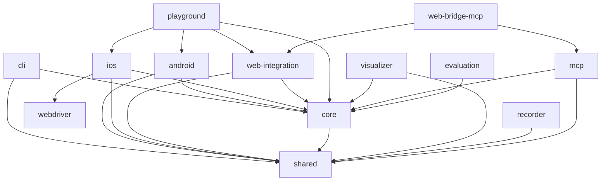

# Midscene 项目代码文档总览

## 项目概述

Midscene.js 是一个基于视觉语言模型（VLM）驱动的、支持全平台的 UI 自动化 SDK。项目采用纯视觉定位方案，通过截图和 AI 模型实现元素识别和操作，无需依赖 DOM 结构，可适用于 Web、Android、iOS 等多种平台。

### 核心特性
- **纯视觉驱动**：基于截图进行元素定位和操作，不依赖 DOM
- **多平台支持**：Web、Android、iOS、桌面应用
- **AI 驱动**：使用大语言模型理解自然语言指令并执行自动化操作
- **调试友好**：提供可视化报告、Playground 调试工具、Chrome 插件
- **多种 API**：交互 API、数据提取 API、实用 API

## 项目架构

### 整体分层架构

```
┌─────────────────────────────────────────────────────────────┐
│                        应用层                                 │
│  CLI工具、Chrome插件、Playground、测试框架集成               │
└───────────────────────┬─────────────────────────────────────┘
                        │
┌───────────────────────┴─────────────────────────────────────┐
│                        Agent层                               │
│  AndroidAgent、iOSAgent、WebAgent（高级自动化接口）         │
└───────────────────────┬─────────────────────────────────────┘
                        │
┌───────────────────────┴─────────────────────────────────────┐
│                        Core层                                │
│  Agent基类、AI模型调用、Action系统、任务管理                 │
└───────────────────────┬─────────────────────────────────────┘
                        │
┌───────────────────────┴─────────────────────────────────────┐
│                       Device层                               │
│  AndroidDevice、iOSDevice、WebPage（设备操作抽象）          │
└───────────────────────┬─────────────────────────────────────┘
                        │
┌───────────────────────┴─────────────────────────────────────┐
│                      Platform层                              │
│  ADB、WebDriver、Puppeteer、Playwright（平台SDK）           │
└─────────────────────────────────────────────────────────────┘
```

## 包结构说明

项目采用 monorepo 结构，主要包含以下 13 个核心包：

### 1. packages/android (6个文件)
**功能**：Android 平台自动化
- 通过 ADB 控制 Android 设备
- 支持应用启动、触摸操作、键盘输入、滚动、截图
- 提供 Playground 调试工具
- 支持多显示屏、中文输入、下拉刷新等高级功能

**核心类**：
- `AndroidDevice`: 设备操作封装
- `AndroidAgent`: AI 驱动的自动化代理

### 2. packages/ios (10个文件)
**功能**：iOS 平台自动化
- 通过 WebDriverAgent 控制 iOS 设备
- 支持应用启动、触摸操作、手势、滚动
- 提供 Playground 调试工具

**核心类**：
- `IOSDevice`: 设备操作封装
- `IOSAgent`: AI 驱动的自动化代理
- `IOSWebDriverClient`: WebDriver 通信客户端

### 3. packages/web-integration (31个文件)
**功能**：Web 平台集成
- 支持 Puppeteer、Playwright 集成
- 提供 Chrome 扩展支持
- 支持桥接模式（Bridge Mode）控制桌面浏览器
- 静态页面自动化

**核心类**：
- `PuppeteerWebPage`: Puppeteer 页面封装
- `PlaywrightWebPage`: Playwright 页面封装
- `BridgeAgent`: 桥接模式代理

### 4. packages/core (46个文件)
**功能**：核心引擎
- Agent 基类和执行会话管理
- AI 模型调用和 Prompt 工程
- Action 系统和任务管理
- 设备接口抽象
- YAML 脚本解析和执行

**核心组件**：
- `Agent`: 所有平台 Agent 的基类
- `ExecutionSession`: 执行会话管理
- `TaskRunner`: 任务执行器
- `YAMLPlayer`: YAML 脚本播放器

### 5. packages/shared (50个文件)
**功能**：共享工具库
- 环境配置管理（AI 模型配置、全局配置）
- 图片处理（缩放、裁剪、base64 转换）
- DOM 提取器和元素定位
- 日志系统
- 工具函数

**核心模块**：
- `env`: 环境变量和配置管理
- `img`: 图片处理工具
- `extractor`: Web 元素提取
- `mcp`: MCP 协议支持

### 6. packages/cli (11个文件)
**功能**：命令行工具
- 执行 YAML 脚本
- 批量运行测试
- 配置管理
- 执行报告

**核心类**：
- `BatchRunner`: 批量执行器
- `TTYRenderer`: 终端渲染器
- `Printer`: 结果输出器

### 7. packages/playground (12个文件)
**功能**：交互式调试工具
- Web 界面的可视化调试
- 支持本地和远程执行
- 实时查看截图和操作结果
- 配置管理和历史记录

**核心类**：
- `PlaygroundServer`: Playground 服务器
- `LocalExecutionAdapter`: 本地执行适配器
- `RemoteExecutionAdapter`: 远程执行适配器

### 8. packages/visualizer (40个文件)
**功能**：可视化组件
- 测试报告查看器
- Playground UI 组件
- 截图查看器
- 配置编辑器

**技术栈**：React + TypeScript

### 9. packages/recorder (7个文件)
**功能**：操作录制工具
- Chrome 扩展的录制功能
- 记录用户操作并生成脚本
- 时间轴展示

**核心组件**：
- `Recorder`: 录制器主类
- `RecordTimeline`: 时间轴组件

### 10. packages/mcp (4个文件)
**功能**：MCP 协议支持
- 将 Midscene 能力暴露为 MCP 工具
- 支持 AI Agent 通过 MCP 调用
- 工具生成和服务器实现

### 11. packages/web-bridge-mcp (6个文件)
**功能**：Web 桥接 MCP 服务
- 提供 Web 平台的 MCP 工具集
- 桥接模式的 MCP 封装

### 12. packages/webdriver (7个文件)
**功能**：WebDriver 客户端
- iOS WebDriverAgent 客户端实现
- WDA 服务管理
- HTTP 请求封装

**核心类**：
- `WebDriverClient`: WebDriver 客户端
- `WDAManager`: WDA 服务管理器

### 13. packages/evaluation (5个文件)
**功能**：评估和基准测试
- 生成测试数据
- 分析测试结果
- 性能评估

## 跨包调用关系

### 依赖关系图



### 核心数据流

1. **用户输入** → CLI/Playground/Chrome扩展
2. **指令解析** → Core (Agent + AI Model)
3. **操作执行** → Device 层 (AndroidDevice/IOSDevice/WebPage)
4. **平台调用** → Platform 层 (ADB/WebDriver/Puppeteer)
5. **结果返回** → Visualizer (报告/截图/日志)

## 关键技术实现

### 1. 纯视觉定位
- 截图捕获：各平台统一截图接口
- AI 分析：使用 VLM 模型分析截图，识别元素位置
- 坐标转换：逻辑坐标与物理像素的转换
- 缓存优化：缓存截图和分析结果

### 2. Action 系统
- 统一的 Action 定义（defineAction）
- 参数验证（Zod Schema）
- 动作空间（actionSpace）管理
- 动作执行和追踪

### 3. AI 模型集成
- 多模型支持：GPT、Claude、Gemini、Qwen、Doubao、UI-TARS
- Prompt 工程：针对不同任务优化的 Prompt
- 对话历史管理
- Token 优化和缓存

### 4. 执行会话管理
- 会话隔离：每个自动化任务独立会话
- 状态管理：记录执行状态和中间结果
- 错误恢复：支持重试和回滚
- 缓存机制：复用已执行的结果

### 5. 跨平台抽象
- 统一的 Device 接口
- 平台特定的 Action
- 坐标系转换
- 屏幕尺寸适配

## 配置系统

### 环境变量配置
- `MIDSCENE_MODEL_NAME`: AI 模型名称
- `MIDSCENE_OPENAI_API_KEY`: OpenAI API Key
- `MIDSCENE_ANTHROPIC_API_KEY`: Anthropic API Key
- `MIDSCENE_ADB_PATH`: ADB 可执行文件路径
- `MIDSCENE_ANDROID_IME_STRATEGY`: Android 输入法策略
- `DEBUG`: 调试日志开关

### 配置文件
- `.env`: 环境变量配置
- `midscene.config.js`: CLI 配置文件
- `package.json`: 依赖和脚本配置

## 开发工具链

### 构建工具
- **rslib**: 统一的构建配置，支持 CJS 和 ESM 双格式输出
- **TypeScript**: 类型系统和编译
- **Biome**: 代码格式化和 Lint

### 测试工具
- **Vitest**: 单元测试框架
- **Playwright**: E2E 测试框架

### 调试工具
- **Playground**: Web 界面调试
- **Chrome 扩展**: 浏览器调试
- **DEBUG 日志**: 详细的调试日志

## 使用场景

### 1. 自动化测试
```yaml
# example.yaml
tasks:
  - aiAction: 打开 github.com 并登录
  - aiAssert: 确认登录成功
```

### 2. RPA 任务
- 批量数据采集
- 表单自动填写
- 定时任务执行

### 3. 性能测试
- 模拟用户操作
- 压力测试
- 性能监控

### 4. UI 测试
- 跨平台 UI 测试
- 回归测试
- A/B 测试

## 最佳实践

### 1. 环境准备
- 配置 AI 模型 API Key
- Android: 开启 USB 调试，连接 ADB
- iOS: 安装并启动 WebDriverAgent
- Web: 安装 Puppeteer/Playwright

### 2. 脚本编写
- 使用自然语言描述操作
- 合理使用 aiAssert 验证结果
- 善用缓存提升效率
- 设置合理的超时时间

### 3. 调试技巧
- 使用 Playground 交互式调试
- 开启 DEBUG 日志
- 查看可视化报告
- 分析截图和执行历史

### 4. 性能优化
- 启用缓存机制
- 批量执行任务
- 复用浏览器上下文
- 选择合适的 AI 模型

## 未来规划

- 支持更多 AI 模型
- 增强多模态理解能力
- 提供更多平台支持（Windows、macOS、Linux 桌面）
- 优化性能和成本
- 增强调试和监控能力

## 总结

Midscene 项目通过创新的纯视觉定位方案，结合 AI 大模型的理解能力，提供了一套统一的跨平台 UI 自动化解决方案。项目架构清晰，分层合理，代码质量高，工具链完善，为开发者提供了强大而易用的自动化能力。

整个项目包含 270+ 个源文件，13 个核心包，涵盖了从底层设备控制到上层应用工具的完整链路。通过本文档以及各包、各文件的详细文档，开发者可以全面理解 Midscene 的设计思想和实现细节，快速上手开发和使用。
