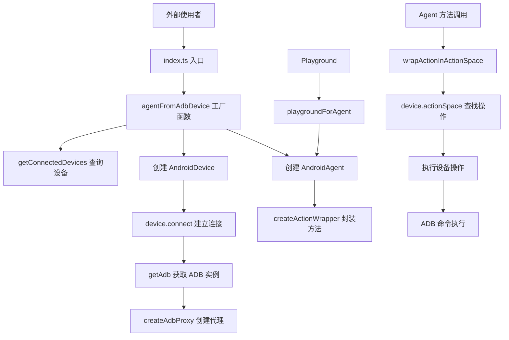

# Android 包 - 目录总结

## 目录概述
Android 包是 Midscene 项目中用于 Android 设备自动化的核心模块，提供基于 ADB 的设备控制、AI 驱动的自动化能力和交互式调试工具。

## 框架架构组织方式

### 架构层次
```
android/
├── src/                    # 核心源代码
│   ├── index.ts           # 模块入口，导出公共 API
│   ├── agent.ts           # Agent 层：AI 驱动的高级自动化
│   ├── device.ts          # Device 层：底层设备操作封装
│   └── utils.ts           # 工具层：辅助函数
├── demo/                   # 示例和演示
│   └── playground.ts      # Playground 启动脚本
├── rslib.config.ts        # 构建配置
├── package.json           # 依赖和脚本
└── tests/                 # 测试文件（已排除）
```

### 架构设计模式

#### 1. 分层架构
```
外部使用者
    ↓
[Agent 层] AndroidAgent - AI 驱动的自动化代理
    ↓
[Device 层] AndroidDevice - 设备操作抽象
    ↓
[ADB 层] appium-adb - ADB 通信库
    ↓
Android 设备
```

#### 2. 工厂模式
- `agentFromAdbDevice()` 函数封装 Agent 创建复杂度
- 自动处理设备选择、连接、初始化

#### 3. 代理模式
- `createAdbProxy()` 拦截 ADB 方法调用
- 统一添加日志记录和错误处理

#### 4. 单例模式
- ADB 连接采用单例，避免重复初始化
- 使用 `connectingAdb` Promise 防止并发连接

## 代码调用关系总览

### 核心调用链


### 文件间依赖关系

| 文件 | 依赖项 | 被依赖项 |
|------|--------|----------|
| index.ts | device.ts, agent.ts, utils.ts | 外部使用者, playground.ts |
| agent.ts | device.ts, utils.ts, @midscene/core | index.ts |
| device.ts | @midscene/core, @midscene/shared, appium-adb | agent.ts, index.ts |
| utils.ts | appium-adb, @midscene/shared | agent.ts, index.ts |
| playground.ts | index.ts, @midscene/playground | 无（可执行脚本） |
| rslib.config.ts | @rslib/core | 构建系统 |

## 跨目录调用

### 依赖的其他包
- **@midscene/core**: 核心 Agent 基类、设备接口定义、Action 系统
- **@midscene/shared**: 共享工具（日志、图片处理、环境配置、工具函数）
- **@midscene/playground**: Playground UI 服务
- **appium-adb**: ADB 通信库（第三方）

### 被其他包调用
- **测试包**: 集成测试使用 Android 包进行设备自动化
- **示例应用**: 演示 Android 自动化能力
- **MCP 服务**: 可能通过 MCP 协议暴露 Android 操作

## 核心功能总结

### 1. 设备管理
- **设备发现**: 查询已连接的 Android 设备列表
- **设备连接**: 通过 ADB 建立设备通信
- **设备信息**: 获取屏幕尺寸、密度、方向等参数
- **多显示屏支持**: 支持指定 displayId 操作特定屏幕

### 2. 屏幕操作
- **截图**: 多种方式捕获屏幕（adb.takeScreenshot / shell screencap / forceScreenshot）
- **显示信息**: 获取和缓存屏幕尺寸、方向、密度
- **坐标转换**: 逻辑坐标与物理像素的转换

### 3. 触摸交互
- **点击**: 单击、双击、长按
- **拖拽**: 从一点拖动到另一点
- **滑动**: 支持四个方向的滑动
- **手势**: 下拉刷新、上拉加载

### 4. 键盘输入
- **文本输入**: 支持 ASCII 和中文（通过 yadb 工具）
- **按键操作**: 支持特殊键（Enter、Backspace、方向键等）
- **输入框清空**: 批量删除或使用 yadb 清空
- **键盘控制**: 显示和隐藏软键盘

### 5. 滚动操作
- **方向滚动**: 上下左右滚动指定距离
- **滚动到边界**: 快速滚动到顶部/底部/左侧/右侧
- **从元素滚动**: 从指定元素位置开始滚动
- **滚动参数**: 可配置距离和持续时间

### 6. 应用控制
- **启动应用**: 支持包名、Activity、URL 等多种启动方式
- **系统按键**: 返回键、主屏幕键、最近应用键
- **ADB 命令**: 执行任意 ADB shell 命令

### 7. AI 自动化
- **Agent 接口**: 基于自然语言的自动化能力
- **动作空间**: 定义所有可用操作及其参数
- **动作追踪**: 记录操作历史用于回放和调试
- **AI 上下文**: 配置 AI 行为（如自动处理权限弹窗）

### 8. 开发工具
- **Playground**: Web 界面的交互式调试工具
- **调试日志**: 详细的操作日志便于排查问题
- **错误提示**: 友好的错误消息和 FAQ 链接
- **类型定义**: 完整的 TypeScript 类型支持

## 技术特点

### 1. 健壮性
- 多层错误处理和回退机制
- ADB 代理统一处理错误和日志
- 详细的异常信息和排查指引

### 2. 性能优化
- 屏幕信息缓存减少查询
- ADB 连接复用避免重复初始化
- 坐标提前计算减少运行时开销

### 3. 兼容性
- 支持多种 Android 版本
- 支持多显示屏设备
- 支持远程 ADB（remoteAdbHost/Port）
- 适配不同 IME 输入策略

### 4. 可扩展性
- 自定义操作支持（customActions）
- 插件式的工具部署（yadb）
- 灵活的配置选项（AndroidDeviceOpt）

### 5. 开发体验
- TypeScript 类型安全
- 详细的调试日志
- Playground 可视化调试
- 完整的错误提示

## 使用场景

1. **自动化测试**: 对 Android 应用进行 UI 自动化测试
2. **RPA**: Android 设备上的重复任务自动化
3. **设备监控**: 周期性截图和信息采集
4. **性能测试**: 模拟用户操作进行压力测试
5. **开发调试**: 通过 Playground 快速验证自动化脚本
6. **CI/CD 集成**: 在持续集成中运行自动化测试

## 最佳实践

1. **设备准备**: 确保 USB 调试开启，设备解锁，ADB 正常工作
2. **环境配置**: 在 .env 文件中配置 AI 模型密钥
3. **错误处理**: 使用 try-catch 捕获操作异常
4. **资源清理**: 使用完毕后调用 device.destroy()
5. **日志调试**: 启用 DEBUG 环境变量查看详细日志
6. **屏幕适配**: 根据设备 DPI 调整截图缩放比例
7. **输入策略**: 根据文本类型选择合适的 IME 策略
