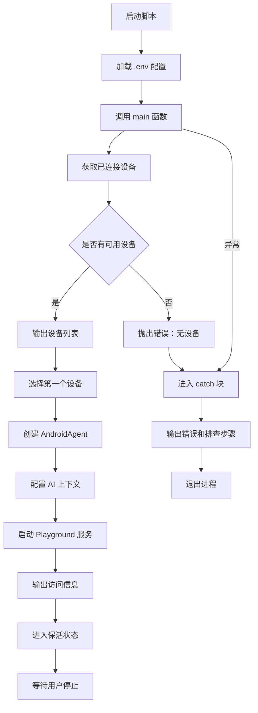

# playground.ts

## 0. 文件概述
Android Playground 启动脚本，用于在本地启动 Web 界面的 Android 设备交互式调试工具。

## 1. 核心功能

### 1.1 设备连接与选择
- **功能说明**：查找并连接可用的 Android 设备
- **实现细节**：
  - 调用 `getConnectedDevices()` 获取所有已连接设备
  - 检查设备列表是否为空，为空则抛出错误并提供故障排查提示
  - 输出所有可用设备的信息（设备 ID、状态）
  - 自动选择第一个设备用于 Playground
- **应用场景**：Playground 启动时自动识别设备

### 1.2 Android Agent 创建
- **功能说明**：为选定的设备创建 AndroidAgent 实例
- **实现细节**：
  - 使用 `agentFromAdbDevice()` 工厂函数创建 Agent
  - 配置 `aiActionContext` 提供默认的 AI 上下文（处理权限弹窗、登录提示等）
  - Agent 作为 Playground 的控制核心
- **应用场景**：为 Playground UI 提供设备操作能力

### 1.3 Playground 服务启动
- **功能说明**：启动 Web 服务器，提供可视化调试界面
- **实现细节**：
  - 调用 `playgroundForAgent(agent).launch()` 启动服务
  - 配置端口：5809
  - 自动打开浏览器
  - 启用详细日志（verbose: true）
  - 输出服务器 ID、访问地址、连接设备信息
- **应用场景**：开发者通过浏览器调试 Android 自动化

### 1.4 环境配置加载
- **功能说明**：加载环境变量（如 AI 模型配置）
- **实现细节**：
  - 使用 dotenv 加载项目根目录的 `.env` 文件
  - 配置路径为 `../../.env`（相对于 demo 目录）
- **应用场景**：加载 API Key、模型配置等敏感信息

### 1.5 错误处理与用户提示
- **功能说明**：捕获并友好展示错误信息
- **实现细节**：
  - catch 块捕获所有异常
  - 输出详细的错误信息和故障排查步骤
  - 提供 4 个关键检查点：设备连接、USB 调试、ADB 安装、设备解锁
  - 退出进程（exit code 1）
- **应用场景**：帮助用户快速定位问题

### 1.6 进程保活
- **功能说明**：保持 Playground 服务持续运行
- **实现细节**：
  - 使用 `await new Promise(() => {})` 创建永不 resolve 的 Promise
  - 进程将持续运行直到用户按 Ctrl+C
  - 输出提示信息告知用户如何停止
- **应用场景**：作为长期运行的开发工具

## 2. 逻辑流程

**流程说明**：
1. 脚本启动时首先加载环境变量配置
2. 进入 main 函数，查询已连接的 Android 设备
3. 如无设备则直接报错退出；有设备则列出所有设备信息
4. 使用第一个设备创建 AndroidAgent，配置默认 AI 上下文
5. 启动 Playground Web 服务，监听 5809 端口
6. 输出服务信息（Server ID、访问地址、设备 ID）
7. 进入保活循环，等待用户手动停止（Ctrl+C）
8. 任何阶段出错都会被 catch 捕获，输出友好的排查提示

## 3. 关键细节

### 3.1 核心变量
- **devices**: 已连接设备列表，从 `getConnectedDevices()` 获取
- **targetDevice**: 选定用于 Playground 的设备（第一个）
- **agent**: AndroidAgent 实例，包含设备操作能力
- **server**: Playground 服务器实例，包含 server.id 等信息
- **aiActionContext**: AI 默认上下文，处理常见弹窗（权限、登录、Cookie等）

### 3.2 条件判断逻辑
- **设备可用性检查**: `devices.length === 0` 判断是否有设备
- **设备循环输出**: 使用 forEach 输出所有设备信息

### 3.3 异常处理机制
- **双层 Promise 结构**: 使用 `Promise.resolve(async () => {...})` 包裹异步逻辑
- **统一错误处理**: main 函数的 catch 块捕获所有错误
- **详细错误提示**: 输出 4 个关键检查点帮助排查
- **错误退出**: process.exit(1) 标记异常退出

### 3.4 数据流转路径
- **输入**: 
  - 环境变量（.env 文件）
  - 系统 ADB 设备列表
- **处理**:
  1. 加载配置
  2. 查询设备
  3. 创建 Agent
  4. 启动服务
  5. 进入保活
- **输出**:
  - 控制台日志（设备信息、服务地址）
  - Web 服务（http://localhost:5809）
  - 进程退出码（成功=持续运行，失败=1）

## 4. 跨文件调用关系

### 4.1 该文件调用的其他文件
| 被调用文件 | 调用内容 | 调用场景 |
|----------|---------|---------|
| `@midscene/playground` | `playgroundForAgent` | 启动 Playground 服务 |
| `dotenv` | `dotenv.config` | 加载环境变量 |
| `../src` | `agentFromAdbDevice`, `getConnectedDevices` | 创建 Agent 和查询设备 |

### 4.2 调用该文件的其他文件
| 调用文件 | 调用场景 | 使用方式 |
|---------|---------|---------|
| 开发者 | 本地调试 Android 自动化 | 直接运行：`node demo/playground.js` 或 npm script |
| package.json scripts | 作为 npm 命令 | `npm run playground` 等 |
