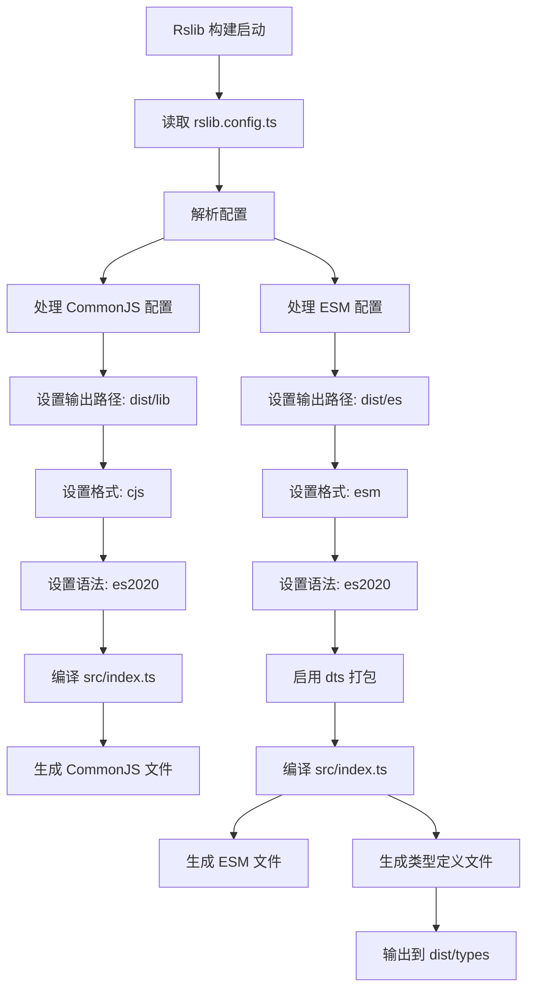

# rslib.config.ts

## 0. 文件概述
Rslib 构建配置文件，定义 Android 包的构建输出格式、目录结构和语法目标。

## 1. 核心功能

### 1.1 多格式输出配置
- **功能说明**：配置构建输出两种 JavaScript 模块格式
- **实现细节**：
  - **CommonJS 格式**：
    - 输出目录：`dist/lib`
    - 格式：`cjs` (CommonJS)
    - 语法目标：ES2020
    - 用途：Node.js 环境和旧版工具兼容
  - **ES Module 格式**：
    - 输出目录：`dist/es`
    - 格式：`esm` (ES Module)
    - 语法目标：ES2020
    - 类型声明：
      - 启用类型声明文件打包（bundle: true）
      - 类型文件输出到 `dist/types`
    - 用途：现代构建工具和 tree-shaking 优化
- **应用场景**：支持不同模块系统的使用者

### 1.2 入口文件配置
- **功能说明**：指定构建的源代码入口
- **实现细节**：
  - 入口文件：`./src/index.ts`
  - 入口名称：`index`
  - 构建产物会根据此入口生成对应的输出文件
- **应用场景**：rslib 从此入口开始分析依赖并打包

### 1.3 TypeScript 类型声明
- **功能说明**：生成 TypeScript 类型定义文件
- **实现细节**：
  - 仅在 ESM 配置中启用 `dts` 选项
  - 使用 bundle 模式，将所有类型定义打包到单一文件
  - 输出路径：`dist/types`
- **应用场景**：为 TypeScript 用户提供类型支持

## 2. 逻辑流程

**流程说明**：
1. Rslib 构建系统读取配置文件
2. 根据 `lib` 数组中的配置，并行处理两种输出格式
3. CommonJS 配置生成 dist/lib 目录下的 .js 文件
4. ESM 配置生成 dist/es 目录下的 .js 文件和 dist/types 目录下的 .d.ts 文件
5. 两种格式都以 src/index.ts 作为入口，语法目标均为 ES2020

## 3. 关键细节

### 3.1 核心变量
- **lib**: 构建配置数组，定义多种输出格式
- **source.entry**: 入口文件配置，指定构建起点
- **output.distPath**: 输出目录配置
- **format**: 模块格式（cjs 或 esm）
- **syntax**: 目标语法版本（es2020）
- **dts**: TypeScript 类型声明配置

### 3.2 条件判断逻辑
- 无显式条件判断，通过数组配置实现多格式输出

### 3.3 异常处理机制
- 配置错误由 rslib 构建系统处理
- 语法错误会在构建时由 TypeScript 编译器报告

### 3.4 数据流转路径
- **输入**: src/index.ts 及其依赖的所有源文件
- **处理**: 
  1. TypeScript 编译
  2. 模块格式转换（CJS/ESM）
  3. 类型声明提取和打包
  4. 代码优化
- **输出**: 
  - dist/lib/*.js (CommonJS)
  - dist/es/*.js (ES Module)
  - dist/types/*.d.ts (TypeScript 类型)

## 4. 跨文件调用关系

### 4.1 该文件调用的其他文件
| 被调用文件 | 调用内容 | 调用场景 |
|----------|---------|---------|
| `@rslib/core` | `defineConfig` | 定义配置对象 |
| `./src/index.ts` | 作为入口 | 构建起点 |

### 4.2 调用该文件的其他文件
| 调用文件 | 调用场景 | 使用方式 |
|---------|---------|---------|
| rslib CLI | 构建命令 | `rslib build` 等命令读取此配置 |
| package.json | npm scripts | 通过 npm run build 间接调用 |
