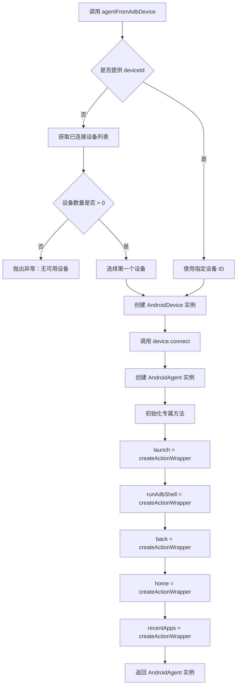

# agent.ts

## 0. 文件概述
Android Agent 代理类实现，基于核心 Agent 扩展 Android 特定功能，提供 AI 驱动的 Android 设备自动化能力。

## 1. 核心功能

### 1.1 AndroidAgent 类
- **功能说明**：扩展核心 PageAgent 类，添加 Android 平台特定的操作方法
- **实现细节**：
  - 继承自 `PageAgent<AndroidDevice>`，泛型指定设备类型
  - 添加 Android 专属方法：launch（启动应用）、runAdbShell（执行 ADB 命令）、back/home/recentApps（系统按键）
  - 所有专属方法通过 `createActionWrapper` 进行封装
- **应用场景**：为 Android 自动化提供统一的 AI 代理接口

### 1.2 操作方法封装
- **功能说明**：将设备操作封装为 Agent 方法，支持动作追踪和回放
- **实现细节**：
  - `launch`：启动 Android 应用或 URL
  - `runAdbShell`：执行 ADB shell 命令
  - `back`：触发返回键
  - `home`：触发主屏幕键
  - `recentApps`：触发最近应用键
  - 使用 `wrapActionInActionSpace` 将操作纳入 Agent 的动作空间管理
- **应用场景**：在 AI 自动化流程中记录和重放这些操作

### 1.3 类型安全的方法签名
- **功能说明**：通过 TypeScript 泛型保证方法参数和返回值的类型安全
- **实现细节**：
  - `ActionArgs<T>` 类型：根据 Action 是否需要参数，生成对应的参数列表类型
  - `WrappedAction<T>` 类型：封装后的方法签名，支持可选参数
- **应用场景**：编译时类型检查，防止参数错误

### 1.4 Agent 工厂函数
- **功能说明**：`agentFromAdbDevice` 函数简化 Agent 创建流程
- **实现细节**：
  - 接收可选的 deviceId 参数，未提供则自动选择第一个设备
  - 调用 `getConnectedDevices()` 获取设备列表
  - 创建 AndroidDevice 实例并连接
  - 返回配置好的 AndroidAgent 实例
- **应用场景**：快速创建可用的 Android Agent

## 2. 逻辑流程

**流程说明**：
1. 用户调用 `agentFromAdbDevice` 时可选择性提供设备 ID
2. 如未提供设备 ID，系统会查询所有已连接设备，并选择第一个（如无设备则报错）
3. 使用设备 ID 创建 `AndroidDevice` 实例，传入配置选项
4. 调用 `device.connect()` 建立 ADB 连接
5. 创建 `AndroidAgent` 实例，构造函数中初始化所有专属方法
6. 每个专属方法通过 `createActionWrapper` 封装，关联到对应的 DeviceAction
7. 返回配置完成的 Agent 供使用

## 3. 关键细节

### 3.1 核心变量
- **debugAgent**：调试日志记录器，用于输出 agent 模块的调试信息
- **AndroidAgentOpt**：Agent 配置选项类型，等同于核心 AgentOpt
- **ActionArgs**：条件类型，根据 Action 是否有参数决定参数列表结构
- **WrappedAction**：封装后的方法类型，统一了有参和无参方法的调用方式

### 3.2 条件判断逻辑
- **设备选择逻辑**：`agentFromAdbDevice` 中判断 `!deviceId` 时自动获取设备列表
- **设备可用性检查**：`devices.length === 0` 时抛出详细错误，提示用户检查设备连接
- **调试信息输出**：使用 `debugAgent` 记录自动选择的设备 ID

### 3.3 异常处理机制
- **无可用设备异常**：当 `getConnectedDevices()` 返回空列表时，抛出包含故障排查提示的错误
- **错误传播**：底层 AndroidDevice 和 ADB 错误会向上传播到 Agent 层

### 3.4 数据流转路径
- **输入**：deviceId（可选）、AndroidAgentOpt 配置对象、AndroidDeviceOpt 设备配置
- **处理**：
  1. 设备 ID 解析（自动或手动指定）
  2. 创建 AndroidDevice 实例
  3. 建立 ADB 连接
  4. 初始化 AndroidAgent 及其方法
- **输出**：完全配置的 AndroidAgent 实例，可立即使用

## 4. 跨文件调用关系

### 4.1 该文件调用的其他文件
| 被调用文件 | 调用内容 | 调用场景 |
|----------|---------|---------|
| `@midscene/core` | `ActionParam`, `ActionReturn`, `DeviceAction` | 类型定义 |
| `@midscene/core/agent` | `Agent as PageAgent`, `AgentOpt` | 继承基类 |
| `@midscene/shared/logger` | `getDebug` | 获取调试日志记录器 |
| `./device` | `AndroidDevice` 及相关类型 | 创建和操作设备实例 |
| `./utils` | `getConnectedDevices` | 查询已连接设备 |

### 4.2 调用该文件的其他文件
| 调用文件 | 调用场景 | 使用的导出项 |
|---------|---------|-------------|
| `./index.ts` | 包入口导出 | `AndroidAgent`, `agentFromAdbDevice`, `AndroidAgentOpt` |
| `demo/playground.ts` | Playground 启动 | `agentFromAdbDevice` |
| 外部测试/脚本 | Android 自动化 | `AndroidAgent` 类和工厂函数 |
