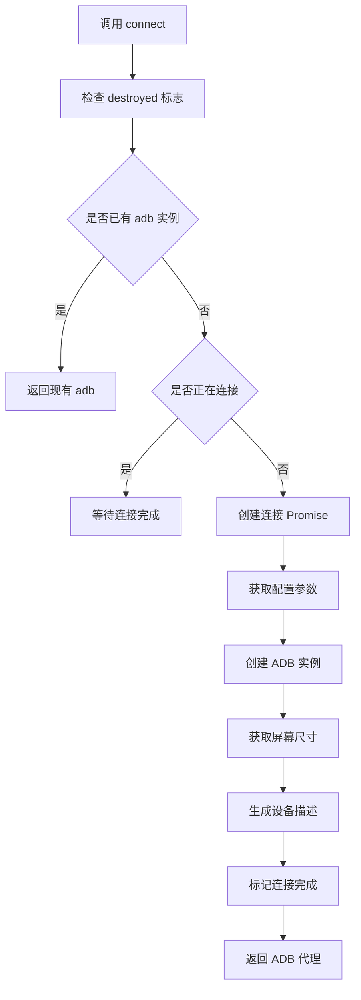
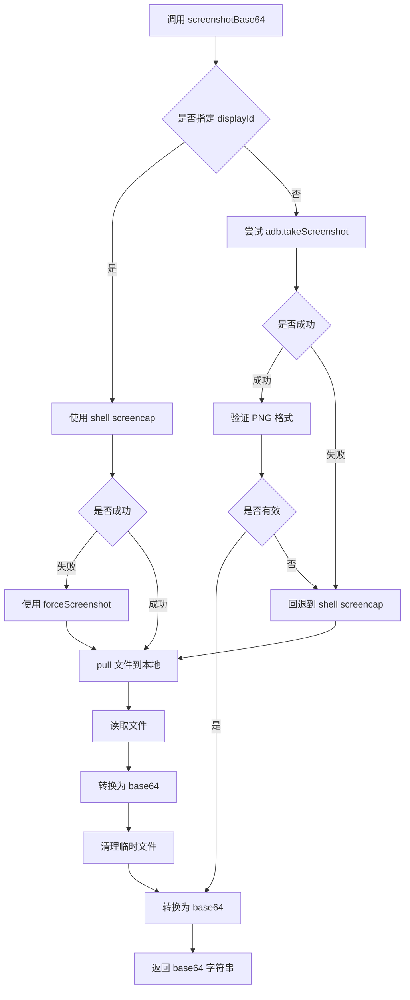
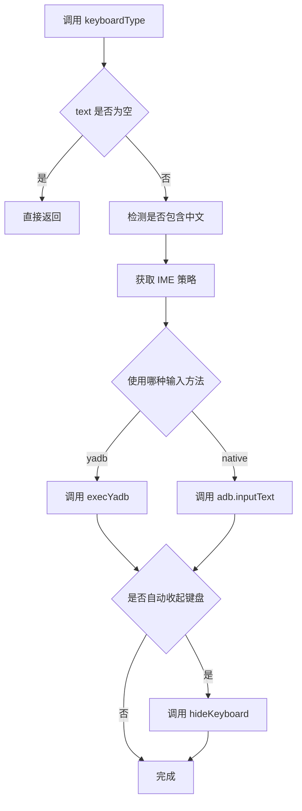
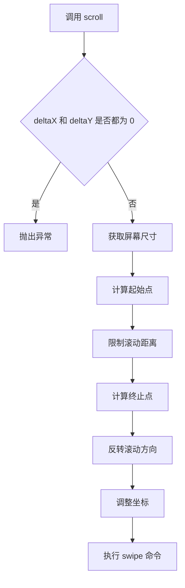

# device.ts

## 0. 文件概述
Android 设备核心实现，封装了与 Android 设备交互的所有底层操作，包括 ADB 通信、屏幕截图、触摸输入、键盘输入、滑动滚动等完整的设备控制能力。

## 1. 核心功能

### 1.1 设备连接与管理
- **功能说明**：建立和维护与 Android 设备的 ADB 连接
- **实现细节**：
  - `connect()` 方法：初始化 ADB 连接，配置 ADB 路径、远程主机、端口等
  - `getAdb()` 方法：获取 ADB 实例，支持连接复用和代理模式
  - `createAdbProxy()` 方法：创建 ADB 代理对象，拦截所有方法调用以添加日志和错误处理
  - 连接状态管理：防止重复连接，支持异步连接等待
- **应用场景**：Agent 初始化时建立设备连接，所有后续操作依赖此连接

### 1.2 屏幕尺寸与显示信息
- **功能说明**：获取设备屏幕尺寸、方向、密度等显示参数
- **实现细节**：
  - `getScreenSize()`：获取物理和覆盖尺寸，支持多显示屏、横竖屏检测
  - `getDisplayOrientation()`：获取屏幕方向（0=竖屏,1=横屏,2=反向竖屏,3=反向横屏）
  - `getDisplayDensity()`：获取屏幕密度（DPI）
  - `size()`：返回逻辑尺寸（考虑缩放比例和设备像素比）
  - 支持多显示屏：通过 `displayId` 指定目标显示屏
  - 支持缓存：避免重复查询提升性能
- **应用场景**：截图缩放、坐标转换、布局适配

### 1.3 屏幕截图
- **功能说明**：捕获设备屏幕截图并转换为 base64 格式
- **实现细节**：
  - `screenshotBase64()`：主方法，返回 PNG 格式的 base64 字符串
  - 优先使用 `adb.takeScreenshot()`，失败时回退到 shell screencap
  - 支持多显示屏截图：通过 `displayId` 或物理显示 ID 指定
  - `forceScreenshot()`：使用 yadb 工具绕过应用截图限制
  - PNG 格式验证：确保截图数据有效
  - 临时文件管理：自动清理本地和远程临时文件
- **应用场景**：AI 视觉识别、UI 验证、测试报告

### 1.4 触摸操作
- **功能说明**：模拟各种触摸操作（点击、双击、长按、拖拽）
- **实现细节**：
  - `mouseClick(x, y)`：单击，使用 swipe 命令实现（起止点相同）
  - `mouseDoubleClick(x, y)`：双击，两次 tap 命令间隔 50ms
  - `longPress(x, y, duration)`：长按，默认 2000ms
  - `mouseDrag(from, to, duration)`：拖拽，可指定持续时间
  - 坐标自动调整：通过 `adjustCoordinates()` 转换逻辑坐标到物理像素
- **应用场景**：UI 交互、手势操作、拖放功能

### 1.5 滚动操作
- **功能说明**：支持多种滚动模式（方向滚动、滚动到边界、下拉刷新）
- **实现细节**：
  - `scroll(deltaX, deltaY, duration)`：基础滚动方法
  - `scrollUp/Down/Left/Right(distance, startPoint)`：方向滚动
  - `scrollUntilTop/Bottom/Left/Right(startPoint)`：滚动到边界（重复 10 次）
  - `pullDown/pullUp(startPoint, distance, duration)`：下拉刷新/上拉加载
  - `calculateScrollEndPoint()`：计算滚动终点，确保在屏幕范围内
  - 支持从指定元素开始滚动
- **应用场景**：列表浏览、页面导航、下拉刷新

### 1.6 键盘输入
- **功能说明**：文本输入和按键操作，支持中文输入
- **实现细节**：
  - `keyboardType(text, options)`：文本输入
    - 策略选择：根据配置决定使用 yadb 还是原生输入
    - 中文检测：自动识别中文字符并选择合适的输入方法
    - 自动收起键盘：可配置输入后是否自动隐藏键盘
  - `keyboardPress(key)`：单键按下，支持特殊键（Enter、Backspace、方向键等）
  - `clearInput(element)`：清空输入框
  - `hideKeyboard(options, timeoutMs)`：隐藏软键盘，支持多种策略
  - IME 策略：
    - `always-yadb`：总是使用 yadb 输入
    - `yadb-for-non-ascii`：仅对非 ASCII 字符使用 yadb（默认）
- **应用场景**：表单填写、搜索输入、文本编辑

### 1.7 应用控制
- **功能说明**：启动应用、执行 ADB 命令、系统按键
- **实现细节**：
  - `launch(uri)`：启动应用或 URL
    - 支持多种 URI 格式：http/https URL、包名/Activity、单纯包名
  - `back()`：返回键（keyevent 4）
  - `home()`：主屏幕键（keyevent 3）
  - `recentApps()`：最近应用键（keyevent 187）
  - `getAdb()` 返回的代理对象可执行任意 shell 命令
- **应用场景**：应用启动、导航控制、系统操作

### 1.8 动作空间定义
- **功能说明**：`actionSpace()` 方法定义设备支持的所有操作
- **实现细节**：
  - 通用操作：Tap、DoubleClick、Input、Scroll、DragAndDrop、KeyboardPress、ClearInput
  - Android 特定操作：AndroidLongPress、AndroidPull
  - 平台特定操作：Launch、RunAdbShell、AndroidBackButton、AndroidHomeButton、AndroidRecentAppsButton
  - 自定义操作：支持通过 `customActions` 扩展
  - 使用 Zod schema 定义参数结构，支持 AI 理解和验证
- **应用场景**：AI Agent 查询可用操作、参数验证、操作记录

### 1.9 辅助工具
- **功能说明**：设备信息、工具部署、坐标转换等辅助功能
- **实现细节**：
  - `describe()`：返回设备描述（设备 ID、屏幕尺寸）
  - `ensureYadb()`：推送 yadb 工具到设备（仅首次）
  - `adjustCoordinates(x, y)`：逻辑坐标转物理像素
  - `getPhysicalDisplayId()`：获取物理显示 ID
  - `getDisplayArg()`：生成 displayId 参数
  - `destroy()`：清理资源，断开连接
- **应用场景**：设备识别、工具初始化、资源管理

## 2. 逻辑流程

### 2.1 设备连接流程

### 2.2 截图流程

### 2.3 输入文本流程

### 2.4 滚动操作流程

**流程说明**：
- 设备连接采用单例模式，避免重复初始化
- 截图有多层回退机制，确保在各种情况下都能成功
- 输入流程根据文本内容和配置动态选择输入方法
- 滚动操作需要反转方向（向下滚动=向上滑动手指）

## 3. 关键细节

### 3.1 核心变量
- **deviceId**: 设备唯一标识符（UDID）
- **adb**: ADB 实例，所有设备操作的基础
- **yadbPushed**: 标记 yadb 工具是否已推送到设备
- **devicePixelRatio**: 设备像素比（DPI / 160）
- **scalingRatio**: 缩放比例，用于坐标转换
- **cachedScreenSize**: 缓存的屏幕尺寸信息
- **cachedOrientation**: 缓存的屏幕方向
- **destroyed**: 设备是否已销毁
- **interfaceType**: 固定为 'android'

### 3.2 条件判断逻辑
- **设备销毁检查**: 所有方法开始时检查 `destroyed` 标志
- **连接状态判断**: 在 `getAdb()` 中判断是否已有连接或正在连接
- **显示屏选择**: 根据 `displayId` 决定使用何种方法获取屏幕信息
- **IME 策略选择**: 根据配置和文本内容决定输入方法
- **截图方法选择**: 根据是否指定 displayId 和是否成功选择合适的截图方式
- **缓存策略**: 根据 `alwaysRefreshScreenInfo` 决定是否使用缓存

### 3.3 异常处理机制
- **ADB 代理错误处理**: 所有 ADB 方法调用都被代理拦截，统一添加错误上下文和 FAQ 链接
- **设备未连接错误**: 在获取 ADB 时检查设备连接状态
- **截图失败回退**: 多层 try-catch 确保截图成功
- **坐标越界保护**: `calculateScrollEndPoint()` 确保坐标在屏幕范围内
- **资源清理**: 异常发生时清理临时文件

### 3.4 数据流转路径
- **输入**: deviceId、配置选项、操作参数（坐标、文本、距离等）
- **处理**: 
  1. 通过 ADB 发送命令到设备
  2. 坐标转换（逻辑 → 物理）
  3. 参数验证和边界检查
  4. 缓存管理
- **输出**: Promise 返回操作结果（截图 base64、设备信息等）

## 4. 跨文件调用关系

### 4.1 该文件调用的其他文件
| 被调用文件 | 调用内容 | 调用场景 |
|----------|---------|---------|
| `@midscene/core` | 各种类型定义 | 类型声明 |
| `@midscene/core/device` | `AbstractInterface`、各种 Action 定义 | 实现接口、定义操作 |
| `@midscene/core/utils` | `getTmpFile`, `sleep` | 临时文件、延时 |
| `@midscene/shared/env` | 环境变量管理 | 获取 ADB 路径等配置 |
| `@midscene/shared/extractor` | `ElementInfo` | 元素信息类型 |
| `@midscene/shared/img` | 图片处理函数 | base64 转换、PNG 验证 |
| `@midscene/shared/logger` | `getDebug` | 调试日志 |
| `@midscene/shared/utils` | `uuid`, `repeat` | 工具函数 |
| `appium-adb` | `ADB` 类 | ADB 客户端 |

### 4.2 调用该文件的其他文件
| 调用文件 | 调用场景 | 使用的导出项 |
|---------|---------|-------------|
| `./agent.ts` | AndroidAgent 内部使用 | `AndroidDevice` |
| `./index.ts` | 模块导出 | `AndroidDevice`、相关类型 |
| 测试文件 | 单元测试 | 所有导出项 |
