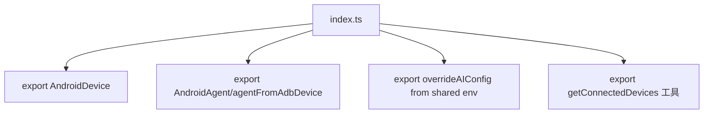

# 核心功能
- 作为 Android 集成包入口，重新导出设备、代理、环境配置覆盖以及设备发现工具。
- 便于外部通过单一入口创建 `AndroidAgent` 或直接获取已连接设备列表。

# 逻辑流程

# 关键细节
- 核心输出：设备类、代理类与类型别名 `AndroidAgentOpt`；工具函数 `getConnectedDevices`；环境配置覆盖函数 `overrideAIConfig`。
- 运行时无逻辑，作用是组织导出路径，减少调用方耦合。
- 数据流：直接从子模块/外部包导出符号，供上层 import。

# 跨文件调用关系
- 本文件调用：引用同目录下 `device.ts`、`agent.ts`、`utils.ts` 以及 `@midscene/shared/env`。
- 被调用场景：其他包使用 `@midscene/android` 时通过此入口获取所有能力；`core` 或 `cli` 在运行 Android 自动化时依赖这些导出。
