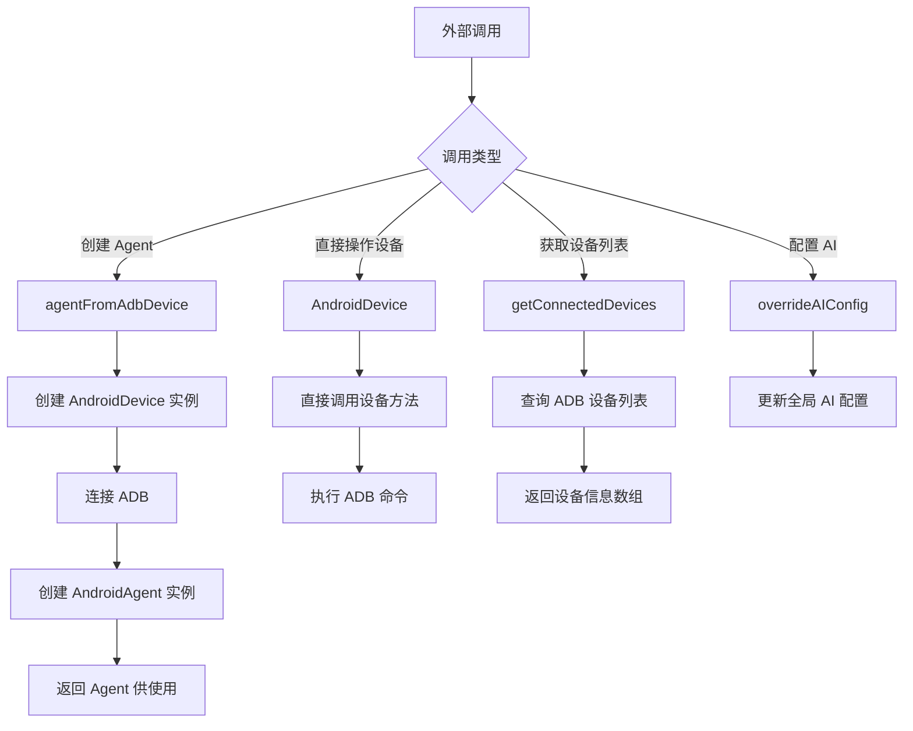

# index.ts

## 0. 文件概述
Android 包的入口文件，负责导出核心类、函数和类型定义，作为外部调用 Android 自动化功能的统一接口。

## 1. 核心功能

### 1.1 设备类导出
- **功能说明**：导出 `AndroidDevice` 类，该类封装了与 Android 设备交互的所有底层操作
- **实现细节**：通过 `export { AndroidDevice } from './device'` 将设备类暴露给外部使用者
- **应用场景**：当开发者需要直接操作 Android 设备时（截图、点击、滑动等）可使用此类

### 1.2 代理类导出
- **功能说明**：导出 `AndroidAgent` 类和工厂函数 `agentFromAdbDevice`
- **实现细节**：
  - `AndroidAgent`：基于 `AndroidDevice` 的高级代理类，提供 AI 驱动的自动化能力
  - `agentFromAdbDevice`：工厂函数，用于从 ADB 设备 ID 创建 AndroidAgent 实例
- **应用场景**：开发者可通过 Agent 使用自然语言描述的方式进行 UI 自动化操作

### 1.3 类型定义导出
- **功能说明**：导出 `AndroidAgentOpt` 类型，定义 AndroidAgent 的配置选项
- **实现细节**：通过 `export type` 导出类型定义，支持 TypeScript 类型检查
- **应用场景**：为使用者提供类型安全的配置项

### 1.4 AI 配置导出
- **功能说明**：导出 `overrideAIConfig` 函数，允许覆盖 AI 模型配置
- **实现细节**：从 `@midscene/shared/env` 导入并重新导出
- **应用场景**：用户可自定义 AI 模型的配置参数（如 API Key、模型名称等）

### 1.5 工具函数导出
- **功能说明**：导出 `getConnectedDevices` 函数，用于获取已连接的 Android 设备列表
- **实现细节**：从 `./utils` 模块导入并导出
- **应用场景**：在初始化 Agent 前，可先获取设备列表供用户选择

## 2. 逻辑流程

**流程说明**：
1. 外部调用者通过入口文件导入所需的类或函数
2. 根据使用场景选择不同的导出项：
   - 如需 AI 驱动的自动化，使用 `agentFromAdbDevice` 创建 Agent
   - 如需底层设备操作，直接使用 `AndroidDevice` 类
   - 如需查看可用设备，调用 `getConnectedDevices`
3. 各导出项内部会调用相应模块的实现逻辑

## 3. 关键细节

### 3.1 核心变量
- **AndroidDevice**：设备操作类，封装所有 ADB 交互逻辑
- **AndroidAgent**：代理类，继承自核心 Agent，添加 Android 特定功能
- **agentFromAdbDevice**：工厂函数，简化 Agent 创建流程
- **AndroidAgentOpt**：类型定义，规范 Agent 配置项结构

### 3.2 条件判断逻辑
- 本文件无条件判断逻辑，纯粹是导出声明

### 3.3 异常处理机制
- 异常处理委托给被导出的模块（device.ts、agent.ts、utils.ts）

### 3.4 数据流转路径
- **输入**：无直接输入，作为模块入口提供导出
- **处理**：聚合并重新导出其他模块的功能
- **输出**：类、函数、类型定义等供外部使用

## 4. 跨文件调用关系

### 4.1 该文件调用的其他文件
| 被调用文件 | 调用内容 | 调用场景 |
|----------|---------|---------|
| `./device` | `AndroidDevice` | 导出设备操作类 |
| `./agent` | `AndroidAgent`, `agentFromAdbDevice`, `AndroidAgentOpt` | 导出代理类和工厂函数 |
| `@midscene/shared/env` | `overrideAIConfig` | 导出 AI 配置函数 |
| `./utils` | `getConnectedDevices` | 导出设备查询工具 |

### 4.2 调用该文件的其他文件
| 调用文件 | 调用场景 | 使用的导出项 |
|---------|---------|-------------|
| `demo/playground.ts` | Playground 演示程序 | `agentFromAdbDevice`, `getConnectedDevices` |
| 外部应用 | Android 自动化测试/脚本 | 所有导出项 |
| 测试文件 | 单元测试和集成测试 | 所有导出项 |
