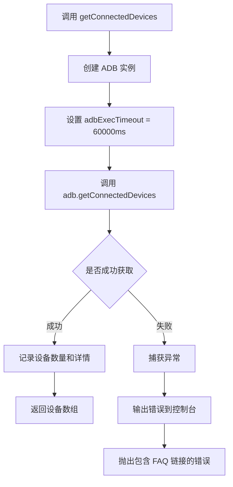

# utils.ts

## 0. 文件概述
Android 设备工具函数模块，提供获取已连接 Android 设备列表的功能。

## 1. 核心功能

### 1.1 获取已连接设备列表
- **功能说明**：`getConnectedDevices` 函数查询当前通过 ADB 连接的所有 Android 设备
- **实现细节**：
  - 创建 ADB 实例，设置 60 秒超时
  - 调用 `adb.getConnectedDevices()` 获取设备列表
  - 每个设备包含 udid（设备唯一标识符）和 state（设备状态）等信息
  - 通过 debugUtils 记录找到的设备数量和详情
- **应用场景**：
  - 在初始化 Agent 前列出可用设备供用户选择
  - 自动选择第一个可用设备
  - 检查设备连接状态

## 2. 逻辑流程

**流程说明**：
1. 函数被调用时创建临时 ADB 实例
2. 配置 60 秒执行超时以应对慢速设备
3. 调用 ADB 的 `getConnectedDevices()` 方法查询设备
4. 成功时记录调试信息并返回设备数组
5. 失败时在控制台输出原始错误，并抛出包含故障排查链接的新错误

## 3. 关键细节

### 3.1 核心变量
- **debugUtils**：调试日志记录器，命名空间为 `android:utils`
- **adb**：临时创建的 ADB 实例，仅用于查询设备
- **devices**：`Device[]` 类型，包含设备信息的数组
- **adbExecTimeout**：60000 毫秒（60 秒），防止查询操作超时

### 3.2 条件判断逻辑
- **try-catch 包裹**：整个函数逻辑包裹在 try-catch 中，确保异常能被正确处理

### 3.3 异常处理机制
- **双层错误处理**：
  - 第一层：`console.error` 输出原始错误信息，方便开发者调试
  - 第二层：抛出新的 Error 对象，包含用户友好的错误消息和 FAQ 链接
- **错误链保留**：通过 `cause: error` 保留原始错误信息
- **用户指引**：错误消息中包含完整的 FAQ 文档链接

### 3.4 数据流转路径
- **输入**：无参数（查询系统当前状态）
- **处理**：
  1. 创建 ADB 客户端
  2. 查询设备列表
  3. 记录调试信息
- **输出**：`Promise<Device[]>`，每个 Device 对象包含：
  - `udid`：设备唯一标识符
  - `state`：设备状态（如 "device", "offline" 等）
  - 其他 ADB 提供的设备元数据

## 4. 跨文件调用关系

### 4.1 该文件调用的其他文件
| 被调用文件 | 调用内容 | 调用场景 |
|----------|---------|---------|
| `@midscene/shared/logger` | `getDebug` | 创建调试日志记录器 |
| `appium-adb` | `ADB`, `Device` 类型 | ADB 客户端和设备类型定义 |

### 4.2 调用该文件的其他文件
| 调用文件 | 调用场景 | 使用的导出项 |
|---------|---------|-------------|
| `./agent.ts` | `agentFromAdbDevice` 中自动选择设备 | `getConnectedDevices` |
| `./index.ts` | 模块入口导出 | `getConnectedDevices` |
| `demo/playground.ts` | Playground 列出可用设备 | `getConnectedDevices` |
| 外部应用 | 设备选择界面 | `getConnectedDevices` |
