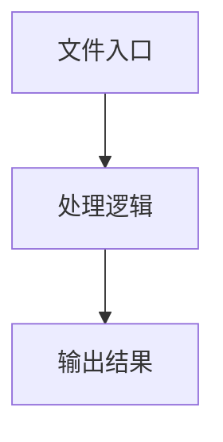

# config-factory.ts

## 0. 文件概述
config-factory.ts - TypeScript/JavaScript 源文件

## 1. 核心功能

### 1.1 导出项
- `export const defaultConfig = {`
- `export interface ConfigFactoryOptions {`
- `export interface ParsedConfig {`
- `export async function parseConfigYaml(`
- `export async function createConfig(`
- `export async function createFilesConfig(`

### 1.2 类定义
- 无类定义

### 1.3 函数定义  
- **expandFilePatterns()**: 函数
- **parseConfigYaml()**: 函数
- **createConfig()**: 函数
- **createFilesConfig()**: 函数

### 1.4 常量定义
- **defaultConfig**: 常量
- **allFiles**: 常量
- **yamlFiles**: 常量
- **basePath**: 常量
- **configContent**: 常量
- **interpolatedContent**: 常量
- **files**: 常量
- **configFileName**: 常量
- **timestamp**: 常量
- **defaultSummary**: 常量
- **config**: 常量
- **parsedConfig**: 常量
- **globalConfig**: 常量
- **keepWindow**: 常量
- **headed**: 常量
- **finalHeaded**: 常量
- **files**: 常量
- **timestamp**: 常量
- **defaultSummary**: 常量
- **keepWindow**: 常量
- **headed**: 常量
- **finalHeaded**: 常量

## 2. 逻辑流程

**流程说明**: 该文件实现特定功能，通过导入依赖模块，定义类/函数/常量，并导出供其他模块使用。

## 3. 关键细节

### 3.1 核心变量
- **defaultConfig**: 定义的常量
- **allFiles**: 定义的常量
- **yamlFiles**: 定义的常量
- **basePath**: 定义的常量
- **configContent**: 定义的常量
- **interpolatedContent**: 定义的常量
- **files**: 定义的常量
- **configFileName**: 定义的常量
- **timestamp**: 定义的常量
- **defaultSummary**: 定义的常量
- **config**: 定义的常量
- **parsedConfig**: 定义的常量
- **globalConfig**: 定义的常量
- **keepWindow**: 定义的常量
- **headed**: 定义的常量
- **finalHeaded**: 定义的常量
- **files**: 定义的常量
- **timestamp**: 定义的常量
- **defaultSummary**: 定义的常量
- **keepWindow**: 定义的常量
- **headed**: 定义的常量
- **finalHeaded**: 定义的常量

### 3.2 依赖项
- `import { readFileSync } from 'node:fs';`
- `import { basename, dirname, extname, resolve } from 'node:path';`
- `import { cwd } from 'node:process';`
- `import type {`
- `import { interpolateEnvVars } from '@midscene/core/yaml';`

（共 9 个导入项）

## 4. 跨文件调用关系

### 4.1 该文件调用的其他文件
根据 import 语句，该文件依赖以下模块：
- import { readFileSync } from 'node:fs';
- import { basename, dirname, extname, resolve } from 'node:path';
- import { cwd } from 'node:process';

### 4.2 调用该文件的其他文件
该文件通过以下导出项被其他模块使用：
- export const defaultConfig = {
- export interface ConfigFactoryOptions {
- export interface ParsedConfig {
