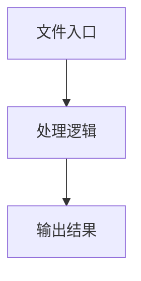

# create-yaml-player.ts

## 0. 文件概述
create-yaml-player.ts - TypeScript/JavaScript 源文件

## 1. 核心功能

### 1.1 导出项
- `export interface SingleYamlExecutionResult {`
- `export const launchServer = async (`
- `export async function createYamlPlayer(`

### 1.2 类定义
- 无类定义

### 1.3 函数定义  
- **resolveTestId()**: 函数
- **buildAgentOptions()**: 函数
- **createYamlPlayer()**: 函数

### 1.4 常量定义
- **debug**: 常量
- **launchServer**: 常量
- **server**: 常量
- **yamlScript**: 常量
- **clonedYamlScript**: 常量
- **fileName**: 常量
- **preference**: 常量
- **player**: 常量
- **freeFn**: 常量
- **webTarget**: 常量
- **targetCount**: 常量
- **specifiedTargets**: 常量
- **serverAddress**: 常量
- **agent**: 常量
- **androidTarget**: 常量
- **agent**: 常量
- **iosTarget**: 常量
- **agent**: 常量
- **interfaceTarget**: 常量
- **moduleSpecifier**: 常量
- **resolvedPath**: 常量
- **importedModule**: 常量
- **DeviceClass**: 常量
- **device**: 常量
- **agent**: 常量

## 2. 逻辑流程

**流程说明**: 该文件实现特定功能，通过导入依赖模块，定义类/函数/常量，并导出供其他模块使用。

## 3. 关键细节

### 3.1 核心变量
- **debug**: 定义的常量
- **launchServer**: 定义的常量
- **server**: 定义的常量
- **yamlScript**: 定义的常量
- **clonedYamlScript**: 定义的常量
- **fileName**: 定义的常量
- **preference**: 定义的常量
- **player**: 定义的常量
- **freeFn**: 定义的常量
- **webTarget**: 定义的常量
- **targetCount**: 定义的常量
- **specifiedTargets**: 定义的常量
- **serverAddress**: 定义的常量
- **agent**: 定义的常量
- **androidTarget**: 定义的常量
- **agent**: 定义的常量
- **iosTarget**: 定义的常量
- **agent**: 定义的常量
- **interfaceTarget**: 定义的常量
- **moduleSpecifier**: 定义的常量
- **resolvedPath**: 定义的常量
- **importedModule**: 定义的常量
- **DeviceClass**: 定义的常量
- **device**: 定义的常量
- **agent**: 定义的常量

### 3.2 依赖项
- `import { readFileSync } from 'node:fs';`
- `import path, { basename, extname, join } from 'node:path';`
- `import { ScriptPlayer, parseYamlScript } from '@midscene/core/yaml';`
- `import { createServer } from 'http-server';`
- `import assert from 'node:assert';`

（共 15 个导入项）

## 4. 跨文件调用关系

### 4.1 该文件调用的其他文件
根据 import 语句，该文件依赖以下模块：
- import { readFileSync } from 'node:fs';
- import path, { basename, extname, join } from 'node:path';
- import { ScriptPlayer, parseYamlScript } from '@midscene/core/yaml';

### 4.2 调用该文件的其他文件
该文件通过以下导出项被其他模块使用：
- export interface SingleYamlExecutionResult {
- export const launchServer = async (
- export async function createYamlPlayer(
