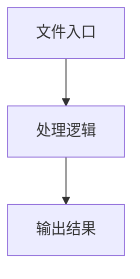

# agent.ts

## 0. 文件概述
agent.ts - TypeScript/JavaScript 源文件

## 1. 核心功能

### 1.1 导出项
- `export type TestStatus =`
- `export type AiActOptions = {`
- `export class Agent<`
- `export const createAgent = (`

### 1.2 类定义
- **Agent**: 类定义

### 1.3 函数定义  
- **that()**: 函数
- **to()**: 函数
- **to()**: 函数

### 1.4 常量定义
- **debug**: 常量
- **distanceOfTwoPoints**: 常量
- **includedInRect**: 常量
- **defaultServiceExtractOption**: 常量
- **CACHE_STRATEGIES**: 常量
- **isValidCacheStrategy**: 常量
- **CACHE_STRATEGY_VALUES**: 常量
- **legacyScrollTypeMap**: 常量
- **normalizeScrollType**: 常量
- **defaultReplanningCycleLimit**: 常量
- **defaultVlmUiTarsReplanningCycleLimit**: 常量
- **pageWidth**: 常量
- **computedScale**: 常量
- **envConfig**: 常量
- **envReplanningCycleLimitRaw**: 常量
- **envReplanningCycleLimit**: 常量
- **resolvedAiActContext**: 常量
- **hasCustomConfig**: 常量
- **cacheConfigObj**: 常量
- **baseActionSpace**: 常量
- **fullActionSpace**: 常量
- **executionDump**: 常量
- **dumpString**: 常量
- **commonAssertionAction**: 常量
- **computedScreenshotScale**: 常量
- **scaleForLog**: 常量
- **targetWidth**: 常量
- **targetHeight**: 常量
- **currentDump**: 常量
- **existingIndex**: 常量
- **param**: 常量
- **tip**: 常量
- **actionPlan**: 常量
- **plans**: 常量
- **title**: 常量
- **defaultIntentModelConfig**: 常量
- **modelConfigForPlanning**: 常量
- **detailedLocateParam**: 常量
- **detailedLocateParam**: 常量
- **detailedLocateParam**: 常量
- **detailedLocateParam**: 常量
- **optWithValue**: 常量
- **detailedLocateParam**: 常量
- **stringValue**: 常量
- **detailedLocateParam**: 常量
- **normalizedScrollType**: 常量
- **detailedLocateParam**: 常量
- **modelConfigForPlanning**: 常量
- **defaultIntentModelConfig**: 常量
- **includeBboxInPlanning**: 常量
- **cacheable**: 常量
- **replanningCycleLimit**: 常量
- **isVlmUiTars**: 常量
- **matchedCache**: 常量
- **yaml**: 常量
- **useDeepThink**: 常量
- **imagesIncludeCount**: 常量
- **yamlContent**: 常量
- **yamlFlowStr**: 常量
- **modelConfig**: 常量
- **modelConfig**: 常量
- **modelConfig**: 常量
- **modelConfig**: 常量
- **modelConfig**: 常量
- **text**: 常量
- **distance**: 常量
- **included**: 常量
- **pass**: 常量
- **verifyResult**: 常量
- **locateParam**: 常量
- **locatePlan**: 常量
- **plans**: 常量
- **defaultIntentModelConfig**: 常量
- **modelConfigForPlanning**: 常量
- **dprValue**: 常量
- **dprEntry**: 常量
- **modelConfig**: 常量
- **serviceOpt**: 常量
- **assertionText**: 常量
- **pass**: 常量
- **message**: 常量
- **errorTask**: 常量
- **thought**: 常量
- **rawError**: 常量
- **rawMessage**: 常量
- **reason**: 常量
- **message**: 常量
- **modelConfig**: 常量
- **script**: 常量
- **player**: 常量
- **errors**: 常量
- **index**: 常量
- **base64**: 常量
- **now**: 常量
- **recorder**: 常量
- **task**: 常量
- **executionDump**: 常量
- **dumpString**: 常量
- **context**: 常量
- **cacheConfig**: 常量
- **id**: 常量
- **rawStrategy**: 常量
- **isReadOnly**: 常量
- **isWriteOnly**: 常量
- **createAgent**: 常量

## 2. 逻辑流程

**流程说明**: 该文件实现特定功能，通过导入依赖模块，定义类/函数/常量，并导出供其他模块使用。

## 3. 关键细节

### 3.1 核心变量
- **debug**: 定义的常量
- **distanceOfTwoPoints**: 定义的常量
- **includedInRect**: 定义的常量
- **defaultServiceExtractOption**: 定义的常量
- **CACHE_STRATEGIES**: 定义的常量
- **isValidCacheStrategy**: 定义的常量
- **CACHE_STRATEGY_VALUES**: 定义的常量
- **legacyScrollTypeMap**: 定义的常量
- **normalizeScrollType**: 定义的常量
- **defaultReplanningCycleLimit**: 定义的常量
- **defaultVlmUiTarsReplanningCycleLimit**: 定义的常量
- **pageWidth**: 定义的常量
- **computedScale**: 定义的常量
- **envConfig**: 定义的常量
- **envReplanningCycleLimitRaw**: 定义的常量
- **envReplanningCycleLimit**: 定义的常量
- **resolvedAiActContext**: 定义的常量
- **hasCustomConfig**: 定义的常量
- **cacheConfigObj**: 定义的常量
- **baseActionSpace**: 定义的常量
- **fullActionSpace**: 定义的常量
- **executionDump**: 定义的常量
- **dumpString**: 定义的常量
- **commonAssertionAction**: 定义的常量
- **computedScreenshotScale**: 定义的常量
- **scaleForLog**: 定义的常量
- **targetWidth**: 定义的常量
- **targetHeight**: 定义的常量
- **currentDump**: 定义的常量
- **existingIndex**: 定义的常量
- **param**: 定义的常量
- **tip**: 定义的常量
- **actionPlan**: 定义的常量
- **plans**: 定义的常量
- **title**: 定义的常量
- **defaultIntentModelConfig**: 定义的常量
- **modelConfigForPlanning**: 定义的常量
- **detailedLocateParam**: 定义的常量
- **detailedLocateParam**: 定义的常量
- **detailedLocateParam**: 定义的常量
- **detailedLocateParam**: 定义的常量
- **optWithValue**: 定义的常量
- **detailedLocateParam**: 定义的常量
- **stringValue**: 定义的常量
- **detailedLocateParam**: 定义的常量
- **normalizedScrollType**: 定义的常量
- **detailedLocateParam**: 定义的常量
- **modelConfigForPlanning**: 定义的常量
- **defaultIntentModelConfig**: 定义的常量
- **includeBboxInPlanning**: 定义的常量
- **cacheable**: 定义的常量
- **replanningCycleLimit**: 定义的常量
- **isVlmUiTars**: 定义的常量
- **matchedCache**: 定义的常量
- **yaml**: 定义的常量
- **useDeepThink**: 定义的常量
- **imagesIncludeCount**: 定义的常量
- **yamlContent**: 定义的常量
- **yamlFlowStr**: 定义的常量
- **modelConfig**: 定义的常量
- **modelConfig**: 定义的常量
- **modelConfig**: 定义的常量
- **modelConfig**: 定义的常量
- **modelConfig**: 定义的常量
- **text**: 定义的常量
- **distance**: 定义的常量
- **included**: 定义的常量
- **pass**: 定义的常量
- **verifyResult**: 定义的常量
- **locateParam**: 定义的常量
- **locatePlan**: 定义的常量
- **plans**: 定义的常量
- **defaultIntentModelConfig**: 定义的常量
- **modelConfigForPlanning**: 定义的常量
- **dprValue**: 定义的常量
- **dprEntry**: 定义的常量
- **modelConfig**: 定义的常量
- **serviceOpt**: 定义的常量
- **assertionText**: 定义的常量
- **pass**: 定义的常量
- **message**: 定义的常量
- **errorTask**: 定义的常量
- **thought**: 定义的常量
- **rawError**: 定义的常量
- **rawMessage**: 定义的常量
- **reason**: 定义的常量
- **message**: 定义的常量
- **modelConfig**: 定义的常量
- **script**: 定义的常量
- **player**: 定义的常量
- **errors**: 定义的常量
- **index**: 定义的常量
- **base64**: 定义的常量
- **now**: 定义的常量
- **recorder**: 定义的常量
- **task**: 定义的常量
- **executionDump**: 定义的常量
- **dumpString**: 定义的常量
- **context**: 定义的常量
- **cacheConfig**: 定义的常量
- **id**: 定义的常量
- **rawStrategy**: 定义的常量
- **isReadOnly**: 定义的常量
- **isWriteOnly**: 定义的常量
- **createAgent**: 定义的常量

### 3.2 依赖项
- `import {`
- `import yaml from 'js-yaml';`
- `import {`
- `import {`
- `import type { AbstractInterface } from '@/device';`

（共 15 个导入项）

## 4. 跨文件调用关系

### 4.1 该文件调用的其他文件
根据 import 语句，该文件依赖以下模块：
- import {
- import yaml from 'js-yaml';
- import {

### 4.2 调用该文件的其他文件
该文件通过以下导出项被其他模块使用：
- export type TestStatus =
- export type AiActOptions = {
- export class Agent<
