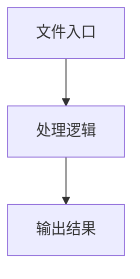

# task-cache.ts

## 0. 文件概述
task-cache.ts - TypeScript/JavaScript 源文件

## 1. 核心功能

### 1.1 导出项
- `export const debug = getDebug('cache');`
- `export interface PlanningCache {`
- `export interface LocateCache {`
- `export interface MatchCacheResult<T extends PlanningCache | LocateCache> {`
- `export type CacheFileContent = {`
- `export const cacheFileExt = '.cache.yaml';`
- `export class TaskCache {`

### 1.2 类定义
- **TaskCache**: 类定义

### 1.3 函数定义  
- 无函数定义

### 1.4 常量定义
- **DEFAULT_CACHE_MAX_FILENAME_LENGTH**: 常量
- **debug**: 常量
- **lowestSupportedMidsceneVersion**: 常量
- **cacheFileExt**: 常量
- **cacheMaxFilenameLength**: 常量
- **prefix**: 常量
- **hash**: 常量
- **readOnlyMode**: 常量
- **writeOnlyMode**: 常量
- **promptStr**: 常量
- **item**: 常量
- **key**: 常量
- **locateItem**: 常量
- **cacheFile**: 常量
- **jsonTypeCacheFile**: 常量
- **data**: 常量
- **jsonData**: 常量
- **version**: 常量
- **version**: 常量
- **originalLength**: 常量
- **usedIndices**: 常量
- **parts**: 常量
- **index**: 常量
- **isUsed**: 常量
- **isNew**: 常量
- **removedCount**: 常量
- **dir**: 常量
- **sortedCaches**: 常量
- **cacheToWrite**: 常量
- **yamlData**: 常量
- **locateCache**: 常量

## 2. 逻辑流程

**流程说明**: 该文件实现特定功能，通过导入依赖模块，定义类/函数/常量，并导出供其他模块使用。

## 3. 关键细节

### 3.1 核心变量
- **DEFAULT_CACHE_MAX_FILENAME_LENGTH**: 定义的常量
- **debug**: 定义的常量
- **lowestSupportedMidsceneVersion**: 定义的常量
- **cacheFileExt**: 定义的常量
- **cacheMaxFilenameLength**: 定义的常量
- **prefix**: 定义的常量
- **hash**: 定义的常量
- **readOnlyMode**: 定义的常量
- **writeOnlyMode**: 定义的常量
- **promptStr**: 定义的常量
- **item**: 定义的常量
- **key**: 定义的常量
- **locateItem**: 定义的常量
- **cacheFile**: 定义的常量
- **jsonTypeCacheFile**: 定义的常量
- **data**: 定义的常量
- **jsonData**: 定义的常量
- **version**: 定义的常量
- **version**: 定义的常量
- **originalLength**: 定义的常量
- **usedIndices**: 定义的常量
- **parts**: 定义的常量
- **index**: 定义的常量
- **isUsed**: 定义的常量
- **isNew**: 定义的常量
- **removedCount**: 定义的常量
- **dir**: 定义的常量
- **sortedCaches**: 定义的常量
- **cacheToWrite**: 定义的常量
- **yamlData**: 定义的常量
- **locateCache**: 定义的常量

### 3.2 依赖项
- `import assert from 'node:assert';`
- `import { existsSync, mkdirSync, readFileSync, writeFileSync } from 'node:fs';`
- `import { dirname, join } from 'node:path';`
- `import { isDeepStrictEqual } from 'node:util';`
- `import type { TUserPrompt } from '@/ai-model';`

（共 15 个导入项）

## 4. 跨文件调用关系

### 4.1 该文件调用的其他文件
根据 import 语句，该文件依赖以下模块：
- import assert from 'node:assert';
- import { existsSync, mkdirSync, readFileSync, writeFileSync } from 'node:fs';
- import { dirname, join } from 'node:path';

### 4.2 调用该文件的其他文件
该文件通过以下导出项被其他模块使用：
- export const debug = getDebug('cache');
- export interface PlanningCache {
- export interface LocateCache {
