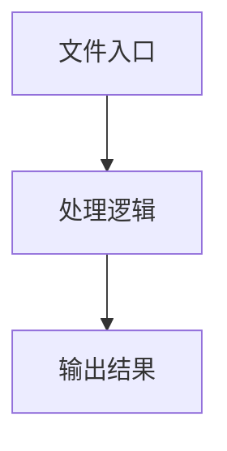

# tasks.ts

## 0. 文件概述
tasks.ts - TypeScript/JavaScript 源文件

## 1. 核心功能

### 1.1 导出项
- `export { locatePlanForLocate } from './task-builder';`
- `export { TaskExecutionError };`
- `export class TaskExecutor {`

### 1.2 类定义
- **TaskExecutor**: 类定义

### 1.3 函数定义  
- **createTypeQueryTask()**: 函数

### 1.4 常量定义
- **debug**: 常量
- **maxErrorCountAllowedInOnePlanningLoop**: 常量
- **session**: 常量
- **task**: 常量
- **runner**: 常量
- **session**: 常量
- **runner**: 常量
- **result**: 常量
- **session**: 常量
- **runner**: 常量
- **yamlFlow**: 常量
- **replanningCycleLimit**: 常量
- **result**: 常量
- **startTime**: 常量
- **uiTarsModelVersion**: 常量
- **actionSpace**: 常量
- **planResult**: 常量
- **finalActions**: 常量
- **timeNow**: 常量
- **timeRemaining**: 常量
- **planResult**: 常量
- **plans**: 常量
- **errorMsg**: 常量
- **finalResult**: 常量
- **queryTask**: 常量
- **applyDump**: 常量
- **uiContext**: 常量
- **ifTypeRestricted**: 常量
- **booleanPrompt**: 常量
- **tree**: 常量
- **session**: 常量
- **queryTask**: 常量
- **runner**: 常量
- **result**: 常量
- **description**: 常量
- **session**: 常量
- **runner**: 常量
- **overallStartTime**: 常量
- **currentCheckStart**: 常量
- **queryTask**: 常量
- **result**: 常量
- **now**: 常量
- **timeRemaining**: 常量
- **sleepTask**: 常量

## 2. 逻辑流程

**流程说明**: 该文件实现特定功能，通过导入依赖模块，定义类/函数/常量，并导出供其他模块使用。

## 3. 关键细节

### 3.1 核心变量
- **debug**: 定义的常量
- **maxErrorCountAllowedInOnePlanningLoop**: 定义的常量
- **session**: 定义的常量
- **task**: 定义的常量
- **runner**: 定义的常量
- **session**: 定义的常量
- **runner**: 定义的常量
- **result**: 定义的常量
- **session**: 定义的常量
- **runner**: 定义的常量
- **yamlFlow**: 定义的常量
- **replanningCycleLimit**: 定义的常量
- **result**: 定义的常量
- **startTime**: 定义的常量
- **uiTarsModelVersion**: 定义的常量
- **actionSpace**: 定义的常量
- **planResult**: 定义的常量
- **finalActions**: 定义的常量
- **timeNow**: 定义的常量
- **timeRemaining**: 定义的常量
- **planResult**: 定义的常量
- **plans**: 定义的常量
- **errorMsg**: 定义的常量
- **finalResult**: 定义的常量
- **queryTask**: 定义的常量
- **applyDump**: 定义的常量
- **uiContext**: 定义的常量
- **ifTypeRestricted**: 定义的常量
- **booleanPrompt**: 定义的常量
- **tree**: 定义的常量
- **session**: 定义的常量
- **queryTask**: 定义的常量
- **runner**: 定义的常量
- **result**: 定义的常量
- **description**: 定义的常量
- **session**: 定义的常量
- **runner**: 定义的常量
- **overallStartTime**: 定义的常量
- **currentCheckStart**: 定义的常量
- **queryTask**: 定义的常量
- **result**: 定义的常量
- **now**: 定义的常量
- **timeRemaining**: 定义的常量
- **sleepTask**: 定义的常量

### 3.2 依赖项
- `import { ConversationHistory, plan, uiTarsPlanning } from '@/ai-model';`
- `import type { TMultimodalPrompt, TUserPrompt } from '@/common';`
- `import type { AbstractInterface } from '@/device';`
- `import type Service from '@/service';`
- `import type { TaskRunner } from '@/task-runner';`

（共 17 个导入项）

## 4. 跨文件调用关系

### 4.1 该文件调用的其他文件
根据 import 语句，该文件依赖以下模块：
- import { ConversationHistory, plan, uiTarsPlanning } from '@/ai-model';
- import type { TMultimodalPrompt, TUserPrompt } from '@/common';
- import type { AbstractInterface } from '@/device';

### 4.2 调用该文件的其他文件
该文件通过以下导出项被其他模块使用：
- export { locatePlanForLocate } from './task-builder';
- export { TaskExecutionError };
- export class TaskExecutor {
