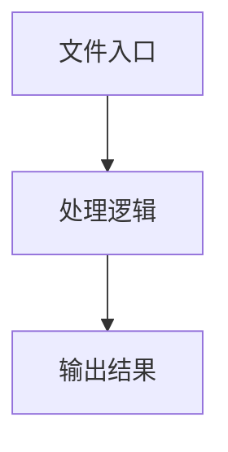

# ui-utils.ts

## 0. 文件概述
ui-utils.ts - TypeScript/JavaScript 源文件

## 1. 核心功能

### 1.1 导出项
- `export function typeStr(task: ExecutionTask) {`
- `export function locateParamStr(locate?: DetailedLocateParam | string): string {`
- `export function scrollParamStr(scrollParam?: ScrollParam) {`
- `export function pullParamStr(pullParam?: PullParam) {`
- `export function extractInsightParam(taskParam: any): {`
- `export function taskTitleStr(`
- `export function paramStr(task: ExecutionTask) {`

### 1.2 类定义
- 无类定义

### 1.3 函数定义  
- **typeStr()**: 函数
- **locateParamStr()**: 函数
- **scrollParamStr()**: 函数
- **pullParamStr()**: 函数
- **extractInsightParam()**: 函数
- **taskTitleStr()**: 函数
- **paramStr()**: 函数

### 1.4 常量定义
- **prompt**: 常量
- **parts**: 常量
- **extractImages**: 常量
- **toContent**: 常量
- **planTask**: 常量
- **locate**: 常量
- **locateStr**: 常量
- **locateStr**: 常量

## 2. 逻辑流程

**流程说明**: 该文件实现特定功能，通过导入依赖模块，定义类/函数/常量，并导出供其他模块使用。

## 3. 关键细节

### 3.1 核心变量
- **prompt**: 定义的常量
- **parts**: 定义的常量
- **extractImages**: 定义的常量
- **toContent**: 定义的常量
- **planTask**: 定义的常量
- **locate**: 定义的常量
- **locateStr**: 定义的常量
- **locateStr**: 定义的常量

### 3.2 依赖项
- `import type {`

## 4. 跨文件调用关系

### 4.1 该文件调用的其他文件
根据 import 语句，该文件依赖以下模块：
- import type {

### 4.2 调用该文件的其他文件
该文件通过以下导出项被其他模块使用：
- export function typeStr(task: ExecutionTask) {
- export function locateParamStr(locate?: DetailedLocateParam | string): string {
- export function scrollParamStr(scrollParam?: ScrollParam) {
