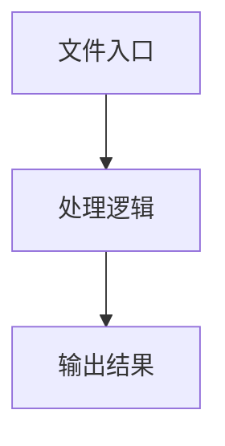

# utils.ts

## 0. 文件概述
utils.ts - TypeScript/JavaScript 源文件

## 1. 核心功能

### 1.1 导出项
- `export async function commonContextParser(`
- `export function getReportFileName(tag = 'web') {`
- `export function printReportMsg(filepath: string) {`
- `export function getCurrentExecutionFile(trace?: string): string | false {`
- `export function generateCacheId(fileName?: string): string {`
- `export function ifPlanLocateParamIsBbox(`
- `export function matchElementFromPlan(`
- `export async function matchElementFromCache(`
- `export const getMidsceneVersion = (): string => {`
- `export const parsePrompt = (`

### 1.2 类定义
- 无类定义

### 1.3 函数定义  
- **commonContextParser()**: 函数
- **getReportFileName()**: 函数
- **printReportMsg()**: 函数
- **getCurrentExecutionFile()**: 函数
- **generateCacheId()**: 函数
- **ifPlanLocateParamIsBbox()**: 函数
- **matchElementFromPlan()**: 函数
- **matchElementFromCache()**: 函数

### 1.4 常量定义
- **debugProfile**: 常量
- **description**: 常量
- **screenshotBase64**: 常量
- **size**: 常量
- **reportTagName**: 常量
- **dateTimeInFileName**: 常量
- **uniqueId**: 常量
- **error**: 常量
- **stackTrace**: 常量
- **pkgDir**: 常量
- **stackLines**: 常量
- **match**: 常量
- **targetFileName**: 常量
- **testFileIndex**: 常量
- **currentIndex**: 常量
- **centerPosition**: 常量
- **element**: 常量
- **rect**: 常量
- **element**: 常量
- **getMidsceneVersion**: 常量
- **parsePrompt**: 常量

## 2. 逻辑流程

**流程说明**: 该文件实现特定功能，通过导入依赖模块，定义类/函数/常量，并导出供其他模块使用。

## 3. 关键细节

### 3.1 核心变量
- **debugProfile**: 定义的常量
- **description**: 定义的常量
- **screenshotBase64**: 定义的常量
- **size**: 定义的常量
- **reportTagName**: 定义的常量
- **dateTimeInFileName**: 定义的常量
- **uniqueId**: 定义的常量
- **error**: 定义的常量
- **stackTrace**: 定义的常量
- **pkgDir**: 定义的常量
- **stackLines**: 定义的常量
- **match**: 定义的常量
- **targetFileName**: 定义的常量
- **testFileIndex**: 定义的常量
- **currentIndex**: 定义的常量
- **centerPosition**: 定义的常量
- **element**: 定义的常量
- **rect**: 定义的常量
- **element**: 定义的常量
- **getMidsceneVersion**: 定义的常量
- **parsePrompt**: 定义的常量

### 3.2 依赖项
- `import type { TMultimodalPrompt, TUserPrompt } from '@/common';`
- `import type { AbstractInterface } from '@/device';`
- `import type {`
- `import { uploadTestInfoToServer } from '@/utils';`
- `import {`

（共 12 个导入项）

## 4. 跨文件调用关系

### 4.1 该文件调用的其他文件
根据 import 语句，该文件依赖以下模块：
- import type { TMultimodalPrompt, TUserPrompt } from '@/common';
- import type { AbstractInterface } from '@/device';
- import type {

### 4.2 调用该文件的其他文件
该文件通过以下导出项被其他模块使用：
- export async function commonContextParser(
- export function getReportFileName(tag = 'web') {
- export function printReportMsg(filepath: string) {
