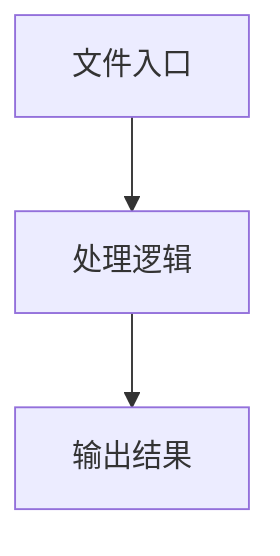

# inspect.ts

## 0. 文件概述
inspect.ts - TypeScript/JavaScript 源文件

## 1. 核心功能

### 1.1 导出项
- `export type AIArgs = [`
- `export async function AiLocateElement(options: {`
- `export async function AiLocateSection(options: {`
- `export async function AiExtractElementInfo<T>(options: {`
- `export async function AiJudgeOrderSensitive(`

### 1.2 类定义
- 无类定义

### 1.3 函数定义  
- **AiLocateElement()**: 函数
- **AiLocateSection()**: 函数
- **AiExtractElementInfo()**: 函数
- **AiJudgeOrderSensitive()**: 函数

### 1.4 常量定义
- **debugInspect**: 常量
- **debugSection**: 常量
- **extraTextFromUserPrompt**: 常量
- **promptsToChatParam**: 常量
- **msgs**: 常量
- **base64**: 常量
- **targetElementDescriptionText**: 常量
- **userInstructionPrompt**: 常量
- **systemPrompt**: 常量
- **paddedResult**: 常量
- **msgs**: 常量
- **addOns**: 常量
- **res**: 常量
- **rawResponse**: 常量
- **rectCenter**: 常量
- **element**: 常量
- **msg**: 常量
- **systemPrompt**: 常量
- **sectionLocatorInstructionText**: 常量
- **msgs**: 常量
- **addOns**: 常量
- **result**: 常量
- **sectionBbox**: 常量
- **targetRect**: 常量
- **referenceBboxList**: 常量
- **referenceRects**: 常量
- **mergedRect**: 常量
- **croppedResult**: 常量
- **systemPrompt**: 常量
- **extractDataPromptText**: 常量
- **userContent**: 常量
- **msgs**: 常量
- **addOns**: 常量
- **result**: 常量
- **systemPrompt**: 常量
- **userPrompt**: 常量
- **msgs**: 常量
- **result**: 常量

## 2. 逻辑流程

**流程说明**: 该文件实现特定功能，通过导入依赖模块，定义类/函数/常量，并导出供其他模块使用。

## 3. 关键细节

### 3.1 核心变量
- **debugInspect**: 定义的常量
- **debugSection**: 定义的常量
- **extraTextFromUserPrompt**: 定义的常量
- **promptsToChatParam**: 定义的常量
- **msgs**: 定义的常量
- **base64**: 定义的常量
- **targetElementDescriptionText**: 定义的常量
- **userInstructionPrompt**: 定义的常量
- **systemPrompt**: 定义的常量
- **paddedResult**: 定义的常量
- **msgs**: 定义的常量
- **addOns**: 定义的常量
- **res**: 定义的常量
- **rawResponse**: 定义的常量
- **rectCenter**: 定义的常量
- **element**: 定义的常量
- **msg**: 定义的常量
- **systemPrompt**: 定义的常量
- **sectionLocatorInstructionText**: 定义的常量
- **msgs**: 定义的常量
- **addOns**: 定义的常量
- **result**: 定义的常量
- **sectionBbox**: 定义的常量
- **targetRect**: 定义的常量
- **referenceBboxList**: 定义的常量
- **referenceRects**: 定义的常量
- **mergedRect**: 定义的常量
- **croppedResult**: 定义的常量
- **systemPrompt**: 定义的常量
- **extractDataPromptText**: 定义的常量
- **userContent**: 定义的常量
- **msgs**: 定义的常量
- **addOns**: 定义的常量
- **result**: 定义的常量
- **systemPrompt**: 定义的常量
- **userPrompt**: 定义的常量
- **msgs**: 定义的常量
- **result**: 定义的常量

### 3.2 依赖项
- `import type {`
- `import type { IModelConfig } from '@midscene/shared/env';`
- `import { generateElementByPosition } from '@midscene/shared/extractor/dom-util';`
- `import {`
- `import { getDebug } from '@midscene/shared/logger';`

（共 15 个导入项）

## 4. 跨文件调用关系

### 4.1 该文件调用的其他文件
根据 import 语句，该文件依赖以下模块：
- import type {
- import type { IModelConfig } from '@midscene/shared/env';
- import { generateElementByPosition } from '@midscene/shared/extractor/dom-util';

### 4.2 调用该文件的其他文件
该文件通过以下导出项被其他模块使用：
- export type AIArgs = [
- export async function AiLocateElement(options: {
- export async function AiLocateSection(options: {
