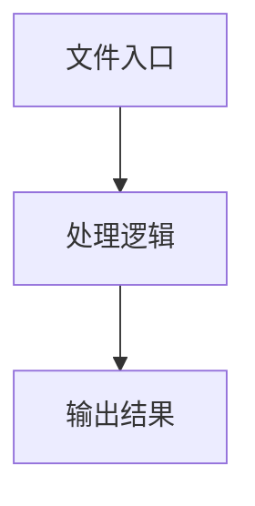

# llm-planning.ts

## 0. 文件概述
llm-planning.ts - TypeScript/JavaScript 源文件

## 1. 核心功能

### 1.1 导出项
- `export async function plan(`

### 1.2 类定义
- 无类定义

### 1.3 函数定义  
- **plan()**: 函数

### 1.4 常量定义
- **debug**: 常量
- **systemPrompt**: 常量
- **rightLimit**: 常量
- **bottomLimit**: 常量
- **paddedResult**: 常量
- **actionContext**: 常量
- **instruction**: 常量
- **historyLog**: 常量
- **msgs**: 常量
- **actions**: 常量
- **returnValue**: 常量
- **type**: 常量
- **actionInActionSpace**: 常量
- **locateFields**: 常量
- **locateResult**: 常量

## 2. 逻辑流程

**流程说明**: 该文件实现特定功能，通过导入依赖模块，定义类/函数/常量，并导出供其他模块使用。

## 3. 关键细节

### 3.1 核心变量
- **debug**: 定义的常量
- **systemPrompt**: 定义的常量
- **rightLimit**: 定义的常量
- **bottomLimit**: 定义的常量
- **paddedResult**: 定义的常量
- **actionContext**: 定义的常量
- **instruction**: 定义的常量
- **historyLog**: 定义的常量
- **msgs**: 定义的常量
- **actions**: 定义的常量
- **returnValue**: 定义的常量
- **type**: 定义的常量
- **actionInActionSpace**: 定义的常量
- **locateFields**: 定义的常量
- **locateResult**: 定义的常量

### 3.2 依赖项
- `import type {`
- `import type { IModelConfig } from '@midscene/shared/env';`
- `import { paddingToMatchBlockByBase64 } from '@midscene/shared/img';`
- `import { getDebug } from '@midscene/shared/logger';`
- `import { assert } from '@midscene/shared/utils';`

（共 10 个导入项）

## 4. 跨文件调用关系

### 4.1 该文件调用的其他文件
根据 import 语句，该文件依赖以下模块：
- import type {
- import type { IModelConfig } from '@midscene/shared/env';
- import { paddingToMatchBlockByBase64 } from '@midscene/shared/img';

### 4.2 调用该文件的其他文件
该文件通过以下导出项被其他模块使用：
- export async function plan(
