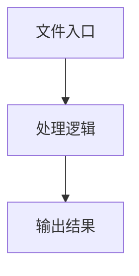

# llm-planning.ts

## 0. 文件概述
llm-planning.ts - TypeScript/JavaScript 源文件

## 1. 核心功能

### 1.1 导出项
- `export const descriptionForAction = (`
- `export async function systemPromptToTaskPlanning({`

### 1.2 类定义
- 无类定义

### 1.3 函数定义  
- **systemPromptToTaskPlanning()**: 函数

### 1.4 常量定义
- **commonOutputFields**: 常量
- **vlLocateParam**: 常量
- **descriptionForAction**: 常量
- **tab**: 常量
- **fields**: 常量
- **paramLines**: 常量
- **schema**: 常量
- **isZodObject**: 常量
- **shape**: 常量
- **isOptional**: 常量
- **keyWithOptional**: 常量
- **typeName**: 常量
- **description**: 常量
- **typeName**: 常量
- **description**: 常量
- **actionDescriptionList**: 常量
- **actionList**: 常量
- **logFieldInstruction**: 常量

## 2. 逻辑流程

**流程说明**: 该文件实现特定功能，通过导入依赖模块，定义类/函数/常量，并导出供其他模块使用。

## 3. 关键细节

### 3.1 核心变量
- **commonOutputFields**: 定义的常量
- **vlLocateParam**: 定义的常量
- **descriptionForAction**: 定义的常量
- **tab**: 定义的常量
- **fields**: 定义的常量
- **paramLines**: 定义的常量
- **schema**: 定义的常量
- **isZodObject**: 定义的常量
- **shape**: 定义的常量
- **isOptional**: 定义的常量
- **keyWithOptional**: 定义的常量
- **typeName**: 定义的常量
- **description**: 定义的常量
- **typeName**: 定义的常量
- **description**: 定义的常量
- **actionDescriptionList**: 定义的常量
- **actionList**: 定义的常量
- **logFieldInstruction**: 定义的常量

### 3.2 依赖项
- `import type { DeviceAction } from '@/types';`
- `import type { TVlModeTypes } from '@midscene/shared/env';`
- `import {`
- `import type { ResponseFormatJSONSchema } from 'openai/resources/index';`
- `import type { z } from 'zod';`

（共 6 个导入项）

## 4. 跨文件调用关系

### 4.1 该文件调用的其他文件
根据 import 语句，该文件依赖以下模块：
- import type { DeviceAction } from '@/types';
- import type { TVlModeTypes } from '@midscene/shared/env';
- import {

### 4.2 调用该文件的其他文件
该文件通过以下导出项被其他模块使用：
- export const descriptionForAction = (
- export async function systemPromptToTaskPlanning({
