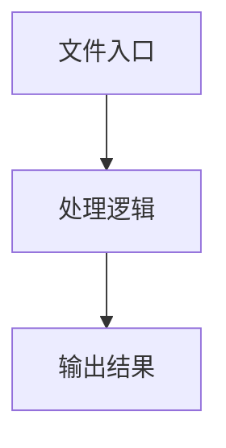

# playwright-generator.ts

## 0. 文件概述
playwright-generator.ts - TypeScript/JavaScript 源文件

## 1. 核心功能

### 1.1 导出项
- `export interface PlaywrightGenerationOptions {`
- `export type {`
- `export {`
- `export const generatePlaywrightTest = async (`
- `export const generatePlaywrightTestStream = async (`

### 1.2 类定义
- 无类定义

### 1.3 函数定义  
- 无函数定义

### 1.4 常量定义
- **generatePlaywrightTest**: 常量
- **summary**: 常量
- **playwrightSummary**: 常量
- **screenshots**: 常量
- **promptText**: 常量
- **messageContent**: 常量
- **systemPrompt**: 常量
- **prompt**: 常量
- **response**: 常量
- **generatePlaywrightTestStream**: 常量
- **summary**: 常量
- **playwrightSummary**: 常量
- **screenshots**: 常量
- **promptText**: 常量
- **messageContent**: 常量
- **systemPrompt**: 常量
- **prompt**: 常量
- **response**: 常量

## 2. 逻辑流程

**流程说明**: 该文件实现特定功能，通过导入依赖模块，定义类/函数/常量，并导出供其他模块使用。

## 3. 关键细节

### 3.1 核心变量
- **generatePlaywrightTest**: 定义的常量
- **summary**: 定义的常量
- **playwrightSummary**: 定义的常量
- **screenshots**: 定义的常量
- **promptText**: 定义的常量
- **messageContent**: 定义的常量
- **systemPrompt**: 定义的常量
- **prompt**: 定义的常量
- **response**: 定义的常量
- **generatePlaywrightTestStream**: 定义的常量
- **summary**: 定义的常量
- **playwrightSummary**: 定义的常量
- **screenshots**: 定义的常量
- **promptText**: 定义的常量
- **messageContent**: 定义的常量
- **systemPrompt**: 定义的常量
- **prompt**: 定义的常量
- **response**: 定义的常量

### 3.2 依赖项
- `import type {`
- `import { PLAYWRIGHT_EXAMPLE_CODE } from '@midscene/shared/constants';`
- `import type { IModelConfig } from '@midscene/shared/env';`
- `import type { ChatCompletionMessageParam } from 'openai/resources/index';`
- `import { AIActionType, callAI, callAIWithStringResponse } from '../index';`

（共 6 个导入项）

## 4. 跨文件调用关系

### 4.1 该文件调用的其他文件
根据 import 语句，该文件依赖以下模块：
- import type {
- import { PLAYWRIGHT_EXAMPLE_CODE } from '@midscene/shared/constants';
- import type { IModelConfig } from '@midscene/shared/env';

### 4.2 调用该文件的其他文件
该文件通过以下导出项被其他模块使用：
- export interface PlaywrightGenerationOptions {
- export type {
- export {
