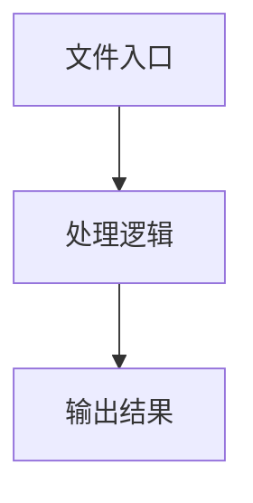

# util.ts

## 0. 文件概述
util.ts - TypeScript/JavaScript 源文件

## 1. 核心功能

### 1.1 导出项
- `export function describeSize(size: Size) {`
- `export function describeElement(`
- `export const distanceThreshold = 16;`
- `export function distance(`
- `export const samplePageDescription = ``
- `export async function describeUserPage(context: UIContext) {`

### 1.2 类定义
- 无类定义

### 1.3 函数定义  
- **describeSize()**: 函数
- **describeElement()**: 函数
- **elementByPositionWithElementInfo()**: 函数
- **dfs()**: 函数
- **distance()**: 函数
- **describeUserPage()**: 函数

### 1.4 常量定义
- **sliceLength**: 常量
- **distanceThreshold**: 常量
- **samplePageDescription**: 常量

## 2. 逻辑流程

**流程说明**: 该文件实现特定功能，通过导入依赖模块，定义类/函数/常量，并导出供其他模块使用。

## 3. 关键细节

### 3.1 核心变量
- **sliceLength**: 定义的常量
- **distanceThreshold**: 定义的常量
- **samplePageDescription**: 定义的常量

### 3.2 依赖项
- `import type { BaseElement, ElementTreeNode, Size, UIContext } from '@/types';`
- `import { NodeType } from '@midscene/shared/constants';`
- `import { assert } from '@midscene/shared/utils';`

## 4. 跨文件调用关系

### 4.1 该文件调用的其他文件
根据 import 语句，该文件依赖以下模块：
- import type { BaseElement, ElementTreeNode, Size, UIContext } from '@/types';
- import { NodeType } from '@midscene/shared/constants';
- import { assert } from '@midscene/shared/utils';

### 4.2 调用该文件的其他文件
该文件通过以下导出项被其他模块使用：
- export function describeSize(size: Size) {
- export function describeElement(
- export const distanceThreshold = 16;
