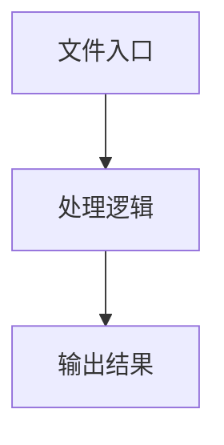

# yaml-generator.ts

## 0. 文件概述
yaml-generator.ts - TypeScript/JavaScript 源文件

## 1. 核心功能

### 1.1 导出项
- `export interface EventCounts {`
- `export interface InputDescription {`
- `export interface ProcessedEvent {`
- `export interface EventSummary {`
- `export interface ChromeRecordedEvent {`
- `export interface YamlGenerationOptions {`
- `export interface FilteredEvents {`
- `export const getScreenshotsForLLM = (`
- `export const filterEventsByType = (`
- `export const createEventCounts = (`
- `export const extractInputDescriptions = (`
- `export const processEventsForLLM = (`
- `export const prepareEventSummary = (`
- `export const createMessageContent = (`
- `export const validateEvents = (events: ChromeRecordedEvent[]): void => {`
- `export const generateYamlTest = async (`
- `export const generateYamlTestStream = async (`

### 1.2 类定义
- 无类定义

### 1.3 函数定义  
- 无函数定义

### 1.4 常量定义
- **getScreenshotsForLLM**: 常量
- **eventsWithScreenshots**: 常量
- **sortedEvents**: 常量
- **screenshots**: 常量
- **screenshot**: 常量
- **filterEventsByType**: 常量
- **createEventCounts**: 常量
- **extractInputDescriptions**: 常量
- **processEventsForLLM**: 常量
- **prepareEventSummary**: 常量
- **filteredEvents**: 常量
- **eventCounts**: 常量
- **startUrl**: 常量
- **clickDescriptions**: 常量
- **inputDescriptions**: 常量
- **urls**: 常量
- **processedEvents**: 常量
- **createMessageContent**: 常量
- **messageContent**: 常量
- **validateEvents**: 常量
- **generateYamlTest**: 常量
- **summary**: 常量
- **yamlSummary**: 常量
- **screenshots**: 常量
- **prompt**: 常量
- **response**: 常量
- **generateYamlTestStream**: 常量
- **summary**: 常量
- **yamlSummary**: 常量
- **screenshots**: 常量
- **prompt**: 常量
- **response**: 常量

## 2. 逻辑流程

**流程说明**: 该文件实现特定功能，通过导入依赖模块，定义类/函数/常量，并导出供其他模块使用。

## 3. 关键细节

### 3.1 核心变量
- **getScreenshotsForLLM**: 定义的常量
- **eventsWithScreenshots**: 定义的常量
- **sortedEvents**: 定义的常量
- **screenshots**: 定义的常量
- **screenshot**: 定义的常量
- **filterEventsByType**: 定义的常量
- **createEventCounts**: 定义的常量
- **extractInputDescriptions**: 定义的常量
- **processEventsForLLM**: 定义的常量
- **prepareEventSummary**: 定义的常量
- **filteredEvents**: 定义的常量
- **eventCounts**: 定义的常量
- **startUrl**: 定义的常量
- **clickDescriptions**: 定义的常量
- **inputDescriptions**: 定义的常量
- **urls**: 定义的常量
- **processedEvents**: 定义的常量
- **createMessageContent**: 定义的常量
- **messageContent**: 定义的常量
- **validateEvents**: 定义的常量
- **generateYamlTest**: 定义的常量
- **summary**: 定义的常量
- **yamlSummary**: 定义的常量
- **screenshots**: 定义的常量
- **prompt**: 定义的常量
- **response**: 定义的常量
- **generateYamlTestStream**: 定义的常量
- **summary**: 定义的常量
- **yamlSummary**: 定义的常量
- **screenshots**: 定义的常量
- **prompt**: 定义的常量
- **response**: 定义的常量

### 3.2 依赖项
- `import type {`
- `import { YAML_EXAMPLE_CODE } from '@midscene/shared/constants';`
- `import type { IModelConfig } from '@midscene/shared/env';`
- `import {`

## 4. 跨文件调用关系

### 4.1 该文件调用的其他文件
根据 import 语句，该文件依赖以下模块：
- import type {
- import { YAML_EXAMPLE_CODE } from '@midscene/shared/constants';
- import type { IModelConfig } from '@midscene/shared/env';

### 4.2 调用该文件的其他文件
该文件通过以下导出项被其他模块使用：
- export interface EventCounts {
- export interface InputDescription {
- export interface ProcessedEvent {
