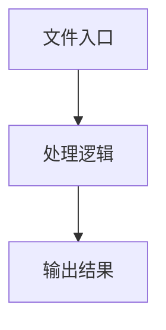

# index.ts

## 0. 文件概述
index.ts - TypeScript/JavaScript 源文件

## 1. 核心功能

### 1.1 导出项
- `export async function callAI(`
- `export async function callAIWithObjectResponse<T>(`
- `export async function callAIWithStringResponse(`
- `export function extractJSONFromCodeBlock(response: string) {`
- `export function preprocessDoubaoBboxJson(input: string) {`
- `export function safeParseJson(input: string, vlMode: TVlModeTypes | undefined) {`

### 1.2 类定义
- 无类定义

### 1.3 函数定义  
- **createChatClient()**: 函数
- **to()**: 函数
- **callAI()**: 函数
- **callAIWithObjectResponse()**: 函数
- **callAIWithStringResponse()**: 函数
- **extractJSONFromCodeBlock()**: 函数
- **preprocessDoubaoBboxJson()**: 函数
- **normalizeJsonObject()**: 函数
- **safeParseJson()**: 函数

### 1.4 常量定义
- **debugProxy**: 常量
- **sanitizeProxyUrl**: 常量
- **parsed**: 常量
- **moduleName**: 常量
- **moduleName**: 常量
- **proxyUrl**: 常量
- **port**: 常量
- **protocol**: 常量
- **socksType**: 常量
- **openAIOptions**: 常量
- **baseOpenAI**: 常量
- **langsmithModule**: 常量
- **langfuseModule**: 常量
- **wrappedClient**: 常量
- **maxTokens**: 常量
- **debugCall**: 常量
- **debugProfileStats**: 常量
- **debugProfileDetail**: 常量
- **startTime**: 常量
- **temperature**: 常量
- **isStreaming**: 常量
- **buildUsageInfo**: 常量
- **cachedInputTokens**: 常量
- **commonConfig**: 常量
- **stream**: 常量
- **content**: 常量
- **reasoning_content**: 常量
- **chunkData**: 常量
- **estimatedTokens**: 常量
- **finalChunk**: 常量
- **result**: 常量
- **estimatedTokens**: 常量
- **newError**: 常量
- **response**: 常量
- **vlMode**: 常量
- **jsonContent**: 常量
- **jsonMatch**: 常量
- **codeBlockMatch**: 常量
- **jsonLikeMatch**: 常量
- **normalized**: 常量
- **trimmedKey**: 常量
- **cleanJsonString**: 常量
- **jsonString**: 常量

## 2. 逻辑流程

**流程说明**: 该文件实现特定功能，通过导入依赖模块，定义类/函数/常量，并导出供其他模块使用。

## 3. 关键细节

### 3.1 核心变量
- **debugProxy**: 定义的常量
- **sanitizeProxyUrl**: 定义的常量
- **parsed**: 定义的常量
- **moduleName**: 定义的常量
- **moduleName**: 定义的常量
- **proxyUrl**: 定义的常量
- **port**: 定义的常量
- **protocol**: 定义的常量
- **socksType**: 定义的常量
- **openAIOptions**: 定义的常量
- **baseOpenAI**: 定义的常量
- **langsmithModule**: 定义的常量
- **langfuseModule**: 定义的常量
- **wrappedClient**: 定义的常量
- **maxTokens**: 定义的常量
- **debugCall**: 定义的常量
- **debugProfileStats**: 定义的常量
- **debugProfileDetail**: 定义的常量
- **startTime**: 定义的常量
- **temperature**: 定义的常量
- **isStreaming**: 定义的常量
- **buildUsageInfo**: 定义的常量
- **cachedInputTokens**: 定义的常量
- **commonConfig**: 定义的常量
- **stream**: 定义的常量
- **content**: 定义的常量
- **reasoning_content**: 定义的常量
- **chunkData**: 定义的常量
- **estimatedTokens**: 定义的常量
- **finalChunk**: 定义的常量
- **result**: 定义的常量
- **estimatedTokens**: 定义的常量
- **newError**: 定义的常量
- **response**: 定义的常量
- **vlMode**: 定义的常量
- **jsonContent**: 定义的常量
- **jsonMatch**: 定义的常量
- **codeBlockMatch**: 定义的常量
- **jsonLikeMatch**: 定义的常量
- **normalized**: 定义的常量
- **trimmedKey**: 定义的常量
- **cleanJsonString**: 定义的常量
- **jsonString**: 定义的常量

### 3.2 依赖项
- `import { AIResponseFormat, type AIUsageInfo } from '@/types';`
- `import type { CodeGenerationChunk, StreamingCallback } from '@/types';`
- `import {`
- `import { getDebug } from '@midscene/shared/logger';`
- `import { assert, ifInBrowser } from '@midscene/shared/utils';`

（共 10 个导入项）

## 4. 跨文件调用关系

### 4.1 该文件调用的其他文件
根据 import 语句，该文件依赖以下模块：
- import { AIResponseFormat, type AIUsageInfo } from '@/types';
- import type { CodeGenerationChunk, StreamingCallback } from '@/types';
- import {

### 4.2 调用该文件的其他文件
该文件通过以下导出项被其他模块使用：
- export async function callAI(
- export async function callAIWithObjectResponse<T>(
- export async function callAIWithStringResponse(
