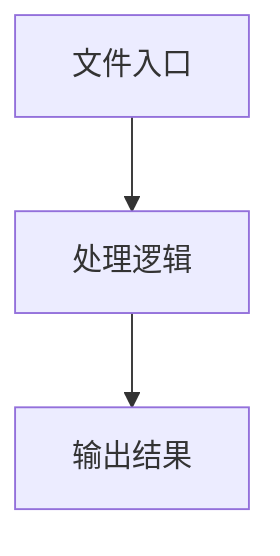

# ui-tars-planning.ts

## 0. 文件概述
ui-tars-planning.ts - TypeScript/JavaScript 源文件

## 1. 核心功能

### 1.1 导出项
- `export async function uiTarsPlanning(`
- `export type Action =`
- `export async function resizeImageForUiTars(`

### 1.2 类定义
- 无类定义

### 1.3 函数定义  
- **uiTarsPlanning()**: 函数
- **convertBboxToCoordinates()**: 函数
- **replaceMatch()**: 函数
- **getPoint()**: 函数
- **resizeImageForUiTars()**: 函数

### 1.4 常量定义
- **debug**: 常量
- **bboxSize**: 常量
- **pointToBbox**: 常量
- **systemPrompt**: 常量
- **imagePayload**: 常量
- **res**: 常量
- **convertedText**: 常量
- **transformActions**: 常量
- **unhandledActions**: 常量
- **actionType**: 常量
- **point**: 常量
- **point**: 常量
- **point**: 常量
- **startPoint**: 常量
- **endPoint**: 常量
- **keys**: 常量
- **errorDetails**: 常量
- **types**: 常量
- **errorMessage**: 常量
- **log**: 常量
- **pattern**: 常量
- **x1Num**: 常量
- **y1Num**: 常量
- **x2Num**: 常量
- **y2Num**: 常量
- **x**: 常量
- **y**: 常量
- **cleanedText**: 常量
- **currentPixels**: 常量
- **maxPixels**: 常量
- **resizeFactor**: 常量
- **newWidth**: 常量
- **newHeight**: 常量
- **resizedImage**: 常量

## 2. 逻辑流程

**流程说明**: 该文件实现特定功能，通过导入依赖模块，定义类/函数/常量，并导出供其他模块使用。

## 3. 关键细节

### 3.1 核心变量
- **debug**: 定义的常量
- **bboxSize**: 定义的常量
- **pointToBbox**: 定义的常量
- **systemPrompt**: 定义的常量
- **imagePayload**: 定义的常量
- **res**: 定义的常量
- **convertedText**: 定义的常量
- **transformActions**: 定义的常量
- **unhandledActions**: 定义的常量
- **actionType**: 定义的常量
- **point**: 定义的常量
- **point**: 定义的常量
- **point**: 定义的常量
- **startPoint**: 定义的常量
- **endPoint**: 定义的常量
- **keys**: 定义的常量
- **errorDetails**: 定义的常量
- **types**: 定义的常量
- **errorMessage**: 定义的常量
- **log**: 定义的常量
- **pattern**: 定义的常量
- **x1Num**: 定义的常量
- **y1Num**: 定义的常量
- **x2Num**: 定义的常量
- **y2Num**: 定义的常量
- **x**: 定义的常量
- **y**: 定义的常量
- **cleanedText**: 定义的常量
- **currentPixels**: 定义的常量
- **maxPixels**: 定义的常量
- **resizeFactor**: 定义的常量
- **newWidth**: 定义的常量
- **newHeight**: 定义的常量
- **resizedImage**: 定义的常量

### 3.2 依赖项
- `import type {`
- `import { type IModelConfig, UITarsModelVersion } from '@midscene/shared/env';`
- `import { resizeImgBase64 } from '@midscene/shared/img';`
- `import { getDebug } from '@midscene/shared/logger';`
- `import { transformHotkeyInput } from '@midscene/shared/us-keyboard-layout';`

（共 11 个导入项）

## 4. 跨文件调用关系

### 4.1 该文件调用的其他文件
根据 import 语句，该文件依赖以下模块：
- import type {
- import { type IModelConfig, UITarsModelVersion } from '@midscene/shared/env';
- import { resizeImgBase64 } from '@midscene/shared/img';

### 4.2 调用该文件的其他文件
该文件通过以下导出项被其他模块使用：
- export async function uiTarsPlanning(
- export type Action =
- export async function resizeImageForUiTars(
