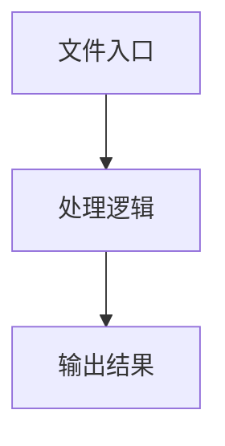

# common.ts

## 0. 文件概述
common.ts - TypeScript/JavaScript 源文件

## 1. 核心功能

### 1.1 导出项
- `export type AIArgs = ChatCompletionMessageParam[];`
- `export enum AIActionType {`
- `export function fillBboxParam(`
- `export function adaptQwen2_5Bbox(`
- `export function adaptDoubaoBbox(`
- `export function adaptBbox(`
- `export function normalized01000(`
- `export function adaptGeminiBbox(`
- `export function adaptBboxToRect(`
- `export function mergeRects(rects: Rect[]) {`
- `export function expandSearchArea(`
- `export async function markupImageForLLM(`
- `export function buildYamlFlowFromPlans(`
- `export const PointSchema = z.object({`
- `export const SizeSchema = z.object({`
- `export const RectSchema = PointSchema.and(SizeSchema).and(`
- `export const TMultimodalPromptSchema = z.object({`
- `export const TUserPromptSchema = z.union([`
- `export type TMultimodalPrompt = z.infer<typeof TMultimodalPromptSchema>;`
- `export type TUserPrompt = z.infer<typeof TUserPromptSchema>;`
- `export type MidsceneLocationResultType = z.infer<typeof MidsceneLocationResult>;`
- `export type MidsceneLocationInputType = z.infer<typeof MidsceneLocationInput>;`
- `export const getMidsceneLocationSchema = () => {`
- `export const ifMidsceneLocatorField = (field: any): boolean => {`
- `export const dumpMidsceneLocatorField = (field: any): string => {`
- `export const findAllMidsceneLocatorField = (`
- `export const dumpActionParam = (`
- `export const loadActionParam = (`
- `export const parseActionParam = (`

### 1.2 类定义
- 无类定义

### 1.3 函数定义  
- **fillBboxParam()**: 函数
- **adaptQwen2_5Bbox()**: 函数
- **adaptDoubaoBbox()**: 函数
- **normalizeBboxInput()**: 函数
- **adaptBbox()**: 函数
- **normalized01000()**: 函数
- **adaptGeminiBbox()**: 函数
- **adaptBboxToRect()**: 函数
- **mergeRects()**: 函数
- **expandSearchArea()**: 函数
- **markupImageForLLM()**: 函数
- **buildYamlFlowFromPlans()**: 函数

### 1.4 常量定义
- **defaultBboxSize**: 常量
- **debugInspectUtils**: 常量
- **msg**: 常量
- **result**: 常量
- **splitted**: 常量
- **msg**: 常量
- **normalizedBbox**: 常量
- **left**: 常量
- **top**: 常量
- **right**: 常量
- **bottom**: 常量
- **rectLeft**: 常量
- **rectTop**: 常量
- **rect**: 常量
- **minLeft**: 常量
- **minTop**: 常量
- **maxRight**: 常量
- **maxBottom**: 常量
- **defaultPadding**: 常量
- **paddingSizeHorizontal**: 常量
- **paddingSizeVertical**: 常量
- **elementsInfo**: 常量
- **elementsPositionInfoWithoutText**: 常量
- **imagePayload**: 常量
- **flow**: 常量
- **verb**: 常量
- **action**: 常量
- **flowKey**: 常量
- **flowParam**: 常量
- **flowItem**: 常量
- **PointSchema**: 常量
- **SizeSchema**: 常量
- **RectSchema**: 常量
- **TMultimodalPromptSchema**: 常量
- **TUserPromptSchema**: 常量
- **locateFieldFlagName**: 常量
- **MidsceneLocationInput**: 常量
- **MidsceneLocationResult**: 常量
- **getMidsceneLocationSchema**: 常量
- **ifMidsceneLocatorField**: 常量
- **shape**: 常量
- **dumpMidsceneLocatorField**: 常量
- **findAllMidsceneLocatorField**: 常量
- **zodObject**: 常量
- **keys**: 常量
- **field**: 常量
- **dumpActionParam**: 常量
- **locatorFields**: 常量
- **result**: 常量
- **fieldValue**: 常量
- **loadActionParam**: 常量
- **locatorFields**: 常量
- **result**: 常量
- **fieldValue**: 常量
- **parseActionParam**: 常量
- **param**: 常量
- **locateFields**: 常量
- **locateFieldValues**: 常量
- **paramsForValidation**: 常量
- **validated**: 常量

## 2. 逻辑流程

**流程说明**: 该文件实现特定功能，通过导入依赖模块，定义类/函数/常量，并导出供其他模块使用。

## 3. 关键细节

### 3.1 核心变量
- **defaultBboxSize**: 定义的常量
- **debugInspectUtils**: 定义的常量
- **msg**: 定义的常量
- **result**: 定义的常量
- **splitted**: 定义的常量
- **msg**: 定义的常量
- **normalizedBbox**: 定义的常量
- **left**: 定义的常量
- **top**: 定义的常量
- **right**: 定义的常量
- **bottom**: 定义的常量
- **rectLeft**: 定义的常量
- **rectTop**: 定义的常量
- **rect**: 定义的常量
- **minLeft**: 定义的常量
- **minTop**: 定义的常量
- **maxRight**: 定义的常量
- **maxBottom**: 定义的常量
- **defaultPadding**: 定义的常量
- **paddingSizeHorizontal**: 定义的常量
- **paddingSizeVertical**: 定义的常量
- **elementsInfo**: 定义的常量
- **elementsPositionInfoWithoutText**: 定义的常量
- **imagePayload**: 定义的常量
- **flow**: 定义的常量
- **verb**: 定义的常量
- **action**: 定义的常量
- **flowKey**: 定义的常量
- **flowParam**: 定义的常量
- **flowItem**: 定义的常量
- **PointSchema**: 定义的常量
- **SizeSchema**: 定义的常量
- **RectSchema**: 定义的常量
- **TMultimodalPromptSchema**: 定义的常量
- **TUserPromptSchema**: 定义的常量
- **locateFieldFlagName**: 定义的常量
- **MidsceneLocationInput**: 定义的常量
- **MidsceneLocationResult**: 定义的常量
- **getMidsceneLocationSchema**: 定义的常量
- **ifMidsceneLocatorField**: 定义的常量
- **shape**: 定义的常量
- **dumpMidsceneLocatorField**: 定义的常量
- **findAllMidsceneLocatorField**: 定义的常量
- **zodObject**: 定义的常量
- **keys**: 定义的常量
- **field**: 定义的常量
- **dumpActionParam**: 定义的常量
- **locatorFields**: 定义的常量
- **result**: 定义的常量
- **fieldValue**: 定义的常量
- **loadActionParam**: 定义的常量
- **locatorFields**: 定义的常量
- **result**: 定义的常量
- **fieldValue**: 定义的常量
- **parseActionParam**: 定义的常量
- **param**: 定义的常量
- **locateFields**: 定义的常量
- **locateFieldValues**: 定义的常量
- **paramsForValidation**: 定义的常量
- **validated**: 定义的常量

### 3.2 依赖项
- `import type {`
- `import { assert } from '@midscene/shared/utils';`
- `import type { ChatCompletionMessageParam } from 'openai/resources/index';`
- `import type { PlanningLocateParam } from '@/types';`
- `import { NodeType } from '@midscene/shared/constants';`

（共 10 个导入项）

## 4. 跨文件调用关系

### 4.1 该文件调用的其他文件
根据 import 语句，该文件依赖以下模块：
- import type {
- import { assert } from '@midscene/shared/utils';
- import type { ChatCompletionMessageParam } from 'openai/resources/index';

### 4.2 调用该文件的其他文件
该文件通过以下导出项被其他模块使用：
- export type AIArgs = ChatCompletionMessageParam[];
- export enum AIActionType {
- export function fillBboxParam(
