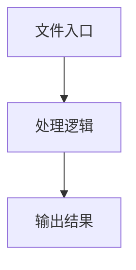

# index.ts

## 0. 文件概述
index.ts - TypeScript/JavaScript 源文件

## 1. 核心功能

### 1.1 导出项
- `export abstract class AbstractInterface {`
- `export const defineAction = <`
- `export const actionTapParamSchema = z.object({`
- `export type ActionTapParam = {`
- `export const defineActionTap = (`
- `export const actionRightClickParamSchema = z.object({`
- `export type ActionRightClickParam = {`
- `export const defineActionRightClick = (`
- `export const actionDoubleClickParamSchema = z.object({`
- `export type ActionDoubleClickParam = {`
- `export const defineActionDoubleClick = (`
- `export const actionHoverParamSchema = z.object({`
- `export type ActionHoverParam = {`
- `export const defineActionHover = (`
- `export const actionInputParamSchema = z.object({`
- `export type ActionInputParam = {`
- `export const defineActionInput = (`
- `export const actionKeyboardPressParamSchema = z.object({`
- `export type ActionKeyboardPressParam = {`
- `export const defineActionKeyboardPress = (`
- `export const actionScrollParamSchema = z.object({`
- `export const defineActionScroll = (`
- `export const actionDragAndDropParamSchema = z.object({`
- `export type ActionDragAndDropParam = {`
- `export const defineActionDragAndDrop = (`
- `export const ActionLongPressParamSchema = z.object({`
- `export type ActionLongPressParam = {`
- `export const defineActionLongPress = (`
- `export const ActionSwipeParamSchema = z.object({`
- `export type ActionSwipeParam = {`
- `export const defineActionSwipe = (`
- `export const actionClearInputParamSchema = z.object({`
- `export type ActionClearInputParam = {`
- `export const defineActionClearInput = (`
- `export const actionAssertParamSchema = z.object({`
- `export type ActionAssertParam = {`
- `export const defineActionAssert = (): DeviceAction<ActionAssertParam> => {`
- `export type { DeviceAction } from '../types';`
- `export type {`

### 1.2 类定义
- **AbstractInterface**: 类定义

### 1.3 函数定义  
- **to()**: 函数

### 1.4 常量定义
- **defineAction**: 常量
- **actionTapParamSchema**: 常量
- **defineActionTap**: 常量
- **actionRightClickParamSchema**: 常量
- **defineActionRightClick**: 常量
- **actionDoubleClickParamSchema**: 常量
- **defineActionDoubleClick**: 常量
- **actionHoverParamSchema**: 常量
- **defineActionHover**: 常量
- **inputLocateDescription**: 常量
- **actionInputParamSchema**: 常量
- **defineActionInput**: 常量
- **actionKeyboardPressParamSchema**: 常量
- **defineActionKeyboardPress**: 常量
- **actionScrollParamSchema**: 常量
- **defineActionScroll**: 常量
- **actionDragAndDropParamSchema**: 常量
- **defineActionDragAndDrop**: 常量
- **ActionLongPressParamSchema**: 常量
- **defineActionLongPress**: 常量
- **ActionSwipeParamSchema**: 常量
- **defineActionSwipe**: 常量
- **actionClearInputParamSchema**: 常量
- **defineActionClearInput**: 常量
- **actionAssertParamSchema**: 常量
- **defineActionAssert**: 常量

## 2. 逻辑流程

**流程说明**: 该文件实现特定功能，通过导入依赖模块，定义类/函数/常量，并导出供其他模块使用。

## 3. 关键细节

### 3.1 核心变量
- **defineAction**: 定义的常量
- **actionTapParamSchema**: 定义的常量
- **defineActionTap**: 定义的常量
- **actionRightClickParamSchema**: 定义的常量
- **defineActionRightClick**: 定义的常量
- **actionDoubleClickParamSchema**: 定义的常量
- **defineActionDoubleClick**: 定义的常量
- **actionHoverParamSchema**: 定义的常量
- **defineActionHover**: 定义的常量
- **inputLocateDescription**: 定义的常量
- **actionInputParamSchema**: 定义的常量
- **defineActionInput**: 定义的常量
- **actionKeyboardPressParamSchema**: 定义的常量
- **defineActionKeyboardPress**: 定义的常量
- **actionScrollParamSchema**: 定义的常量
- **defineActionScroll**: 定义的常量
- **actionDragAndDropParamSchema**: 定义的常量
- **defineActionDragAndDrop**: 定义的常量
- **ActionLongPressParamSchema**: 定义的常量
- **defineActionLongPress**: 定义的常量
- **ActionSwipeParamSchema**: 定义的常量
- **defineActionSwipe**: 定义的常量
- **actionClearInputParamSchema**: 定义的常量
- **defineActionClearInput**: 定义的常量
- **actionAssertParamSchema**: 定义的常量
- **defineActionAssert**: 定义的常量

### 3.2 依赖项
- `import { getMidsceneLocationSchema } from '@/common';`
- `import type {`
- `import type { IModelConfig } from '@midscene/shared/env';`
- `import type { ElementNode } from '@midscene/shared/extractor';`
- `import { getDebug } from '@midscene/shared/logger';`

（共 8 个导入项）

## 4. 跨文件调用关系

### 4.1 该文件调用的其他文件
根据 import 语句，该文件依赖以下模块：
- import { getMidsceneLocationSchema } from '@/common';
- import type {
- import type { IModelConfig } from '@midscene/shared/env';

### 4.2 调用该文件的其他文件
该文件通过以下导出项被其他模块使用：
- export abstract class AbstractInterface {
- export const defineAction = <
- export const actionTapParamSchema = z.object({
