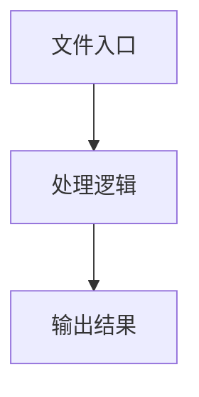

# index.ts

## 0. 文件概述
index.ts - TypeScript/JavaScript 源文件

## 1. 核心功能

### 1.1 导出项
- `export interface LocateOpts {`
- `export type AnyValue<T> = {`
- `export default class Service {`

### 1.2 类定义
- **Service**: 类定义

### 1.3 函数定义  
- **will()**: 函数

### 1.4 常量定义
- **debug**: 常量
- **queryPrompt**: 常量
- **globalDeepThinkSwitch**: 常量
- **context**: 常量
- **startTime**: 常量
- **timeCost**: 常量
- **taskInfo**: 常量
- **dumpData**: 常量
- **elements**: 常量
- **dump**: 常量
- **context**: 常量
- **startTime**: 常量
- **timeCost**: 常量
- **taskInfo**: 常量
- **dumpData**: 常量
- **dump**: 常量
- **context**: 常量
- **systemPrompt**: 常量
- **defaultRectSize**: 常量
- **targetRect**: 常量
- **searchArea**: 常量
- **croppedResult**: 常量
- **msgs**: 常量
- **callAIFn**: 常量
- **res**: 常量

## 2. 逻辑流程

**流程说明**: 该文件实现特定功能，通过导入依赖模块，定义类/函数/常量，并导出供其他模块使用。

## 3. 关键细节

### 3.1 核心变量
- **debug**: 定义的常量
- **queryPrompt**: 定义的常量
- **globalDeepThinkSwitch**: 定义的常量
- **context**: 定义的常量
- **startTime**: 定义的常量
- **timeCost**: 定义的常量
- **taskInfo**: 定义的常量
- **dumpData**: 定义的常量
- **elements**: 定义的常量
- **dump**: 定义的常量
- **context**: 定义的常量
- **startTime**: 定义的常量
- **timeCost**: 定义的常量
- **taskInfo**: 定义的常量
- **dumpData**: 定义的常量
- **dump**: 定义的常量
- **context**: 定义的常量
- **systemPrompt**: 定义的常量
- **defaultRectSize**: 定义的常量
- **targetRect**: 定义的常量
- **searchArea**: 定义的常量
- **croppedResult**: 定义的常量
- **msgs**: 定义的常量
- **callAIFn**: 定义的常量
- **res**: 定义的常量

### 3.2 依赖项
- `import {`
- `import { AiLocateSection } from '@/ai-model/inspect';`
- `import { elementDescriberInstruction } from '@/ai-model/prompt/describe';`
- `import { AIActionType, type AIArgs, expandSearchArea } from '@/common';`
- `import type {`

（共 12 个导入项）

## 4. 跨文件调用关系

### 4.1 该文件调用的其他文件
根据 import 语句，该文件依赖以下模块：
- import {
- import { AiLocateSection } from '@/ai-model/inspect';
- import { elementDescriberInstruction } from '@/ai-model/prompt/describe';

### 4.2 调用该文件的其他文件
该文件通过以下导出项被其他模块使用：
- export interface LocateOpts {
- export type AnyValue<T> = {
- export default class Service {
