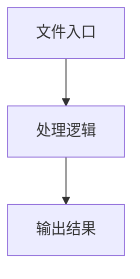

# task-runner.ts

## 0. 文件概述
task-runner.ts - TypeScript/JavaScript 源文件

## 1. 核心功能

### 1.1 导出项
- `export class TaskRunner {`
- `export class TaskExecutionError extends Error {`

### 1.2 类定义
- **TaskRunner**: 类定义
- **TaskExecutionError**: 类定义

### 1.3 函数定义  
- 无函数定义

### 1.4 常量定义
- **debug**: 常量
- **UI_CONTEXT_CACHE_TTL_MS**: 常量
- **now**: 常量
- **shouldReuse**: 常量
- **uiContext**: 常量
- **uiContext**: 常量
- **timing**: 常量
- **screenshot**: 常量
- **recorderItem**: 常量
- **candidate**: 常量
- **nextPendingIndex**: 常量
- **task**: 常量
- **executorContext**: 常量
- **isLastTask**: 常量
- **screenshot**: 常量
- **errorTask**: 常量
- **messageBase**: 常量
- **stack**: 常量
- **message**: 常量
- **outputIndex**: 常量
- **errorTaskIndex**: 常量
- **dumpData**: 常量
- **errorTask**: 常量

## 2. 逻辑流程

**流程说明**: 该文件实现特定功能，通过导入依赖模块，定义类/函数/常量，并导出供其他模块使用。

## 3. 关键细节

### 3.1 核心变量
- **debug**: 定义的常量
- **UI_CONTEXT_CACHE_TTL_MS**: 定义的常量
- **now**: 定义的常量
- **shouldReuse**: 定义的常量
- **uiContext**: 定义的常量
- **uiContext**: 定义的常量
- **timing**: 定义的常量
- **screenshot**: 定义的常量
- **recorderItem**: 定义的常量
- **candidate**: 定义的常量
- **nextPendingIndex**: 定义的常量
- **task**: 定义的常量
- **executorContext**: 定义的常量
- **isLastTask**: 定义的常量
- **screenshot**: 定义的常量
- **errorTask**: 定义的常量
- **messageBase**: 定义的常量
- **stack**: 定义的常量
- **message**: 定义的常量
- **outputIndex**: 定义的常量
- **errorTaskIndex**: 定义的常量
- **dumpData**: 定义的常量
- **errorTask**: 定义的常量

### 3.2 依赖项
- `import type {`
- `import { getDebug } from '@midscene/shared/logger';`
- `import { assert } from '@midscene/shared/utils';`

## 4. 跨文件调用关系

### 4.1 该文件调用的其他文件
根据 import 语句，该文件依赖以下模块：
- import type {
- import { getDebug } from '@midscene/shared/logger';
- import { assert } from '@midscene/shared/utils';

### 4.2 调用该文件的其他文件
该文件通过以下导出项被其他模块使用：
- export class TaskRunner {
- export class TaskExecutionError extends Error {
