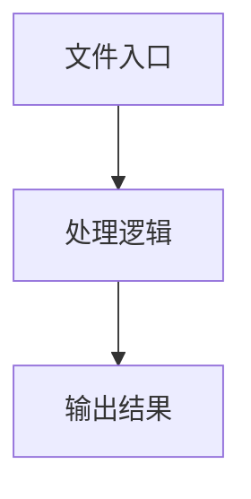

# types.ts

## 0. 文件概述
types.ts - TypeScript/JavaScript 源文件

## 1. 核心功能

### 1.1 导出项
- `export type {`
- `export * from './yaml';`
- `export type AIUsageInfo = Record<string, any> & {`
- `export type { LocateResultElement };`
- `export enum AIResponseFormat {`
- `export type AISingleElementResponseById = {`
- `export type AISingleElementResponseByPosition = {`
- `export type AISingleElementResponse = AISingleElementResponseById;`
- `export interface AIElementCoordinatesResponse {`
- `export type AIElementResponse = AIElementCoordinatesResponse;`
- `export interface AIDataExtractionResponse<DataDemand> {`
- `export interface AISectionLocatorResponse {`
- `export interface AIAssertionResponse {`
- `export interface AIDescribeElementResponse {`
- `export interface LocatorValidatorOption {`
- `export interface LocateValidatorResult {`
- `export interface AgentDescribeElementAtPointResult {`
- `export abstract class UIContext {`
- `export type EnsureObject<T> = { [K in keyof T]: any };`
- `export type ServiceAction = 'locate' | 'extract' | 'assert' | 'describe';`
- `export type ServiceExtractParam = string | Record<string, string>;`
- `export type ElementCacheFeature = Record<string, unknown>;`
- `export interface LocateResult {`
- `export type ThinkingLevel = 'off' | 'medium' | 'high';`
- `export interface ServiceTaskInfo {`
- `export interface DumpMeta {`
- `export interface ReportDumpWithAttributes {`
- `export interface ServiceDump extends DumpMeta {`
- `export type PartialServiceDumpFromSDK = Omit<`
- `export interface ServiceResultBase {`
- `export type LocateResultWithDump = LocateResult & ServiceResultBase;`
- `export interface ServiceExtractResult<T> extends ServiceResultBase {`
- `export class ServiceError extends Error {`
- `export interface LiteUISection {`
- `export type ElementById = (id: string) => BaseElement | null;`
- `export type ServiceAssertionResponse = AIAssertionResponse & {`
- `export type OnTaskStartTip = (tip: string) => Promise<void> | void;`
- `export interface AgentWaitForOpt {`
- `export interface AgentAssertOpt {`
- `export interface PlanningLocateParam extends DetailedLocateParam {`
- `export interface PlanningAction<ParamType = any> {`
- `export interface RawResponsePlanningAIResponse {`
- `export interface PlanningAIResponse`
- `export interface PlanningActionParamSleep {`
- `export interface PlanningActionParamError {`
- `export type PlanningActionParamWaitFor = AgentWaitForOpt & {};`
- `export interface LongPressParam {`
- `export interface PullParam {`
- `export interface Color {`
- `export interface BaseAgentParserOpt {`
- `export interface PuppeteerParserOpt extends BaseAgentParserOpt {}`
- `export interface PlaywrightParserOpt extends BaseAgentParserOpt {}`
- `export interface ExecutionTaskProgressOptions {`
- `export interface ExecutionRecorderItem {`
- `export type ExecutionTaskType = 'Planning' | 'Insight' | 'Action Space' | 'Log';`
- `export interface ExecutorContext {`
- `export interface ExecutionTaskApply<`
- `export interface ExecutionTaskHitBy {`
- `export interface ExecutionTaskReturn<TaskOutput = unknown, TaskLog = unknown> {`
- `export type ExecutionTask<`
- `export interface ExecutionDump extends DumpMeta {`
- `export type ExecutionTaskInsightLocateParam = PlanningLocateParam;`
- `export interface ExecutionTaskInsightLocateOutput {`
- `export type ExecutionTaskInsightDump = ServiceDump;`
- `export type ExecutionTaskInsightLocateApply = ExecutionTaskApply<`
- `export type ExecutionTaskInsightLocate =`
- `export interface ExecutionTaskInsightQueryParam {`
- `export interface ExecutionTaskInsightQueryOutput {`
- `export type ExecutionTaskInsightQueryApply = ExecutionTaskApply<`
- `export type ExecutionTaskInsightQuery =`
- `export interface ExecutionTaskInsightAssertionParam {`
- `export type ExecutionTaskInsightAssertionApply = ExecutionTaskApply<`
- `export type ExecutionTaskInsightAssertion =`
- `export type ExecutionTaskActionApply<ActionParam = any> = ExecutionTaskApply<`
- `export type ExecutionTaskAction = ExecutionTask<ExecutionTaskActionApply>;`
- `export type ExecutionTaskLogApply<`
- `export type ExecutionTaskLog = ExecutionTask<ExecutionTaskLogApply>;`
- `export type ExecutionTaskPlanningApply = ExecutionTaskApply<`
- `export type ExecutionTaskPlanning = ExecutionTask<ExecutionTaskPlanningApply>;`
- `export type ExecutionTaskPlanningLocateParam = PlanningLocateParam;`
- `export interface ExecutionTaskPlanningLocateOutput {`
- `export type ExecutionTaskPlanningDump = ServiceDump;`
- `export type ExecutionTaskPlanningLocateApply = ExecutionTaskApply<`
- `export type ExecutionTaskPlanningLocate =`
- `export interface GroupedActionDump {`
- `export type InterfaceType =`
- `export interface StreamingCodeGenerationOptions {`
- `export type StreamingCallback = (chunk: CodeGenerationChunk) => void;`
- `export interface CodeGenerationChunk {`
- `export interface StreamingAIResponse {`
- `export interface DeviceAction<TParam = any, TReturn = any> {`
- `export type ActionParam<Action extends DeviceAction<any, any>> =`
- `export type ActionReturn<Action extends DeviceAction<any, any>> =`
- `export interface WebElementInfo extends BaseElement {`
- `export type WebUIContext = UIContext;`
- `export type CacheConfig = {`
- `export type Cache =`
- `export interface AgentOpt {`
- `export type TestStatus =`
- `export interface ReportFileWithAttributes {`

### 1.2 类定义
- **UIContext**: 类定义
- **ServiceError**: 类定义

### 1.3 函数定义  
- **to()**: 函数
- **to()**: 函数
- **to()**: 函数
- **will()**: 函数

### 1.4 常量定义
- 无常量定义

## 2. 逻辑流程

**流程说明**: 该文件实现特定功能，通过导入依赖模块，定义类/函数/常量，并导出供其他模块使用。

## 3. 关键细节

### 3.1 核心变量
- 无核心变量

### 3.2 依赖项
- `import type { NodeType } from '@midscene/shared/constants';`
- `import type { CreateOpenAIClientFn, TModelConfig } from '@midscene/shared/env';`
- `import type {`
- `import type { z } from 'zod';`
- `import type { TUserPrompt } from './common';`

（共 6 个导入项）

## 4. 跨文件调用关系

### 4.1 该文件调用的其他文件
根据 import 语句，该文件依赖以下模块：
- import type { NodeType } from '@midscene/shared/constants';
- import type { CreateOpenAIClientFn, TModelConfig } from '@midscene/shared/env';
- import type {

### 4.2 调用该文件的其他文件
该文件通过以下导出项被其他模块使用：
- export type {
- export * from './yaml';
- export type AIUsageInfo = Record<string, any> & {
