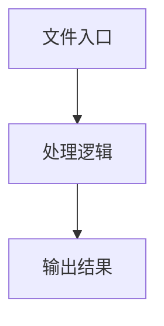

# player.ts

## 0. 文件概述
player.ts - TypeScript/JavaScript 源文件

## 1. 核心功能

### 1.1 导出项
- `export class ScriptPlayer<T extends MidsceneYamlScriptEnv> {`

### 1.2 类定义
- **ScriptPlayer**: 类定义

### 1.3 函数定义  
- 无函数定义

### 1.4 常量定义
- **debug**: 常量
- **aiTaskHandlerMap**: 常量
- **isStringParamSchema**: 常量
- **schemaDef**: 常量
- **options**: 常量
- **resolvedAiActContext**: 常量
- **scriptName**: 常量
- **keyToUse**: 常量
- **taskIndexToNotify**: 常量
- **taskStatus**: 常量
- **output**: 常量
- **outputDir**: 常量
- **content**: 常量
- **filePath**: 常量
- **outputDir**: 常量
- **currentStep**: 常量
- **flowItem**: 常量
- **simpleAIKey**: 常量
- **actionTask**: 常量
- **prompt**: 常量
- **assertTask**: 常量
- **prompt**: 常量
- **msg**: 常量
- **agentMethod**: 常量
- **aiResult**: 常量
- **waitForTask**: 常量
- **prompt**: 常量
- **waitForOptions**: 常量
- **sleepTask**: 常量
- **ms**: 常量
- **evaluateJavaScriptTask**: 常量
- **result**: 常量
- **recordTask**: 常量
- **title**: 常量
- **content**: 常量
- **locatePrompt**: 常量
- **actionSpace**: 常量
- **matchedAction**: 常量
- **actionInterfaceAlias**: 常量
- **keyOfActionInActionSpace**: 常量
- **schemaIsStringParam**: 常量
- **parseResult**: 常量
- **result**: 常量
- **resultName**: 常量
- **sourceForParams**: 常量
- **flowParams**: 常量
- **result**: 常量
- **resultName**: 常量
- **webEnv**: 常量
- **androidEnv**: 常量
- **iosEnv**: 常量
- **platform**: 常量
- **originalOnTaskStartTip**: 常量
- **taskStatus**: 常量

## 2. 逻辑流程

**流程说明**: 该文件实现特定功能，通过导入依赖模块，定义类/函数/常量，并导出供其他模块使用。

## 3. 关键细节

### 3.1 核心变量
- **debug**: 定义的常量
- **aiTaskHandlerMap**: 定义的常量
- **isStringParamSchema**: 定义的常量
- **schemaDef**: 定义的常量
- **options**: 定义的常量
- **resolvedAiActContext**: 定义的常量
- **scriptName**: 定义的常量
- **keyToUse**: 定义的常量
- **taskIndexToNotify**: 定义的常量
- **taskStatus**: 定义的常量
- **output**: 定义的常量
- **outputDir**: 定义的常量
- **content**: 定义的常量
- **filePath**: 定义的常量
- **outputDir**: 定义的常量
- **currentStep**: 定义的常量
- **flowItem**: 定义的常量
- **simpleAIKey**: 定义的常量
- **actionTask**: 定义的常量
- **prompt**: 定义的常量
- **assertTask**: 定义的常量
- **prompt**: 定义的常量
- **msg**: 定义的常量
- **agentMethod**: 定义的常量
- **aiResult**: 定义的常量
- **waitForTask**: 定义的常量
- **prompt**: 定义的常量
- **waitForOptions**: 定义的常量
- **sleepTask**: 定义的常量
- **ms**: 定义的常量
- **evaluateJavaScriptTask**: 定义的常量
- **result**: 定义的常量
- **recordTask**: 定义的常量
- **title**: 定义的常量
- **content**: 定义的常量
- **locatePrompt**: 定义的常量
- **actionSpace**: 定义的常量
- **matchedAction**: 定义的常量
- **actionInterfaceAlias**: 定义的常量
- **keyOfActionInActionSpace**: 定义的常量
- **schemaIsStringParam**: 定义的常量
- **parseResult**: 定义的常量
- **result**: 定义的常量
- **resultName**: 定义的常量
- **sourceForParams**: 定义的常量
- **flowParams**: 定义的常量
- **result**: 定义的常量
- **resultName**: 定义的常量
- **webEnv**: 定义的常量
- **androidEnv**: 定义的常量
- **iosEnv**: 定义的常量
- **platform**: 定义的常量
- **originalOnTaskStartTip**: 定义的常量
- **taskStatus**: 定义的常量

### 3.2 依赖项
- `import { existsSync, mkdirSync, writeFileSync } from 'node:fs';`
- `import { basename, dirname, join, resolve } from 'node:path';`
- `import { assert, ifInBrowser, ifInWorker } from '@midscene/shared/utils';`
- `import { type ZodTypeAny, z } from 'zod';`
- `import type { Agent } from '@/agent/agent';`

（共 10 个导入项）

## 4. 跨文件调用关系

### 4.1 该文件调用的其他文件
根据 import 语句，该文件依赖以下模块：
- import { existsSync, mkdirSync, writeFileSync } from 'node:fs';
- import { basename, dirname, join, resolve } from 'node:path';
- import { assert, ifInBrowser, ifInWorker } from '@midscene/shared/utils';

### 4.2 调用该文件的其他文件
该文件通过以下导出项被其他模块使用：
- export class ScriptPlayer<T extends MidsceneYamlScriptEnv> {
