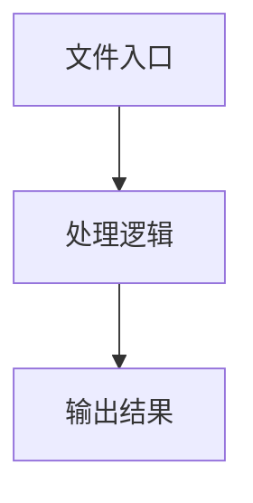

# utils.ts

## 0. 文件概述
utils.ts - TypeScript/JavaScript 源文件

## 1. 核心功能

### 1.1 导出项
- `export function interpolateEnvVars(content: string): string {`
- `export function parseYamlScript(`
- `export function buildDetailedLocateParam(`
- `export function buildDetailedLocateParamAndRestParams(`

### 1.2 类定义
- 无类定义

### 1.3 函数定义  
- **interpolateEnvVars()**: 函数
- **parseYamlScript()**: 函数
- **buildDetailedLocateParam()**: 函数
- **buildDetailedLocateParamAndRestParams()**: 函数

### 1.4 常量定义
- **debugUtils**: 常量
- **lines**: 常量
- **processedLines**: 常量
- **trimmedLine**: 常量
- **value**: 常量
- **interpolatedContent**: 常量
- **obj**: 常量
- **pathTip**: 常量
- **locateParam**: 常量
- **restParams**: 常量
- **allKeys**: 常量
- **locateParamKeys**: 常量

## 2. 逻辑流程

**流程说明**: 该文件实现特定功能，通过导入依赖模块，定义类/函数/常量，并导出供其他模块使用。

## 3. 关键细节

### 3.1 核心变量
- **debugUtils**: 定义的常量
- **lines**: 定义的常量
- **processedLines**: 定义的常量
- **trimmedLine**: 定义的常量
- **value**: 定义的常量
- **interpolatedContent**: 定义的常量
- **obj**: 定义的常量
- **pathTip**: 定义的常量
- **locateParam**: 定义的常量
- **restParams**: 定义的常量
- **allKeys**: 定义的常量
- **locateParamKeys**: 定义的常量

### 3.2 依赖项
- `import type { TUserPrompt } from '@/common';`
- `import type {`
- `import { getDebug } from '@midscene/shared/logger';`
- `import { assert } from '@midscene/shared/utils';`
- `import yaml from 'js-yaml';`

## 4. 跨文件调用关系

### 4.1 该文件调用的其他文件
根据 import 语句，该文件依赖以下模块：
- import type { TUserPrompt } from '@/common';
- import type {
- import { getDebug } from '@midscene/shared/logger';

### 4.2 调用该文件的其他文件
该文件通过以下导出项被其他模块使用：
- export function interpolateEnvVars(content: string): string {
- export function parseYamlScript(
- export function buildDetailedLocateParam(
