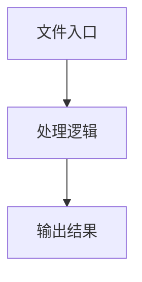

# utils.ts

## 0. 文件概述
utils.ts - TypeScript/JavaScript 源文件

## 1. 核心功能

### 1.1 导出项
- `export function generateTestDataPath(testDataName: string) {`
- `export async function generateExtractData(`
- `export function writeFileSyncWithDir(`
- `export async function getElementsInfo(page: WebPage) {`

### 1.2 类定义
- 无类定义

### 1.3 函数定义  
- **generateTestDataPath()**: 函数
- **generateExtractData()**: 函数
- **ensureDirectoryExistence()**: 函数
- **writeFileSyncWithDir()**: 函数
- **getElementsInfo()**: 函数

### 1.4 常量定义
- **midsceneTestDataPath**: 常量
- **inputImgBase64**: 常量
- **inputImagePath**: 常量
- **outputImagePath**: 常量
- **outputWithoutTextImgPath**: 常量
- **resizeOutputImgPath**: 常量
- **snapshotJsonPath**: 常量
- **elementTreeJsonPath**: 常量
- **elementTreeTextText**: 常量
- **elementTreeTextPath**: 常量
- **originalSize**: 常量
- **resizedImg**: 常量
- **dirname**: 常量
- **captureElementSnapshot**: 常量
- **elementTree**: 常量
- **elementsPositionInfoWithoutText**: 常量

## 2. 逻辑流程

**流程说明**: 该文件实现特定功能，通过导入依赖模块，定义类/函数/常量，并导出供其他模块使用。

## 3. 关键细节

### 3.1 核心变量
- **midsceneTestDataPath**: 定义的常量
- **inputImgBase64**: 定义的常量
- **inputImagePath**: 定义的常量
- **outputImagePath**: 定义的常量
- **outputWithoutTextImgPath**: 定义的常量
- **resizeOutputImgPath**: 定义的常量
- **snapshotJsonPath**: 定义的常量
- **elementTreeJsonPath**: 定义的常量
- **elementTreeTextText**: 定义的常量
- **elementTreeTextPath**: 定义的常量
- **originalSize**: 定义的常量
- **resizedImg**: 定义的常量
- **dirname**: 定义的常量
- **captureElementSnapshot**: 定义的常量
- **elementTree**: 定义的常量
- **elementsPositionInfoWithoutText**: 定义的常量

### 3.2 依赖项
- `import assert from 'node:assert';`
- `import { existsSync, mkdirSync, writeFileSync } from 'node:fs';`
- `import { NodeType } from '@midscene/shared/constants';`
- `import path from 'node:path';`
- `import { descriptionOfTree } from '@midscene/core/tree';`

（共 8 个导入项）

## 4. 跨文件调用关系

### 4.1 该文件调用的其他文件
根据 import 语句，该文件依赖以下模块：
- import assert from 'node:assert';
- import { existsSync, mkdirSync, writeFileSync } from 'node:fs';
- import { NodeType } from '@midscene/shared/constants';

### 4.2 调用该文件的其他文件
该文件通过以下导出项被其他模块使用：
- export function generateTestDataPath(testDataName: string) {
- export async function generateExtractData(
- export function writeFileSyncWithDir(
