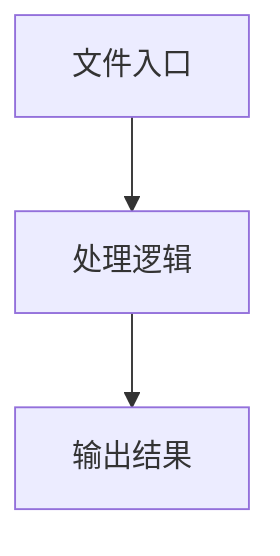

# test-analyzer.ts

## 0. 文件概述
test-analyzer.ts - TypeScript/JavaScript 源文件

## 1. 核心功能

### 1.1 导出项
- `export class TestResultCollector {`

### 1.2 类定义
- **TestResultCollector**: 类定义

### 1.3 函数定义  
- 无函数定义

### 1.4 常量定义
- **logBasePath**: 常量
- **sameResult**: 常量
- **errorMsg**: 常量
- **testLog**: 常量
- **logContent**: 常量
- **groupedTestLogs**: 常量
- **resultData**: 常量
- **passRate**: 常量
- **averageCost**: 常量
- **totalTimeCost**: 常量
- **failedCases**: 常量
- **centerX1**: 常量
- **centerY1**: 常量
- **centerX2**: 常量
- **centerY2**: 常量
- **centerX1**: 常量
- **centerY1**: 常量
- **centerX2**: 常量
- **centerY2**: 常量
- **distanceThreshold**: 常量
- **msg**: 常量
- **msg**: 常量
- **expected**: 常量
- **planningResult**: 常量
- **steps**: 常量
- **actualActions**: 常量
- **msg**: 常量
- **msg**: 常量
- **msg**: 常量
- **expectedBbox**: 常量
- **actualBbox**: 常量
- **msg**: 常量
- **distance**: 常量
- **msg**: 常量
- **resultRect**: 常量
- **distance**: 常量
- **msg**: 常量
- **expectedId**: 常量
- **expectedIndexId**: 常量
- **actualId**: 常量
- **msg**: 常量
- **msg**: 常量

## 2. 逻辑流程

**流程说明**: 该文件实现特定功能，通过导入依赖模块，定义类/函数/常量，并导出供其他模块使用。

## 3. 关键细节

### 3.1 核心变量
- **logBasePath**: 定义的常量
- **sameResult**: 定义的常量
- **errorMsg**: 定义的常量
- **testLog**: 定义的常量
- **logContent**: 定义的常量
- **groupedTestLogs**: 定义的常量
- **resultData**: 定义的常量
- **passRate**: 定义的常量
- **averageCost**: 定义的常量
- **totalTimeCost**: 定义的常量
- **failedCases**: 定义的常量
- **centerX1**: 定义的常量
- **centerY1**: 定义的常量
- **centerX2**: 定义的常量
- **centerY2**: 定义的常量
- **centerX1**: 定义的常量
- **centerY1**: 定义的常量
- **centerX2**: 定义的常量
- **centerY2**: 定义的常量
- **distanceThreshold**: 定义的常量
- **msg**: 定义的常量
- **msg**: 定义的常量
- **expected**: 定义的常量
- **planningResult**: 定义的常量
- **steps**: 定义的常量
- **actualActions**: 定义的常量
- **msg**: 定义的常量
- **msg**: 定义的常量
- **msg**: 定义的常量
- **expectedBbox**: 定义的常量
- **actualBbox**: 定义的常量
- **msg**: 定义的常量
- **distance**: 定义的常量
- **msg**: 定义的常量
- **resultRect**: 定义的常量
- **distance**: 定义的常量
- **msg**: 定义的常量
- **expectedId**: 定义的常量
- **expectedIndexId**: 定义的常量
- **actualId**: 定义的常量
- **msg**: 定义的常量
- **msg**: 定义的常量

### 3.2 依赖项
- `import { appendFileSync, existsSync, mkdirSync } from 'node:fs';`
- `import path from 'node:path';`
- `import type {`
- `import type { AiLocateSection } from '@midscene/core/ai-model';`
- `import { globalModelConfigManager } from '@midscene/shared/env';`

（共 6 个导入项）

## 4. 跨文件调用关系

### 4.1 该文件调用的其他文件
根据 import 语句，该文件依赖以下模块：
- import { appendFileSync, existsSync, mkdirSync } from 'node:fs';
- import path from 'node:path';
- import type {

### 4.2 调用该文件的其他文件
该文件通过以下导出项被其他模块使用：
- export class TestResultCollector {
