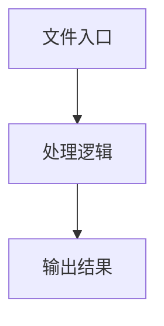

# device.ts

## 0. 文件概述
device.ts - TypeScript/JavaScript 源文件

## 1. 核心功能

### 1.1 导出项
- `export type { IOSDeviceOpt, IOSDeviceInputOpt } from '@midscene/core/device';`
- `export const WDA_HTTP_METHODS = ['GET', 'POST', 'DELETE', 'PUT'] as const;`
- `export type WDAHttpMethod = (typeof WDA_HTTP_METHODS)[number];`
- `export class IOSDevice implements AbstractInterface {`
- `export type DeviceActionRunWdaRequest = DeviceAction<`
- `export type DeviceActionLaunch = DeviceAction<LaunchParam, void>;`
- `export type DeviceActionIOSHomeButton = DeviceAction<undefined, void>;`
- `export type DeviceActionIOSAppSwitcher = DeviceAction<undefined, void>;`

### 1.2 类定义
- **IOSDevice**: 类定义

### 1.3 函数定义  
- 无函数定义

### 1.4 常量定义
- **debugDevice**: 常量
- **WDA_HTTP_METHODS**: 常量
- **defaultActions**: 常量
- **element**: 常量
- **element**: 常量
- **element**: 常量
- **autoDismissKeyboard**: 常量
- **element**: 常量
- **startingPoint**: 常量
- **scrollToEventName**: 常量
- **from**: 常量
- **to**: 常量
- **element**: 常量
- **element**: 常量
- **platformSpecificActions**: 常量
- **customActions**: 常量
- **wdaPort**: 常量
- **wdaHost**: 常量
- **deviceInfo**: 常量
- **size**: 常量
- **apiScale**: 常量
- **windowSize**: 常量
- **screenSize**: 常量
- **base64Data**: 常量
- **result**: 常量
- **cleared**: 常量
- **shouldAutoDismissKeyboard**: 常量
- **start**: 常量
- **scrollDistance**: 常量
- **start**: 常量
- **scrollDistance**: 常量
- **start**: 常量
- **scrollDistance**: 常量
- **start**: 常量
- **scrollDistance**: 常量
- **len1**: 常量
- **len2**: 常量
- **minLength**: 常量
- **sampleSize**: 常量
- **diffPercent**: 常量
- **isSimilar**: 常量
- **maxAttempts**: 常量
- **currentScreenshot**: 常量
- **scrollDistance**: 常量
- **centerX**: 常量
- **startY**: 常量
- **endY**: 常量
- **dismissKeys**: 常量
- **windowSize**: 常量
- **centerX**: 常量
- **startY**: 常量
- **endY**: 常量
- **opts**: 常量
- **runWdaRequestParamSchema**: 常量
- **launchParamSchema**: 常量
- **createPlatformActions**: 常量

## 2. 逻辑流程

**流程说明**: 该文件实现特定功能，通过导入依赖模块，定义类/函数/常量，并导出供其他模块使用。

## 3. 关键细节

### 3.1 核心变量
- **debugDevice**: 定义的常量
- **WDA_HTTP_METHODS**: 定义的常量
- **defaultActions**: 定义的常量
- **element**: 定义的常量
- **element**: 定义的常量
- **element**: 定义的常量
- **autoDismissKeyboard**: 定义的常量
- **element**: 定义的常量
- **startingPoint**: 定义的常量
- **scrollToEventName**: 定义的常量
- **from**: 定义的常量
- **to**: 定义的常量
- **element**: 定义的常量
- **element**: 定义的常量
- **platformSpecificActions**: 定义的常量
- **customActions**: 定义的常量
- **wdaPort**: 定义的常量
- **wdaHost**: 定义的常量
- **deviceInfo**: 定义的常量
- **size**: 定义的常量
- **apiScale**: 定义的常量
- **windowSize**: 定义的常量
- **screenSize**: 定义的常量
- **base64Data**: 定义的常量
- **result**: 定义的常量
- **cleared**: 定义的常量
- **shouldAutoDismissKeyboard**: 定义的常量
- **start**: 定义的常量
- **scrollDistance**: 定义的常量
- **start**: 定义的常量
- **scrollDistance**: 定义的常量
- **start**: 定义的常量
- **scrollDistance**: 定义的常量
- **start**: 定义的常量
- **scrollDistance**: 定义的常量
- **len1**: 定义的常量
- **len2**: 定义的常量
- **minLength**: 定义的常量
- **sampleSize**: 定义的常量
- **diffPercent**: 定义的常量
- **isSimilar**: 定义的常量
- **maxAttempts**: 定义的常量
- **currentScreenshot**: 定义的常量
- **scrollDistance**: 定义的常量
- **centerX**: 定义的常量
- **startY**: 定义的常量
- **endY**: 定义的常量
- **dismissKeys**: 定义的常量
- **windowSize**: 定义的常量
- **centerX**: 定义的常量
- **startY**: 定义的常量
- **endY**: 定义的常量
- **opts**: 定义的常量
- **runWdaRequestParamSchema**: 定义的常量
- **launchParamSchema**: 定义的常量
- **createPlatformActions**: 定义的常量

### 3.2 依赖项
- `import assert from 'node:assert';`
- `import {`
- `import {`
- `import { sleep } from '@midscene/core/utils';`
- `import { DEFAULT_WDA_PORT } from '@midscene/shared/constants';`

（共 10 个导入项）

## 4. 跨文件调用关系

### 4.1 该文件调用的其他文件
根据 import 语句，该文件依赖以下模块：
- import assert from 'node:assert';
- import {
- import {

### 4.2 调用该文件的其他文件
该文件通过以下导出项被其他模块使用：
- export type { IOSDeviceOpt, IOSDeviceInputOpt } from '@midscene/core/device';
- export const WDA_HTTP_METHODS = ['GET', 'POST', 'DELETE', 'PUT'] as const;
- export type WDAHttpMethod = (typeof WDA_HTTP_METHODS)[number];
