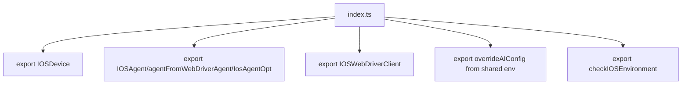

# 核心功能
- iOS 集成入口，导出设备、代理、WebDriver 客户端以及环境配置工具。
- 统一暴露 `IOSAgent`、`IOSDevice`、`IOSWebDriverClient` 和环境检查/配置覆盖能力，便于上层一次性导入。

# 逻辑流程

# 关键细节
- 无运行时代码，核心作用是整理导出路径，减少调用方耦合。
- 导出中包含类型别名 `IOSAgentOpt` 供类型安全配置使用。

# 跨文件调用关系
- 本文件调用：引用同目录的 `agent.ts`、`device.ts`、`ios-webdriver-client.ts`、`utils.ts` 以及 `@midscene/shared/env`。
- 被调用场景：其他包通过 `@midscene/ios` 获取全部 iOS 自动化能力；CLI/Playground 中的入口依赖本文件作为聚合出口。 
