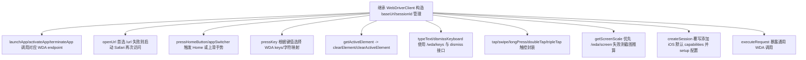

# 核心功能
- 在通用 `WebDriverClient` 基础上扩展 iOS/WebDriverAgent 专用能力：启动/激活/关闭 App、打开 URL、系统按键、App Switcher、键盘输入与清空、屏幕信息获取等。
- 负责将 WDA 相关接口（/wda/ 前缀与 W3C actions）封装成稳定调用，并补充容错回退。

# 逻辑流程

# 关键细节
- 核心变量：继承的 `sessionId/baseUrl/timeout`；调试日志 `debugIOS`。创建 session 时默认使用 `platformName=iOS`、`automationName=XCUITest` 等。
- 条件逻辑：大量 `ensureSession` 确保会话存在；打开 URL/按键等操作失败时尝试回退路径（Safari、不同 endpoint）；屏幕比例先 API 后截图推算。
- 异常处理：多数方法捕获错误并包装/重抛，调试日志记录失败原因；可选配置失败不阻断（如 `setupIOSSession`）。
- 数据流：输入 bundleId/URL/键值/坐标 -> 组装 HTTP 请求发送至 WDA -> 返回成功或抛出错误；屏幕信息通过 API/截图 -> 供尺寸与坐标换算使用。

# 跨文件调用关系
- 本文件调用：继承 `@midscene/webdriver` 的请求能力；使用共享日志；在 `getScreenScale` 中动态导入 `@midscene/shared/img` 处理截图。
- 被调用场景：`IOSDevice` 作为底层后端实例使用其方法；`src/index.ts` 导出供外部直接使用或测试；部分逻辑由 `IOSAgent` 间接触发。
