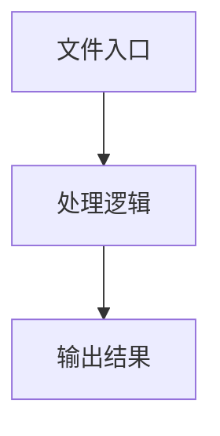

# ios-webdriver-client.ts

## 0. 文件概述
ios-webdriver-client.ts - TypeScript/JavaScript 源文件

## 1. 核心功能

### 1.1 导出项
- `export class IOSWebDriverClient extends WebDriverClient {`

### 1.2 类定义
- **IOSWebDriverClient**: 类定义

### 1.3 函数定义  
- 无函数定义

### 1.4 常量定义
- **debugIOS**: 常量
- **windowSize**: 常量
- **centerX**: 常量
- **startY**: 常量
- **endY**: 常量
- **normalizedKey**: 常量
- **iosKeyMap**: 常量
- **response**: 常量
- **elementId**: 常量
- **elementId**: 常量
- **cleanText**: 常量
- **actions**: 常量
- **screenResponse**: 常量
- **screenshotImg**: 常量
- **screenshotWidth**: 常量
- **screenshotHeight**: 常量
- **scale**: 常量
- **roundedScale**: 常量
- **defaultCapabilities**: 常量
- **session**: 常量

## 2. 逻辑流程

**流程说明**: 该文件实现特定功能，通过导入依赖模块，定义类/函数/常量，并导出供其他模块使用。

## 3. 关键细节

### 3.1 核心变量
- **debugIOS**: 定义的常量
- **windowSize**: 定义的常量
- **centerX**: 定义的常量
- **startY**: 定义的常量
- **endY**: 定义的常量
- **normalizedKey**: 定义的常量
- **iosKeyMap**: 定义的常量
- **response**: 定义的常量
- **elementId**: 定义的常量
- **elementId**: 定义的常量
- **cleanText**: 定义的常量
- **actions**: 定义的常量
- **screenResponse**: 定义的常量
- **screenshotImg**: 定义的常量
- **screenshotWidth**: 定义的常量
- **screenshotHeight**: 定义的常量
- **scale**: 定义的常量
- **roundedScale**: 定义的常量
- **defaultCapabilities**: 定义的常量
- **session**: 定义的常量

### 3.2 依赖项
- `import { getDebug } from '@midscene/shared/logger';`
- `import { WebDriverClient } from '@midscene/webdriver';`

## 4. 跨文件调用关系

### 4.1 该文件调用的其他文件
根据 import 语句，该文件依赖以下模块：
- import { getDebug } from '@midscene/shared/logger';
- import { WebDriverClient } from '@midscene/webdriver';

### 4.2 调用该文件的其他文件
该文件通过以下导出项被其他模块使用：
- export class IOSWebDriverClient extends WebDriverClient {
