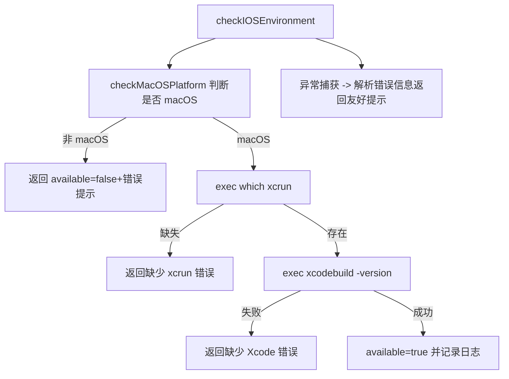

# 核心功能
- 检查当前系统环境是否满足 iOS/WebDriverAgent 运行条件（仅 macOS，需 xcrun/xcodebuild）。
- 提供平台检测 `checkMacOSPlatform` 与综合校验 `checkIOSEnvironment`，并输出调试日志。

# 逻辑流程

# 关键细节
- 核心变量：`execAsync` 包装 shell 执行；`debugUtils` 日志实例。
- 条件逻辑：逐步短路检查平台、xcrun、xcodebuild；针对 xcrun 错误提供 `xcode-select --reset` 建议。
- 异常处理：所有异常捕获后返回结构 `{available:false,error}`，并记录调试信息。
- 数据流：无输入或自动环境 -> 执行系统命令 -> 生成可用性布尔和错误描述供上层决策。

# 跨文件调用关系
- 本文件调用：`node:child_process`、`node:os`、`node:util` 以及共享日志。
- 被调用场景：`agentFromWebDriverAgent` 在创建设备前调用；其他工具可独立调用以提前检查环境。 
