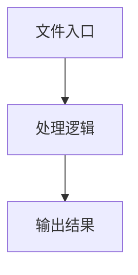

# base.ts

## 0. 文件概述
base.ts - TypeScript/JavaScript 源文件

## 1. 核心功能

### 1.1 导出项
- `export abstract class BasePlaygroundAdapter {`

### 1.2 类定义
- **BasePlaygroundAdapter**: 类定义

### 1.3 函数定义  
- 无函数定义

### 1.4 常量定义
- **needsStructuredParams**: 常量
- **paramsForValidation**: 常量
- **paramsList**: 常量
- **schema**: 常量
- **filtered**: 常量
- **shape**: 常量
- **paramsForValidation**: 常量
- **locatorFieldKeys**: 常量
- **zodError**: 常量
- **errorMessages**: 常量
- **path**: 常量
- **field**: 常量
- **errorMsg**: 常量
- **paramsList**: 常量
- **schema**: 常量
- **locatorFieldKeys**: 常量
- **shapeKeys**: 常量
- **paramValue**: 常量
- **displayKey**: 常量
- **formattedValue**: 常量

## 2. 逻辑流程

**流程说明**: 该文件实现特定功能，通过导入依赖模块，定义类/函数/常量，并导出供其他模块使用。

## 3. 关键细节

### 3.1 核心变量
- **needsStructuredParams**: 定义的常量
- **paramsForValidation**: 定义的常量
- **paramsList**: 定义的常量
- **schema**: 定义的常量
- **filtered**: 定义的常量
- **shape**: 定义的常量
- **paramsForValidation**: 定义的常量
- **locatorFieldKeys**: 定义的常量
- **zodError**: 定义的常量
- **errorMessages**: 定义的常量
- **path**: 定义的常量
- **field**: 定义的常量
- **errorMsg**: 定义的常量
- **paramsList**: 定义的常量
- **schema**: 定义的常量
- **locatorFieldKeys**: 定义的常量
- **shapeKeys**: 定义的常量
- **paramValue**: 定义的常量
- **displayKey**: 定义的常量
- **formattedValue**: 定义的常量

### 3.2 依赖项
- `import type { DeviceAction } from '@midscene/core';`
- `import { findAllMidsceneLocatorField } from '@midscene/core/ai-model';`
- `import type { ExecutionOptions, FormValue, ValidationResult } from '../types';`

## 4. 跨文件调用关系

### 4.1 该文件调用的其他文件
根据 import 语句，该文件依赖以下模块：
- import type { DeviceAction } from '@midscene/core';
- import { findAllMidsceneLocatorField } from '@midscene/core/ai-model';
- import type { ExecutionOptions, FormValue, ValidationResult } from '../types';

### 4.2 调用该文件的其他文件
该文件通过以下导出项被其他模块使用：
- export abstract class BasePlaygroundAdapter {
