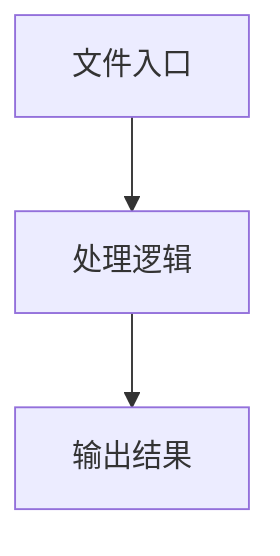

# local-execution.ts

## 0. 文件概述
local-execution.ts - TypeScript/JavaScript 源文件

## 1. 核心功能

### 1.1 导出项
- `export class LocalExecutionAdapter extends BasePlaygroundAdapter {`

### 1.2 类定义
- **LocalExecutionAdapter**: 类定义

### 1.3 函数定义  
- 无函数定义

### 1.4 常量定义
- **errorMessage**: 常量
- **page**: 常量
- **contextPage**: 常量
- **page**: 常量
- **actionSpace**: 常量
- **response**: 常量
- **dumpString**: 常量
- **groupedDump**: 常量
- **errorMessage**: 常量
- **response**: 常量
- **dumpString**: 常量
- **groupedDump**: 常量
- **type**: 常量
- **description**: 常量

## 2. 逻辑流程

**流程说明**: 该文件实现特定功能，通过导入依赖模块，定义类/函数/常量，并导出供其他模块使用。

## 3. 关键细节

### 3.1 核心变量
- **errorMessage**: 定义的常量
- **page**: 定义的常量
- **contextPage**: 定义的常量
- **page**: 定义的常量
- **actionSpace**: 定义的常量
- **response**: 定义的常量
- **dumpString**: 定义的常量
- **groupedDump**: 定义的常量
- **errorMessage**: 定义的常量
- **response**: 定义的常量
- **dumpString**: 定义的常量
- **groupedDump**: 定义的常量
- **type**: 定义的常量
- **description**: 定义的常量

### 3.2 依赖项
- `import type { DeviceAction, ExecutionDump } from '@midscene/core';`
- `import { overrideAIConfig } from '@midscene/shared/env';`
- `import { uuid } from '@midscene/shared/utils';`
- `import { executeAction, parseStructuredParams } from '../common';`
- `import type { ExecutionOptions, FormValue, PlaygroundAgent } from '../types';`

（共 6 个导入项）

## 4. 跨文件调用关系

### 4.1 该文件调用的其他文件
根据 import 语句，该文件依赖以下模块：
- import type { DeviceAction, ExecutionDump } from '@midscene/core';
- import { overrideAIConfig } from '@midscene/shared/env';
- import { uuid } from '@midscene/shared/utils';

### 4.2 调用该文件的其他文件
该文件通过以下导出项被其他模块使用：
- export class LocalExecutionAdapter extends BasePlaygroundAdapter {
