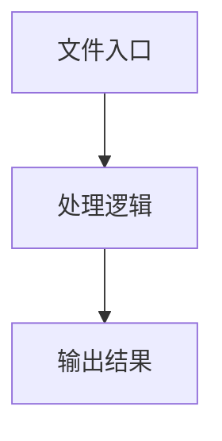

# remote-execution.ts

## 0. 文件概述
remote-execution.ts - TypeScript/JavaScript 源文件

## 1. 核心功能

### 1.1 导出项
- `export class RemoteExecutionAdapter extends BasePlaygroundAdapter {`

### 1.2 类定义
- **RemoteExecutionAdapter**: 类定义

### 1.3 函数定义  
- 无函数定义

### 1.4 常量定义
- **needsStructuredParams**: 常量
- **schema**: 常量
- **shape**: 常量
- **missingFields**: 常量
- **fieldDef**: 常量
- **isOptional**: 常量
- **message**: 常量
- **androidErrors**: 常量
- **androidError**: 常量
- **payload**: 常量
- **response**: 常量
- **errorText**: 常量
- **result**: 常量
- **optionalParams**: 常量
- **optionalFields**: 常量
- **response**: 常量
- **result**: 常量
- **actionSpaceMethod**: 常量
- **result**: 常量
- **res**: 常量
- **data**: 常量
- **response**: 常量
- **response**: 常量
- **progressData**: 常量
- **res**: 常量
- **result**: 常量
- **response**: 常量
- **response**: 常量

## 2. 逻辑流程

**流程说明**: 该文件实现特定功能，通过导入依赖模块，定义类/函数/常量，并导出供其他模块使用。

## 3. 关键细节

### 3.1 核心变量
- **needsStructuredParams**: 定义的常量
- **schema**: 定义的常量
- **shape**: 定义的常量
- **missingFields**: 定义的常量
- **fieldDef**: 定义的常量
- **isOptional**: 定义的常量
- **message**: 定义的常量
- **androidErrors**: 定义的常量
- **androidError**: 定义的常量
- **payload**: 定义的常量
- **response**: 定义的常量
- **errorText**: 定义的常量
- **result**: 定义的常量
- **optionalParams**: 定义的常量
- **optionalFields**: 定义的常量
- **response**: 定义的常量
- **result**: 定义的常量
- **actionSpaceMethod**: 定义的常量
- **result**: 定义的常量
- **res**: 定义的常量
- **data**: 定义的常量
- **response**: 定义的常量
- **response**: 定义的常量
- **progressData**: 定义的常量
- **res**: 定义的常量
- **result**: 定义的常量
- **response**: 定义的常量
- **response**: 定义的常量

### 3.2 依赖项
- `import type { DeviceAction, ExecutionDump } from '@midscene/core';`
- `import { parseStructuredParams } from '../common';`
- `import type { ExecutionOptions, FormValue, ValidationResult } from '../types';`
- `import { BasePlaygroundAdapter } from './base';`

## 4. 跨文件调用关系

### 4.1 该文件调用的其他文件
根据 import 语句，该文件依赖以下模块：
- import type { DeviceAction, ExecutionDump } from '@midscene/core';
- import { parseStructuredParams } from '../common';
- import type { ExecutionOptions, FormValue, ValidationResult } from '../types';

### 4.2 调用该文件的其他文件
该文件通过以下导出项被其他模块使用：
- export class RemoteExecutionAdapter extends BasePlaygroundAdapter {
