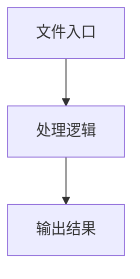

# common.ts

## 0. 文件概述
common.ts - TypeScript/JavaScript 源文件

## 1. 核心功能

### 1.1 导出项
- `export const dataExtractionAPIs = [`
- `export const validationAPIs = ['aiAssert', 'aiWaitFor'];`
- `export const noReplayAPIs = [...dataExtractionAPIs, ...validationAPIs];`
- `export const formatErrorMessage = (e: any): string => {`
- `export async function parseStructuredParams(`
- `export function validateStructuredParams(`
- `export async function executeAction(`

### 1.2 类定义
- 无类定义

### 1.3 函数定义  
- **parseStructuredParams()**: 函数
- **validateStructuredParams()**: 函数
- **executeAction()**: 函数

### 1.4 常量定义
- **dataExtractionAPIs**: 常量
- **validationAPIs**: 常量
- **noReplayAPIs**: 常量
- **formatErrorMessage**: 常量
- **errorMessage**: 常量
- **schema**: 常量
- **keys**: 常量
- **paramObj**: 常量
- **locatorFieldKeys**: 常量
- **locatePrompt**: 常量
- **detailedLocateParam**: 常量
- **paramsForValidation**: 常量
- **schema**: 常量
- **locatorFieldKeys**: 常量
- **zodError**: 常量
- **errorMessages**: 常量
- **path**: 常量
- **field**: 常量
- **errorMsg**: 常量
- **action**: 常量
- **parsedParams**: 常量
- **detailedLocateParam**: 常量
- **actionParams**: 常量
- **prompt**: 常量

## 2. 逻辑流程

**流程说明**: 该文件实现特定功能，通过导入依赖模块，定义类/函数/常量，并导出供其他模块使用。

## 3. 关键细节

### 3.1 核心变量
- **dataExtractionAPIs**: 定义的常量
- **validationAPIs**: 定义的常量
- **noReplayAPIs**: 定义的常量
- **formatErrorMessage**: 定义的常量
- **errorMessage**: 定义的常量
- **schema**: 定义的常量
- **keys**: 定义的常量
- **paramObj**: 定义的常量
- **locatorFieldKeys**: 定义的常量
- **locatePrompt**: 定义的常量
- **detailedLocateParam**: 定义的常量
- **paramsForValidation**: 定义的常量
- **schema**: 定义的常量
- **locatorFieldKeys**: 定义的常量
- **zodError**: 定义的常量
- **errorMessages**: 定义的常量
- **path**: 定义的常量
- **field**: 定义的常量
- **errorMsg**: 定义的常量
- **action**: 定义的常量
- **parsedParams**: 定义的常量
- **detailedLocateParam**: 定义的常量
- **actionParams**: 定义的常量
- **prompt**: 定义的常量

### 3.2 依赖项
- `import type { DeviceAction } from '@midscene/core';`
- `import { findAllMidsceneLocatorField } from '@midscene/core/ai-model';`
- `import { buildDetailedLocateParam } from '@midscene/core/yaml';`
- `import type {`

## 4. 跨文件调用关系

### 4.1 该文件调用的其他文件
根据 import 语句，该文件依赖以下模块：
- import type { DeviceAction } from '@midscene/core';
- import { findAllMidsceneLocatorField } from '@midscene/core/ai-model';
- import { buildDetailedLocateParam } from '@midscene/core/yaml';

### 4.2 调用该文件的其他文件
该文件通过以下导出项被其他模块使用：
- export const dataExtractionAPIs = [
- export const validationAPIs = ['aiAssert', 'aiWaitFor'];
- export const noReplayAPIs = [...dataExtractionAPIs, ...validationAPIs];
