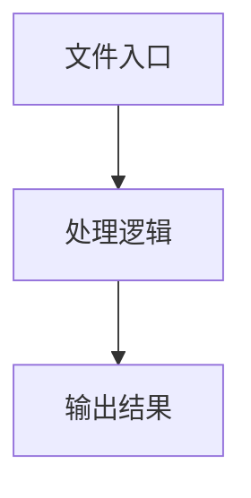

# index.ts

## 0. 文件概述
index.ts - TypeScript/JavaScript 源文件

## 1. 核心功能

### 1.1 导出项
- `export class PlaygroundSDK {`

### 1.2 类定义
- **PlaygroundSDK**: 类定义

### 1.3 函数定义  
- 无函数定义

### 1.4 常量定义
- **finalServerUrl**: 常量
- **result**: 常量
- **result**: 常量

## 2. 逻辑流程

**流程说明**: 该文件实现特定功能，通过导入依赖模块，定义类/函数/常量，并导出供其他模块使用。

## 3. 关键细节

### 3.1 核心变量
- **finalServerUrl**: 定义的常量
- **result**: 定义的常量
- **result**: 定义的常量

### 3.2 依赖项
- `import type { DeviceAction } from '@midscene/core';`
- `import { PLAYGROUND_SERVER_PORT } from '@midscene/shared/constants';`
- `import type { BasePlaygroundAdapter } from '../adapters/base';`
- `import { LocalExecutionAdapter } from '../adapters/local-execution';`
- `import { RemoteExecutionAdapter } from '../adapters/remote-execution';`

（共 6 个导入项）

## 4. 跨文件调用关系

### 4.1 该文件调用的其他文件
根据 import 语句，该文件依赖以下模块：
- import type { DeviceAction } from '@midscene/core';
- import { PLAYGROUND_SERVER_PORT } from '@midscene/shared/constants';
- import type { BasePlaygroundAdapter } from '../adapters/base';

### 4.2 调用该文件的其他文件
该文件通过以下导出项被其他模块使用：
- export class PlaygroundSDK {
