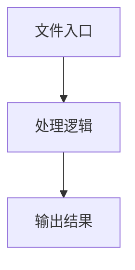

# RecordTimeline.tsx

## 0. 文件概述
RecordTimeline.tsx - TypeScript/JavaScript 源文件

## 1. 核心功能

### 1.1 导出项
- `export const RecordTimeline = ({`

### 1.2 类定义
- 无类定义

### 1.3 函数定义  
- 无函数定义

### 1.4 常量定义
- **RecordTimeline**: 常量
- **timeline**: 常量
- **toggleEventExpansion**: 常量
- **newExpanded**: 常量
- **truncateJsonStrings**: 常量
- **truncated**: 常量
- **copyToClipboard**: 常量
- **getEventIcon**: 常量
- **getEventColor**: 常量
- **formatTime**: 常量
- **getEventTitle**: 常量
- **getEventDescription**: 常量
- **eventTitle**: 常量
- **truncatedUrl**: 常量
- **timelineItems**: 常量
- **boxedImage**: 常量
- **afterImage**: 常量
- **isExpanded**: 常量
- **target**: 常量
- **target**: 常量
- **target**: 常量
- **target**: 常量

## 2. 逻辑流程

**流程说明**: 该文件实现特定功能，通过导入依赖模块，定义类/函数/常量，并导出供其他模块使用。

## 3. 关键细节

### 3.1 核心变量
- **RecordTimeline**: 定义的常量
- **timeline**: 定义的常量
- **toggleEventExpansion**: 定义的常量
- **newExpanded**: 定义的常量
- **truncateJsonStrings**: 定义的常量
- **truncated**: 定义的常量
- **copyToClipboard**: 定义的常量
- **getEventIcon**: 定义的常量
- **getEventColor**: 定义的常量
- **formatTime**: 定义的常量
- **getEventTitle**: 定义的常量
- **getEventDescription**: 定义的常量
- **eventTitle**: 定义的常量
- **truncatedUrl**: 定义的常量
- **timelineItems**: 定义的常量
- **boxedImage**: 定义的常量
- **afterImage**: 定义的常量
- **isExpanded**: 定义的常量
- **target**: 定义的常量
- **target**: 定义的常量
- **target**: 定义的常量
- **target**: 定义的常量

### 3.2 依赖项
- `import {`
- `import {`
- `import React, { useState, useEffect } from 'react';`
- `import { ShinyText } from './components/shiny-text';`
- `import type { RecordedEvent } from './recorder';`

（共 6 个导入项）

## 4. 跨文件调用关系

### 4.1 该文件调用的其他文件
根据 import 语句，该文件依赖以下模块：
- import {
- import {
- import React, { useState, useEffect } from 'react';

### 4.2 调用该文件的其他文件
该文件通过以下导出项被其他模块使用：
- export const RecordTimeline = ({
