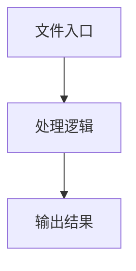

# recorder.ts

## 0. 文件概述
recorder.ts - TypeScript/JavaScript 源文件

## 1. 核心功能

### 1.1 导出项
- `export interface ChromeRecordedEvent {`
- `export interface RecordedEvent extends ChromeRecordedEvent {`
- `export type EventCallback = (event: RecordedEvent) => void;`
- `export class EventRecorder {`
- `export function convertToChromeEvent(`
- `export function convertToChromeEvents(`

### 1.2 类定义
- **EventRecorder**: 类定义

### 1.3 函数定义  
- **debugLog()**: 函数
- **generateHashId()**: 函数
- **type()**: 函数
- **isElementScrollable()**: 函数
- **getAllScrollableElements()**: 函数
- **isDocument()**: 函数
- **convertToChromeEvent()**: 函数
- **convertToChromeEvents()**: 函数

### 1.4 常量定义
- **DEBUG**: 常量
- **rectStr**: 常量
- **combined**: 常量
- **char**: 常量
- **isSameInputTarget**: 常量
- **isSameScrollTarget**: 常量
- **getLastLabelClick**: 常量
- **event**: 常量
- **style**: 常量
- **overflowY**: 常量
- **overflowX**: 常量
- **isScrollableY**: 常量
- **isScrollableX**: 常量
- **elements**: 常量
- **all**: 常量
- **descendants**: 常量
- **navigationEvent**: 常量
- **target**: 常量
- **rect**: 常量
- **elementRect**: 常量
- **clickEvent**: 常量
- **target**: 常量
- **scrollXTarget**: 常量
- **scrollYTarget**: 常量
- **rect**: 常量
- **elementRect**: 常量
- **scrollEvent**: 常量
- **target**: 常量
- **rect**: 常量
- **elementRect**: 常量
- **inputEvent**: 常量
- **lastEvent**: 常量
- **lastEvent**: 常量
- **oldInputEvent**: 常量
- **newEvents**: 常量
- **oldScrollEvent**: 常量
- **newEvents**: 常量

## 2. 逻辑流程

**流程说明**: 该文件实现特定功能，通过导入依赖模块，定义类/函数/常量，并导出供其他模块使用。

## 3. 关键细节

### 3.1 核心变量
- **DEBUG**: 定义的常量
- **rectStr**: 定义的常量
- **combined**: 定义的常量
- **char**: 定义的常量
- **isSameInputTarget**: 定义的常量
- **isSameScrollTarget**: 定义的常量
- **getLastLabelClick**: 定义的常量
- **event**: 定义的常量
- **style**: 定义的常量
- **overflowY**: 定义的常量
- **overflowX**: 定义的常量
- **isScrollableY**: 定义的常量
- **isScrollableX**: 定义的常量
- **elements**: 定义的常量
- **all**: 定义的常量
- **descendants**: 定义的常量
- **navigationEvent**: 定义的常量
- **target**: 定义的常量
- **rect**: 定义的常量
- **elementRect**: 定义的常量
- **clickEvent**: 定义的常量
- **target**: 定义的常量
- **scrollXTarget**: 定义的常量
- **scrollYTarget**: 定义的常量
- **rect**: 定义的常量
- **elementRect**: 定义的常量
- **scrollEvent**: 定义的常量
- **target**: 定义的常量
- **rect**: 定义的常量
- **elementRect**: 定义的常量
- **inputEvent**: 定义的常量
- **lastEvent**: 定义的常量
- **lastEvent**: 定义的常量
- **oldInputEvent**: 定义的常量
- **newEvents**: 定义的常量
- **oldScrollEvent**: 定义的常量
- **newEvents**: 定义的常量

### 3.2 依赖项
- `import { isNotContainerElement } from '@midscene/shared/extractor';`
- `import { getElementXpath } from '@midscene/shared/extractor';`

## 4. 跨文件调用关系

### 4.1 该文件调用的其他文件
根据 import 语句，该文件依赖以下模块：
- import { isNotContainerElement } from '@midscene/shared/extractor';
- import { getElementXpath } from '@midscene/shared/extractor';

### 4.2 调用该文件的其他文件
该文件通过以下导出项被其他模块使用：
- export interface ChromeRecordedEvent {
- export interface RecordedEvent extends ChromeRecordedEvent {
- export type EventCallback = (event: RecordedEvent) => void;
