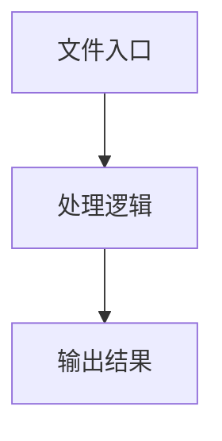

# index.ts

## 0. 文件概述
index.ts - TypeScript/JavaScript 源文件

## 1. 核心功能

### 1.1 导出项
- `export const TEXT_SIZE_THRESHOLD = 9;`
- `export const TEXT_MAX_SIZE = 40;`
- `export const CONTAINER_MINI_HEIGHT = 3;`
- `export const CONTAINER_MINI_WIDTH = 3;`
- `export enum NodeType {`
- `export const PLAYGROUND_SERVER_PORT = 5800;`
- `export const SCRCPY_SERVER_PORT = 5700;`
- `export const WEBDRIVER_ELEMENT_ID_KEY = 'element-6066-11e4-a52e-4f735466cecf';`
- `export const DEFAULT_WDA_PORT = 8100;`
- `export const DEFAULT_WAIT_FOR_NAVIGATION_TIMEOUT = 5000;`
- `export const DEFAULT_WAIT_FOR_NETWORK_IDLE_TIMEOUT = 2000;`
- `export const DEFAULT_WAIT_FOR_NETWORK_IDLE_TIME = 300;`
- `export const DEFAULT_WAIT_FOR_NETWORK_IDLE_CONCURRENCY = 2;`
- `export { PLAYWRIGHT_EXAMPLE_CODE, YAML_EXAMPLE_CODE } from './example-code';`

### 1.2 类定义
- 无类定义

### 1.3 函数定义  
- 无函数定义

### 1.4 常量定义
- **TEXT_SIZE_THRESHOLD**: 常量
- **TEXT_MAX_SIZE**: 常量
- **CONTAINER_MINI_HEIGHT**: 常量
- **CONTAINER_MINI_WIDTH**: 常量
- **PLAYGROUND_SERVER_PORT**: 常量
- **SCRCPY_SERVER_PORT**: 常量
- **WEBDRIVER_ELEMENT_ID_KEY**: 常量
- **DEFAULT_WDA_PORT**: 常量
- **DEFAULT_WAIT_FOR_NAVIGATION_TIMEOUT**: 常量
- **DEFAULT_WAIT_FOR_NETWORK_IDLE_TIMEOUT**: 常量
- **DEFAULT_WAIT_FOR_NETWORK_IDLE_TIME**: 常量
- **DEFAULT_WAIT_FOR_NETWORK_IDLE_CONCURRENCY**: 常量

## 2. 逻辑流程

**流程说明**: 该文件实现特定功能，通过导入依赖模块，定义类/函数/常量，并导出供其他模块使用。

## 3. 关键细节

### 3.1 核心变量
- **TEXT_SIZE_THRESHOLD**: 定义的常量
- **TEXT_MAX_SIZE**: 定义的常量
- **CONTAINER_MINI_HEIGHT**: 定义的常量
- **CONTAINER_MINI_WIDTH**: 定义的常量
- **PLAYGROUND_SERVER_PORT**: 定义的常量
- **SCRCPY_SERVER_PORT**: 定义的常量
- **WEBDRIVER_ELEMENT_ID_KEY**: 定义的常量
- **DEFAULT_WDA_PORT**: 定义的常量
- **DEFAULT_WAIT_FOR_NAVIGATION_TIMEOUT**: 定义的常量
- **DEFAULT_WAIT_FOR_NETWORK_IDLE_TIMEOUT**: 定义的常量
- **DEFAULT_WAIT_FOR_NETWORK_IDLE_TIME**: 定义的常量
- **DEFAULT_WAIT_FOR_NETWORK_IDLE_CONCURRENCY**: 定义的常量

### 3.2 依赖项
- 无外部依赖

## 4. 跨文件调用关系

### 4.1 该文件调用的其他文件
- 无外部调用

### 4.2 调用该文件的其他文件
该文件通过以下导出项被其他模块使用：
- export const TEXT_SIZE_THRESHOLD = 9;
- export const TEXT_MAX_SIZE = 40;
- export const CONTAINER_MINI_HEIGHT = 3;
