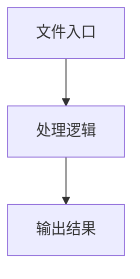

# helper.ts

## 0. 文件概述
helper.ts - TypeScript/JavaScript 源文件

## 1. 核心功能

### 1.1 导出项
- `export const maskConfig = (config: Record<string, unknown>) => {`
- `export const parseJson = (key: string, value: string | undefined) => {`

### 1.2 类定义
- 无类定义

### 1.3 函数定义  
- 无函数定义

### 1.4 常量定义
- **maskKey**: 常量
- **prefixLen**: 常量
- **suffixLen**: 常量
- **keepLength**: 常量
- **prefix**: 常量
- **suffix**: 常量
- **maskLength**: 常量
- **mask**: 常量
- **maskConfig**: 常量
- **valueStr**: 常量
- **parseJson**: 常量

## 2. 逻辑流程

**流程说明**: 该文件实现特定功能，通过导入依赖模块，定义类/函数/常量，并导出供其他模块使用。

## 3. 关键细节

### 3.1 核心变量
- **maskKey**: 定义的常量
- **prefixLen**: 定义的常量
- **suffixLen**: 定义的常量
- **keepLength**: 定义的常量
- **prefix**: 定义的常量
- **suffix**: 定义的常量
- **maskLength**: 定义的常量
- **mask**: 定义的常量
- **maskConfig**: 定义的常量
- **valueStr**: 定义的常量
- **parseJson**: 定义的常量

### 3.2 依赖项
- `import { assert } from '../utils';`
- `import type { IModelConfig } from './types';`

## 4. 跨文件调用关系

### 4.1 该文件调用的其他文件
根据 import 语句，该文件依赖以下模块：
- import { assert } from '../utils';
- import type { IModelConfig } from './types';

### 4.2 调用该文件的其他文件
该文件通过以下导出项被其他模块使用：
- export const maskConfig = (config: Record<string, unknown>) => {
- export const parseJson = (key: string, value: string | undefined) => {
