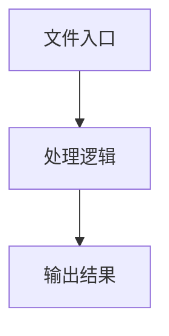

# parse-model-config.ts

## 0. 文件概述
parse-model-config.ts - TypeScript/JavaScript 源文件

## 1. 核心功能

### 1.1 导出项
- `export const modelFamilyToVLConfig = (`
- `export const legacyConfigToModelFamily = (`
- `export const parseOpenaiSdkConfig = ({`
- `export const decideModelConfigFromIntentConfig = (`

### 1.2 类定义
- 无类定义

### 1.3 函数定义  
- 无函数定义

### 1.4 常量定义
- **KEYS_MAP**: 常量
- **modelFamilyToVLConfig**: 常量
- **legacyConfigToModelFamily**: 常量
- **isDoubao**: 常量
- **isQwen**: 常量
- **isQwen3**: 常量
- **isUiTars**: 常量
- **isGemini**: 常量
- **enabledModes**: 常量
- **parseOpenaiSdkConfig**: 常量
- **debugLog**: 常量
- **legacyAPIKey**: 常量
- **legacyBaseURL**: 常量
- **legacySocksProxy**: 常量
- **legacyHttpProxy**: 常量
- **legacyOpenaiExtraConfig**: 常量
- **legacyModelFamily**: 常量
- **modelFamilyRaw**: 常量
- **openaiApiKey**: 常量
- **openaiBaseURL**: 常量
- **socksProxy**: 常量
- **httpProxy**: 常量
- **modelName**: 常量
- **openaiExtraConfigStr**: 常量
- **openaiExtraConfig**: 常量
- **temperature**: 常量
- **getModelDescription**: 常量
- **modelDescription**: 常量
- **decideModelConfigFromIntentConfig**: 常量
- **debugLog**: 常量
- **keysForFn**: 常量
- **modelName**: 常量
- **finalResult**: 常量

## 2. 逻辑流程

**流程说明**: 该文件实现特定功能，通过导入依赖模块，定义类/函数/常量，并导出供其他模块使用。

## 3. 关键细节

### 3.1 核心变量
- **KEYS_MAP**: 定义的常量
- **modelFamilyToVLConfig**: 定义的常量
- **legacyConfigToModelFamily**: 定义的常量
- **isDoubao**: 定义的常量
- **isQwen**: 定义的常量
- **isQwen3**: 定义的常量
- **isUiTars**: 定义的常量
- **isGemini**: 定义的常量
- **enabledModes**: 定义的常量
- **parseOpenaiSdkConfig**: 定义的常量
- **debugLog**: 定义的常量
- **legacyAPIKey**: 定义的常量
- **legacyBaseURL**: 定义的常量
- **legacySocksProxy**: 定义的常量
- **legacyHttpProxy**: 定义的常量
- **legacyOpenaiExtraConfig**: 定义的常量
- **legacyModelFamily**: 定义的常量
- **modelFamilyRaw**: 定义的常量
- **openaiApiKey**: 定义的常量
- **openaiBaseURL**: 定义的常量
- **socksProxy**: 定义的常量
- **httpProxy**: 定义的常量
- **modelName**: 定义的常量
- **openaiExtraConfigStr**: 定义的常量
- **openaiExtraConfig**: 定义的常量
- **temperature**: 定义的常量
- **getModelDescription**: 定义的常量
- **modelDescription**: 定义的常量
- **decideModelConfigFromIntentConfig**: 定义的常量
- **debugLog**: 定义的常量
- **keysForFn**: 定义的常量
- **modelName**: 定义的常量
- **finalResult**: 定义的常量

### 3.2 依赖项
- `import {`
- `import {`
- `import { getDebug } from '../logger';`
- `import { assert } from '../utils';`
- `import { maskConfig, parseJson } from './helper';`

（共 6 个导入项）

## 4. 跨文件调用关系

### 4.1 该文件调用的其他文件
根据 import 语句，该文件依赖以下模块：
- import {
- import {
- import { getDebug } from '../logger';

### 4.2 调用该文件的其他文件
该文件通过以下导出项被其他模块使用：
- export const modelFamilyToVLConfig = (
- export const legacyConfigToModelFamily = (
- export const parseOpenaiSdkConfig = ({
