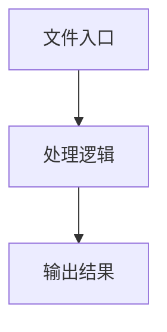

# types.ts

## 0. 文件概述
types.ts - TypeScript/JavaScript 源文件

## 1. 核心功能

### 1.1 导出项
- `export const MIDSCENE_MODEL_INIT_CONFIG_JSON =`
- `export const MIDSCENE_MODEL_NAME = 'MIDSCENE_MODEL_NAME';`
- `export const MIDSCENE_DEBUG_MODEL_PROFILE = 'MIDSCENE_DEBUG_MODEL_PROFILE';`
- `export const MIDSCENE_DEBUG_MODEL_RESPONSE = 'MIDSCENE_DEBUG_MODEL_RESPONSE';`
- `export const MIDSCENE_DANGEROUSLY_PRINT_ALL_CONFIG =`
- `export const MIDSCENE_DEBUG_MODE = 'MIDSCENE_DEBUG_MODE';`
- `export const MIDSCENE_MCP_USE_PUPPETEER_MODE =`
- `export const MIDSCENE_MCP_CHROME_PATH = 'MIDSCENE_MCP_CHROME_PATH';`
- `export const MIDSCENE_MCP_ANDROID_MODE = 'MIDSCENE_MCP_ANDROID_MODE';`
- `export const DOCKER_CONTAINER = 'DOCKER_CONTAINER';`
- `export const MIDSCENE_FORCE_DEEP_THINK = 'MIDSCENE_FORCE_DEEP_THINK';`
- `export const MIDSCENE_LANGSMITH_DEBUG = 'MIDSCENE_LANGSMITH_DEBUG';`
- `export const MIDSCENE_LANGFUSE_DEBUG = 'MIDSCENE_LANGFUSE_DEBUG';`
- `export const MIDSCENE_MODEL_SOCKS_PROXY = 'MIDSCENE_MODEL_SOCKS_PROXY';`
- `export const MIDSCENE_MODEL_HTTP_PROXY = 'MIDSCENE_MODEL_HTTP_PROXY';`
- `export const MIDSCENE_MODEL_API_KEY = 'MIDSCENE_MODEL_API_KEY';`
- `export const MIDSCENE_MODEL_BASE_URL = 'MIDSCENE_MODEL_BASE_URL';`
- `export const MIDSCENE_MODEL_MAX_TOKENS = 'MIDSCENE_MODEL_MAX_TOKENS';`
- `export const MIDSCENE_MODEL_TIMEOUT = 'MIDSCENE_MODEL_TIMEOUT';`
- `export const MIDSCENE_MODEL_TEMPERATURE = 'MIDSCENE_MODEL_TEMPERATURE';`
- `export const OPENAI_API_KEY = 'OPENAI_API_KEY';`
- `export const OPENAI_BASE_URL = 'OPENAI_BASE_URL';`
- `export const MIDSCENE_OPENAI_INIT_CONFIG_JSON =`
- `export const MIDSCENE_OPENAI_HTTP_PROXY = 'MIDSCENE_OPENAI_HTTP_PROXY';`
- `export const MIDSCENE_OPENAI_SOCKS_PROXY = 'MIDSCENE_OPENAI_SOCKS_PROXY';`
- `export const OPENAI_MAX_TOKENS = 'OPENAI_MAX_TOKENS';`
- `export const MIDSCENE_ADB_PATH = 'MIDSCENE_ADB_PATH';`
- `export const MIDSCENE_ADB_REMOTE_HOST = 'MIDSCENE_ADB_REMOTE_HOST';`
- `export const MIDSCENE_ADB_REMOTE_PORT = 'MIDSCENE_ADB_REMOTE_PORT';`
- `export const MIDSCENE_ANDROID_IME_STRATEGY = 'MIDSCENE_ANDROID_IME_STRATEGY';`
- `export const MIDSCENE_IOS_DEVICE_UDID = 'MIDSCENE_IOS_DEVICE_UDID';`
- `export const MIDSCENE_IOS_SIMULATOR_UDID = 'MIDSCENE_IOS_SIMULATOR_UDID';`
- `export const MIDSCENE_CACHE = 'MIDSCENE_CACHE';`
- `export const MIDSCENE_USE_VLM_UI_TARS = 'MIDSCENE_USE_VLM_UI_TARS';`
- `export const MIDSCENE_USE_QWEN_VL = 'MIDSCENE_USE_QWEN_VL';`
- `export const MIDSCENE_USE_QWEN3_VL = 'MIDSCENE_USE_QWEN3_VL';`
- `export const MIDSCENE_USE_DOUBAO_VISION = 'MIDSCENE_USE_DOUBAO_VISION';`
- `export const MIDSCENE_USE_GEMINI = 'MIDSCENE_USE_GEMINI';`
- `export const MIDSCENE_USE_VL_MODEL = 'MIDSCENE_USE_VL_MODEL';`
- `export const MATCH_BY_POSITION = 'MATCH_BY_POSITION';`
- `export const MIDSCENE_REPORT_TAG_NAME = 'MIDSCENE_REPORT_TAG_NAME';`
- `export const MIDSCENE_PREFERRED_LANGUAGE = 'MIDSCENE_PREFERRED_LANGUAGE';`
- `export const MIDSCENE_CACHE_MAX_FILENAME_LENGTH =`
- `export const MIDSCENE_REPLANNING_CYCLE_LIMIT =`
- `export const MIDSCENE_RUN_DIR = 'MIDSCENE_RUN_DIR';`
- `export const MIDSCENE_INSIGHT_MODEL_NAME = 'MIDSCENE_INSIGHT_MODEL_NAME';`
- `export const MIDSCENE_INSIGHT_MODEL_SOCKS_PROXY =`
- `export const MIDSCENE_INSIGHT_MODEL_HTTP_PROXY =`
- `export const MIDSCENE_INSIGHT_MODEL_BASE_URL =`
- `export const MIDSCENE_INSIGHT_MODEL_API_KEY = 'MIDSCENE_INSIGHT_MODEL_API_KEY';`
- `export const MIDSCENE_INSIGHT_MODEL_INIT_CONFIG_JSON =`
- `export const MIDSCENE_INSIGHT_MODEL_TIMEOUT = 'MIDSCENE_INSIGHT_MODEL_TIMEOUT';`
- `export const MIDSCENE_INSIGHT_MODEL_TEMPERATURE =`
- `export const MIDSCENE_PLANNING_MODEL_NAME = 'MIDSCENE_PLANNING_MODEL_NAME';`
- `export const MIDSCENE_PLANNING_MODEL_SOCKS_PROXY =`
- `export const MIDSCENE_PLANNING_MODEL_HTTP_PROXY =`
- `export const MIDSCENE_PLANNING_MODEL_BASE_URL =`
- `export const MIDSCENE_PLANNING_MODEL_API_KEY =`
- `export const MIDSCENE_PLANNING_MODEL_INIT_CONFIG_JSON =`
- `export const MIDSCENE_PLANNING_MODEL_TIMEOUT =`
- `export const MIDSCENE_PLANNING_MODEL_TEMPERATURE =`
- `export const MIDSCENE_MODEL_FAMILY = 'MIDSCENE_MODEL_FAMILY';`
- `export const UNUSED_ENV_KEYS = [MIDSCENE_DANGEROUSLY_PRINT_ALL_CONFIG];`
- `export const BASIC_ENV_KEYS = [`
- `export const BOOLEAN_ENV_KEYS = [`
- `export const NUMBER_ENV_KEYS = [`
- `export const STRING_ENV_KEYS = [`
- `export const GLOBAL_ENV_KEYS = [`
- `export const MODEL_ENV_KEYS = [`
- `export const ALL_ENV_KEYS = [`
- `export type TEnvKeys = (typeof ALL_ENV_KEYS)[number];`
- `export type TGlobalConfig = Record<TEnvKeys, string | undefined>;`
- `export type TVlModeValues =`
- `export type TVlModeTypes =`
- `export const VL_MODE_RAW_VALID_VALUES: TVlModeValues[] = [`
- `export type TModelFamily = TVlModeValues;`
- `export const MODEL_FAMILY_VALUES: TVlModeValues[] = [`
- `export interface IModelConfigForInsight {`
- `export interface IModelConfigForPlanning {`
- `export interface IModelConfigForDefault {`
- `export interface IModelConfigForDefaultLegacy {`
- `export type TIntent = 'insight' | 'planning' | 'default';`
- `export type TModelConfig = Record<string, string | number>;`
- `export enum UITarsModelVersion {`
- `export type CreateOpenAIClientFn = (`
- `export interface IModelConfig {`

### 1.2 类定义
- 无类定义

### 1.3 函数定义  
- **will()**: 函数

### 1.4 常量定义
- **MIDSCENE_MODEL_INIT_CONFIG_JSON**: 常量
- **MIDSCENE_MODEL_NAME**: 常量
- **MIDSCENE_DEBUG_MODEL_PROFILE**: 常量
- **MIDSCENE_DEBUG_MODEL_RESPONSE**: 常量
- **MIDSCENE_DANGEROUSLY_PRINT_ALL_CONFIG**: 常量
- **MIDSCENE_DEBUG_MODE**: 常量
- **MIDSCENE_MCP_USE_PUPPETEER_MODE**: 常量
- **MIDSCENE_MCP_CHROME_PATH**: 常量
- **MIDSCENE_MCP_ANDROID_MODE**: 常量
- **DOCKER_CONTAINER**: 常量
- **MIDSCENE_FORCE_DEEP_THINK**: 常量
- **MIDSCENE_LANGSMITH_DEBUG**: 常量
- **MIDSCENE_LANGFUSE_DEBUG**: 常量
- **MIDSCENE_MODEL_SOCKS_PROXY**: 常量
- **MIDSCENE_MODEL_HTTP_PROXY**: 常量
- **MIDSCENE_MODEL_API_KEY**: 常量
- **MIDSCENE_MODEL_BASE_URL**: 常量
- **MIDSCENE_MODEL_MAX_TOKENS**: 常量
- **MIDSCENE_MODEL_TIMEOUT**: 常量
- **MIDSCENE_MODEL_TEMPERATURE**: 常量
- **OPENAI_API_KEY**: 常量
- **OPENAI_BASE_URL**: 常量
- **MIDSCENE_OPENAI_INIT_CONFIG_JSON**: 常量
- **MIDSCENE_OPENAI_HTTP_PROXY**: 常量
- **MIDSCENE_OPENAI_SOCKS_PROXY**: 常量
- **OPENAI_MAX_TOKENS**: 常量
- **MIDSCENE_ADB_PATH**: 常量
- **MIDSCENE_ADB_REMOTE_HOST**: 常量
- **MIDSCENE_ADB_REMOTE_PORT**: 常量
- **MIDSCENE_ANDROID_IME_STRATEGY**: 常量
- **MIDSCENE_IOS_DEVICE_UDID**: 常量
- **MIDSCENE_IOS_SIMULATOR_UDID**: 常量
- **MIDSCENE_CACHE**: 常量
- **MIDSCENE_USE_VLM_UI_TARS**: 常量
- **MIDSCENE_USE_QWEN_VL**: 常量
- **MIDSCENE_USE_QWEN3_VL**: 常量
- **MIDSCENE_USE_DOUBAO_VISION**: 常量
- **MIDSCENE_USE_GEMINI**: 常量
- **MIDSCENE_USE_VL_MODEL**: 常量
- **MATCH_BY_POSITION**: 常量
- **MIDSCENE_REPORT_TAG_NAME**: 常量
- **MIDSCENE_PREFERRED_LANGUAGE**: 常量
- **MIDSCENE_CACHE_MAX_FILENAME_LENGTH**: 常量
- **MIDSCENE_REPLANNING_CYCLE_LIMIT**: 常量
- **MIDSCENE_RUN_DIR**: 常量
- **MIDSCENE_INSIGHT_MODEL_NAME**: 常量
- **MIDSCENE_INSIGHT_MODEL_SOCKS_PROXY**: 常量
- **MIDSCENE_INSIGHT_MODEL_HTTP_PROXY**: 常量
- **MIDSCENE_INSIGHT_MODEL_BASE_URL**: 常量
- **MIDSCENE_INSIGHT_MODEL_API_KEY**: 常量
- **MIDSCENE_INSIGHT_MODEL_INIT_CONFIG_JSON**: 常量
- **MIDSCENE_INSIGHT_MODEL_TIMEOUT**: 常量
- **MIDSCENE_INSIGHT_MODEL_TEMPERATURE**: 常量
- **MIDSCENE_PLANNING_MODEL_NAME**: 常量
- **MIDSCENE_PLANNING_MODEL_SOCKS_PROXY**: 常量
- **MIDSCENE_PLANNING_MODEL_HTTP_PROXY**: 常量
- **MIDSCENE_PLANNING_MODEL_BASE_URL**: 常量
- **MIDSCENE_PLANNING_MODEL_API_KEY**: 常量
- **MIDSCENE_PLANNING_MODEL_INIT_CONFIG_JSON**: 常量
- **MIDSCENE_PLANNING_MODEL_TIMEOUT**: 常量
- **MIDSCENE_PLANNING_MODEL_TEMPERATURE**: 常量
- **MIDSCENE_MODEL_FAMILY**: 常量
- **UNUSED_ENV_KEYS**: 常量
- **BASIC_ENV_KEYS**: 常量
- **BOOLEAN_ENV_KEYS**: 常量
- **NUMBER_ENV_KEYS**: 常量
- **STRING_ENV_KEYS**: 常量
- **GLOBAL_ENV_KEYS**: 常量
- **MODEL_ENV_KEYS**: 常量
- **ALL_ENV_KEYS**: 常量
- **VL_MODE_RAW_VALID_VALUES**: 常量
- **MODEL_FAMILY_VALUES**: 常量

## 2. 逻辑流程

**流程说明**: 该文件实现特定功能，通过导入依赖模块，定义类/函数/常量，并导出供其他模块使用。

## 3. 关键细节

### 3.1 核心变量
- **MIDSCENE_MODEL_INIT_CONFIG_JSON**: 定义的常量
- **MIDSCENE_MODEL_NAME**: 定义的常量
- **MIDSCENE_DEBUG_MODEL_PROFILE**: 定义的常量
- **MIDSCENE_DEBUG_MODEL_RESPONSE**: 定义的常量
- **MIDSCENE_DANGEROUSLY_PRINT_ALL_CONFIG**: 定义的常量
- **MIDSCENE_DEBUG_MODE**: 定义的常量
- **MIDSCENE_MCP_USE_PUPPETEER_MODE**: 定义的常量
- **MIDSCENE_MCP_CHROME_PATH**: 定义的常量
- **MIDSCENE_MCP_ANDROID_MODE**: 定义的常量
- **DOCKER_CONTAINER**: 定义的常量
- **MIDSCENE_FORCE_DEEP_THINK**: 定义的常量
- **MIDSCENE_LANGSMITH_DEBUG**: 定义的常量
- **MIDSCENE_LANGFUSE_DEBUG**: 定义的常量
- **MIDSCENE_MODEL_SOCKS_PROXY**: 定义的常量
- **MIDSCENE_MODEL_HTTP_PROXY**: 定义的常量
- **MIDSCENE_MODEL_API_KEY**: 定义的常量
- **MIDSCENE_MODEL_BASE_URL**: 定义的常量
- **MIDSCENE_MODEL_MAX_TOKENS**: 定义的常量
- **MIDSCENE_MODEL_TIMEOUT**: 定义的常量
- **MIDSCENE_MODEL_TEMPERATURE**: 定义的常量
- **OPENAI_API_KEY**: 定义的常量
- **OPENAI_BASE_URL**: 定义的常量
- **MIDSCENE_OPENAI_INIT_CONFIG_JSON**: 定义的常量
- **MIDSCENE_OPENAI_HTTP_PROXY**: 定义的常量
- **MIDSCENE_OPENAI_SOCKS_PROXY**: 定义的常量
- **OPENAI_MAX_TOKENS**: 定义的常量
- **MIDSCENE_ADB_PATH**: 定义的常量
- **MIDSCENE_ADB_REMOTE_HOST**: 定义的常量
- **MIDSCENE_ADB_REMOTE_PORT**: 定义的常量
- **MIDSCENE_ANDROID_IME_STRATEGY**: 定义的常量
- **MIDSCENE_IOS_DEVICE_UDID**: 定义的常量
- **MIDSCENE_IOS_SIMULATOR_UDID**: 定义的常量
- **MIDSCENE_CACHE**: 定义的常量
- **MIDSCENE_USE_VLM_UI_TARS**: 定义的常量
- **MIDSCENE_USE_QWEN_VL**: 定义的常量
- **MIDSCENE_USE_QWEN3_VL**: 定义的常量
- **MIDSCENE_USE_DOUBAO_VISION**: 定义的常量
- **MIDSCENE_USE_GEMINI**: 定义的常量
- **MIDSCENE_USE_VL_MODEL**: 定义的常量
- **MATCH_BY_POSITION**: 定义的常量
- **MIDSCENE_REPORT_TAG_NAME**: 定义的常量
- **MIDSCENE_PREFERRED_LANGUAGE**: 定义的常量
- **MIDSCENE_CACHE_MAX_FILENAME_LENGTH**: 定义的常量
- **MIDSCENE_REPLANNING_CYCLE_LIMIT**: 定义的常量
- **MIDSCENE_RUN_DIR**: 定义的常量
- **MIDSCENE_INSIGHT_MODEL_NAME**: 定义的常量
- **MIDSCENE_INSIGHT_MODEL_SOCKS_PROXY**: 定义的常量
- **MIDSCENE_INSIGHT_MODEL_HTTP_PROXY**: 定义的常量
- **MIDSCENE_INSIGHT_MODEL_BASE_URL**: 定义的常量
- **MIDSCENE_INSIGHT_MODEL_API_KEY**: 定义的常量
- **MIDSCENE_INSIGHT_MODEL_INIT_CONFIG_JSON**: 定义的常量
- **MIDSCENE_INSIGHT_MODEL_TIMEOUT**: 定义的常量
- **MIDSCENE_INSIGHT_MODEL_TEMPERATURE**: 定义的常量
- **MIDSCENE_PLANNING_MODEL_NAME**: 定义的常量
- **MIDSCENE_PLANNING_MODEL_SOCKS_PROXY**: 定义的常量
- **MIDSCENE_PLANNING_MODEL_HTTP_PROXY**: 定义的常量
- **MIDSCENE_PLANNING_MODEL_BASE_URL**: 定义的常量
- **MIDSCENE_PLANNING_MODEL_API_KEY**: 定义的常量
- **MIDSCENE_PLANNING_MODEL_INIT_CONFIG_JSON**: 定义的常量
- **MIDSCENE_PLANNING_MODEL_TIMEOUT**: 定义的常量
- **MIDSCENE_PLANNING_MODEL_TEMPERATURE**: 定义的常量
- **MIDSCENE_MODEL_FAMILY**: 定义的常量
- **UNUSED_ENV_KEYS**: 定义的常量
- **BASIC_ENV_KEYS**: 定义的常量
- **BOOLEAN_ENV_KEYS**: 定义的常量
- **NUMBER_ENV_KEYS**: 定义的常量
- **STRING_ENV_KEYS**: 定义的常量
- **GLOBAL_ENV_KEYS**: 定义的常量
- **MODEL_ENV_KEYS**: 定义的常量
- **ALL_ENV_KEYS**: 定义的常量
- **VL_MODE_RAW_VALID_VALUES**: 定义的常量
- **MODEL_FAMILY_VALUES**: 定义的常量

### 3.2 依赖项
- 无外部依赖

## 4. 跨文件调用关系

### 4.1 该文件调用的其他文件
- 无外部调用

### 4.2 调用该文件的其他文件
该文件通过以下导出项被其他模块使用：
- export const MIDSCENE_MODEL_INIT_CONFIG_JSON =
- export const MIDSCENE_MODEL_NAME = 'MIDSCENE_MODEL_NAME';
- export const MIDSCENE_DEBUG_MODEL_PROFILE = 'MIDSCENE_DEBUG_MODEL_PROFILE';
