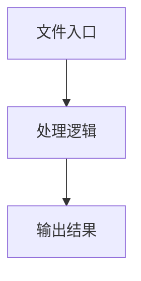

# dom-util.ts

## 0. 文件概述
dom-util.ts - TypeScript/JavaScript 源文件

## 1. 核心功能

### 1.1 导出项
- `export function isFormElement(node: globalThis.Node) {`
- `export function isButtonElement(`
- `export function isAElement(`
- `export function isSvgElement(`
- `export function isImgElement(`
- `export function isNotContainerElement(node: globalThis.Node) {`
- `export function isTextElement(`
- `export function isContainerElement(`
- `export function generateElementByPosition(`

### 1.2 类定义
- 无类定义

### 1.3 函数定义  
- **isFormElement()**: 函数
- **isButtonElement()**: 函数
- **isAElement()**: 函数
- **isSvgElement()**: 函数
- **isImgElement()**: 函数
- **isIconfont()**: 函数
- **isNotContainerElement()**: 函数
- **isTextElement()**: 函数
- **isContainerElement()**: 函数
- **includeBaseElement()**: 函数
- **generateElementByPosition()**: 函数

### 1.4 常量定义
- **computedStyle**: 常量
- **backgroundImage**: 常量
- **computedStyle**: 常量
- **fontFamilyValue**: 常量
- **computedStyle**: 常量
- **backgroundColor**: 常量
- **includeList**: 常量
- **element**: 常量
- **edgeSize**: 常量
- **rect**: 常量
- **element**: 常量

## 2. 逻辑流程

**流程说明**: 该文件实现特定功能，通过导入依赖模块，定义类/函数/常量，并导出供其他模块使用。

## 3. 关键细节

### 3.1 核心变量
- **computedStyle**: 定义的常量
- **backgroundImage**: 定义的常量
- **computedStyle**: 定义的常量
- **fontFamilyValue**: 定义的常量
- **computedStyle**: 定义的常量
- **backgroundColor**: 定义的常量
- **includeList**: 定义的常量
- **element**: 定义的常量
- **edgeSize**: 定义的常量
- **rect**: 定义的常量
- **element**: 定义的常量

### 3.2 依赖项
- `import type { LocateResultElement } from '../types';`

## 4. 跨文件调用关系

### 4.1 该文件调用的其他文件
根据 import 语句，该文件依赖以下模块：
- import type { LocateResultElement } from '../types';

### 4.2 调用该文件的其他文件
该文件通过以下导出项被其他模块使用：
- export function isFormElement(node: globalThis.Node) {
- export function isButtonElement(
- export function isAElement(
